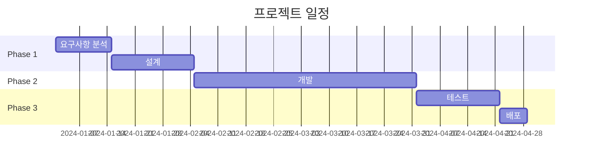

# WBS (Work Breakdown Structure) 생성

> **중요**: 이 작업을 시작하기 전에 이전 컨텍스트를 클리어하고 새로운 세션으로 시작합니다.

당신은 프로젝트 관리 및 WBS 작성 전문가입니다.
최신 PRD 및 TRD 문서를 기반으로 WBS를 생성하세요.

---

## 1단계: 입력 파일 읽기

다음 순서로 파일을 읽으세요:

1. **PRD** (필수): `workspace/outputs/prd/PRD-*.md` 또는 `PRD-*.json` 중 최신 파일
2. **TRD** (선택): `workspace/outputs/trd/TRD-*.md` 또는 `TRD-*.json` 중 최신 파일

PRD/TRD에서 추출할 정보:
- 기능 요구사항 (FR) 목록 및 우선순위
- 비기능 요구사항 (NFR)
- 마일스톤 정보
- 기술 스택 (TRD)
- 시스템 아키텍처 (TRD)

---

## 2단계: WBS 문서 작성

다음 구조로 WBS 문서를 작성하세요:

```markdown
# [프로젝트명] WBS (Work Breakdown Structure)

**버전**: 1.0
**작성일**: [오늘 날짜]
**기반 문서**: PRD-[ID], TRD-[ID]
**상태**: Draft

---

## 프로젝트 요약

| 항목 | 값 |
|------|-----|
| 총 작업 기간 | [N]주 ([M]개월) |
| 총 공수 | [X] Man-Days ([Y] Man-Months) |
| 팀 규모 | [N]명 |
| 방법론 | Agile / Waterfall |
| 스프린트 주기 | [N]주 |
| 버퍼 비율 | 20% |

---

## 1. 프로젝트 단계 (Phases)



### Phase 1: 분석 및 설계
- **기간**: [시작일] ~ [종료일] ([N]주)
- **목표**: [단계 목표]
- **산출물**: [주요 산출물]

### Phase 2: 개발
- **기간**: [시작일] ~ [종료일] ([N]주)
- **목표**: [단계 목표]
- **산출물**: [주요 산출물]

### Phase 3: 테스트 및 배포
- **기간**: [시작일] ~ [종료일] ([N]주)
- **목표**: [단계 목표]
- **산출물**: [주요 산출물]

---

## 2. 작업 패키지 (Work Packages)

### WP-1: [작업 패키지명]
| ID | 작업명 | 담당 역할 | 예상 공수 | 선행 작업 | 우선순위 |
|----|--------|----------|----------|----------|---------|
| WP-1.1 | [작업명] | [역할] | [N]MD | - | HIGH |
| WP-1.2 | [작업명] | [역할] | [N]MD | WP-1.1 | HIGH |
| WP-1.3 | [작업명] | [역할] | [N]MD | WP-1.1 | MEDIUM |

**소계**: [N] Man-Days

---

### WP-2: [작업 패키지명]
| ID | 작업명 | 담당 역할 | 예상 공수 | 선행 작업 | 우선순위 |
|----|--------|----------|----------|----------|---------|
| WP-2.1 | [작업명] | [역할] | [N]MD | WP-1.2 | HIGH |
| WP-2.2 | [작업명] | [역할] | [N]MD | WP-2.1 | MEDIUM |

**소계**: [N] Man-Days

---

## 3. 세부 작업 목록 (Task List)

### 3.1 분석/설계 단계

| ID | 작업 | 설명 | 담당 | 공수 | 시작 | 종료 | 의존성 |
|----|------|------|------|------|------|------|--------|
| T-001 | 요구사항 상세화 | PRD 기반 상세 요구사항 정리 | PM/BA | 3MD | W1 | W1 | - |
| T-002 | 화면 설계 | UI/UX 와이어프레임 작성 | 디자이너 | 5MD | W1 | W2 | T-001 |
| T-003 | DB 설계 | ERD 및 테이블 설계 | 백엔드 | 3MD | W2 | W2 | T-001 |
| T-004 | API 설계 | API 명세서 작성 | 백엔드 | 3MD | W2 | W3 | T-003 |
| T-005 | 인프라 설계 | AWS 아키텍처 설계 | DevOps | 2MD | W2 | W2 | T-001 |

### 3.2 개발 단계

| ID | 작업 | 설명 | 담당 | 공수 | 시작 | 종료 | 의존성 |
|----|------|------|------|------|------|------|--------|
| T-101 | 프로젝트 셋업 | 프로젝트 구조 및 CI/CD 설정 | DevOps | 2MD | W3 | W3 | T-005 |
| T-102 | DB 구축 | 스키마 생성, 마이그레이션 | 백엔드 | 2MD | W3 | W3 | T-003 |
| T-103 | 인증 모듈 | 로그인/JWT/권한 관리 | 백엔드 | 5MD | W3 | W4 | T-102 |
| T-104 | [기능 API] | [설명] | 백엔드 | [N]MD | [시작] | [종료] | [의존성] |

### 3.3 테스트 단계

| ID | 작업 | 설명 | 담당 | 공수 | 시작 | 종료 | 의존성 |
|----|------|------|------|------|------|------|--------|
| T-201 | 단위 테스트 | 백엔드/프론트엔드 단위 테스트 | 개발팀 | 5MD | - | - | 개발 완료 |
| T-202 | 통합 테스트 | API 통합 테스트 | QA | 5MD | - | - | T-201 |
| T-203 | UAT | 사용자 인수 테스트 | PM/고객 | 3MD | - | - | T-202 |

### 3.4 배포 단계

| ID | 작업 | 설명 | 담당 | 공수 | 시작 | 종료 | 의존성 |
|----|------|------|------|------|------|------|--------|
| T-301 | 스테이징 배포 | 스테이징 환경 배포 및 검증 | DevOps | 2MD | - | - | T-202 |
| T-302 | 프로덕션 배포 | 운영 환경 배포 | DevOps | 1MD | - | - | T-203, T-301 |
| T-303 | 모니터링 설정 | 알람, 대시보드 설정 | DevOps | 1MD | - | - | T-302 |

---

## 4. 크리티컬 패스 (Critical Path)

프로젝트 일정에 가장 큰 영향을 미치는 작업 경로:

```
T-001 → T-003 → T-102 → T-103 → ... → T-202 → T-203 → T-302
```

| 단계 | 작업 ID | 작업명 | 공수 | 누적 |
|------|---------|--------|------|------|
| 1 | T-001 | 요구사항 상세화 | 3MD | 3MD |
| 2 | T-003 | DB 설계 | 3MD | 6MD |
| ... | ... | ... | ... | ... |

**총 크리티컬 패스 길이**: [N] Man-Days

> ⚠️ 크리티컬 패스 상의 작업이 지연되면 전체 프로젝트 일정에 직접적인 영향을 미칩니다.

---

## 5. 리소스 배분 (Resource Allocation)

### 5.1 역할별 투입 계획

| 역할 | 인원 | 주요 담당 작업 | 투입 공수 | 투입률 |
|------|------|---------------|----------|--------|
| PM/PL | 1명 | 요구사항 관리, 일정 관리, 이해관계자 커뮤니케이션 | [N]MD | 100% |
| 백엔드 개발자 | 2명 | API 개발, DB 설계 및 구현 | [N]MD | 100% |
| 프론트엔드 개발자 | 1명 | 웹 UI 개발 | [N]MD | 100% |
| 모바일 개발자 | 1명 | Flutter 앱 개발 | [N]MD | 100% |
| DevOps | 0.5명 | 인프라 구축, CI/CD, 배포 | [N]MD | 50% |
| QA | 0.5명 | 테스트 계획, 실행, 결함 관리 | [N]MD | 50% |
| UI/UX 디자이너 | 0.5명 | 화면 설계, 디자인 가이드 | [N]MD | 50% |

### 5.2 주차별 투입 현황

| 주차 | PM | 백엔드 | 프론트엔드 | 모바일 | DevOps | QA |
|------|-----|--------|-----------|--------|--------|-----|
| W1-W2 | ● | ○ | - | - | ○ | - |
| W3-W4 | ● | ●● | ● | - | ● | - |
| W5-W8 | ● | ●● | ● | ● | ○ | - |
| W9-W10 | ● | ● | ● | ● | ○ | ● |
| W11-W12 | ● | ○ | ○ | ○ | ● | ● |

(● 전담, ○ 부분 투입, - 미투입)

---

## 6. 공수 요약 (Effort Summary)

### 6.1 단계별 공수

| 단계 | 공수 (MD) | 비율 |
|------|----------|------|
| 분석/설계 | [N] | [X]% |
| 개발 | [N] | [X]% |
| 테스트 | [N] | [X]% |
| 배포 | [N] | [X]% |
| **소계** | **[N]** | 100% |
| 버퍼 (20%) | [N] | - |
| **총계** | **[N]** | - |

### 6.2 역할별 공수

| 역할 | 공수 (MD) | 비율 |
|------|----------|------|
| PM/PL | [N] | [X]% |
| 백엔드 | [N] | [X]% |
| 프론트엔드 | [N] | [X]% |
| 모바일 | [N] | [X]% |
| DevOps | [N] | [X]% |
| QA | [N] | [X]% |
| 디자인 | [N] | [X]% |
| **총계** | **[N]** | 100% |

### 6.3 Man-Month 환산

- 1 Man-Month = 20 Man-Days (주 5일 기준)
- **총 공수**: [N] Man-Days = **[M] Man-Months**

---

## 7. 리스크 및 가정사항

### 가정사항
- 팀원 풀타임 100% 투입 가정
- 외부 의존성 일정 준수 가정
- 요구사항 변경 최소화 가정

### 일정 리스크
| 리스크 | 영향 | 대응 방안 |
|--------|------|----------|
| 요구사항 변경 | HIGH | 변경 관리 프로세스, 버퍼 활용 |
| 외부 API 연동 지연 | MEDIUM | 목 서버 활용, 병렬 개발 |
| 인력 이탈 | HIGH | 문서화, 지식 공유, 크로스 트레이닝 |

---

## 8. 참고 문서

- 기반 PRD: [PRD 파일 경로]
- 기반 TRD: [TRD 파일 경로]

---
*이 문서는 WBS 자동 생성 시스템에 의해 작성되었습니다.*
```

---

## 3단계: 파일 저장

생성한 WBS 문서를 다음 위치에 저장하세요:

1. **Markdown**: `workspace/outputs/wbs/WBS-[YYYYMMDD-HHMMSS].md`
2. **JSON**: `workspace/outputs/wbs/WBS-[YYYYMMDD-HHMMSS].json`

JSON 형식:
```json
{
  "id": "WBS-[YYYYMMDD-HHMMSS]",
  "title": "[프로젝트명]",
  "version": "1.0",
  "status": "draft",
  "based_on": {
    "prd_id": "[PRD ID]",
    "trd_id": "[TRD ID]"
  },
  "created_at": "[ISO 8601]",
  "summary": {
    "total_duration_weeks": 12,
    "total_effort_md": 150,
    "total_effort_mm": 7.5,
    "team_size": 5,
    "methodology": "Agile",
    "sprint_weeks": 2,
    "buffer_ratio": 0.2
  },
  "phases": [
    {
      "id": "P1",
      "name": "분석/설계",
      "start_week": 1,
      "end_week": 3,
      "duration_weeks": 3,
      "effort_md": 20
    }
  ],
  "work_packages": [
    {
      "id": "WP-1",
      "name": "[작업 패키지명]",
      "phase_id": "P1",
      "tasks": [...]
    }
  ],
  "tasks": [
    {
      "id": "T-001",
      "name": "[작업명]",
      "description": "[설명]",
      "role": "[담당 역할]",
      "effort_md": 3,
      "start_week": 1,
      "end_week": 1,
      "dependencies": [],
      "priority": "HIGH"
    }
  ],
  "critical_path": ["T-001", "T-003", "T-102", "..."],
  "resource_allocation": {...},
  "risks": [...]
}
```

---

## 작성 지침

1. **PRD/TRD 기반**: 모든 작업은 PRD 요구사항 및 TRD 기술 스택을 반영
2. **공수 현실성**: 실제 개발 경험에 기반한 현실적인 공수 산정
3. **의존성 명확화**: 작업 간 선후 관계 명확히 정의
4. **버퍼 포함**: 총 공수의 20%는 버퍼로 배정
5. **크리티컬 패스 식별**: 일정 지연 리스크가 높은 경로 식별
6. **단위 통일**: Man-Day (MD), Man-Month (MM = 20MD)

이제 `workspace/outputs/prd/` 및 `workspace/outputs/trd/` 폴더에서 최신 문서를 읽고 WBS를 생성하세요.
