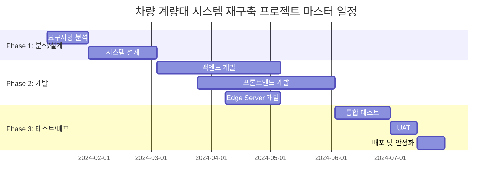

# 차량 계량대 시스템 재구축 프로젝트 제안서

**제안사**: [제안사명]
**수신**: [고객사명] 귀중
**제안일**: 2026년 01월 25일
**버전**: 1.0

---

## 1. 경영진 요약 (Executive Summary)

본 제안서는 현재 운영 중인 DOS 기반 레거시 계량대 시스템을 웹 기반 관리 시스템과 모바일 앱으로 재구축하여 계량 프로세스의 효율화와 자동화를 달성하기 위한 프로젝트입니다.

- **프로젝트 개요**: 15년 이상 운영된 레거시 계량대 시스템을 현대화하여 실시간 모니터링, 모바일 대기 순번 확인, 전자 전표 기능을 제공하는 통합 시스템 구축
- **핵심 목표**:
  - 계량 데이터 수기 입력 100% 자동화로 오기입 제로화
  - 운전기사 평균 대기 시간 45분 → 20분 이내로 단축
  - 대기 관련 민원 90% 감소
  - 전자 전표 도입으로 프로세스 간소화
  - 실시간 현황 모니터링 및 통계 리포트 자동화
- **예상 기간**: 7개월 (28주)
- **예상 투입 공수**: 16 Man-Months (320 Man-Days)
- **기대 효과**: 운영 효율성 향상, 데이터 정확도 100%, 고객 만족도 대폭 개선

> 본 제안서는 차량 계량대 시스템 재구축 프로젝트의 성공적인 구축을 위한 상세 계획을 담고 있습니다.

---

## 2. 프로젝트 개요

### 2.1 배경 및 필요성

현재 운영 중인 계량대 시스템은 2008년 도입 이후 15년 이상 운영되어 온 DOS 기반 레거시 시스템입니다.

**현재 상황 및 문제점:**
- 유지보수 인력 확보 어려움 (레거시 기술 숙련자 감소)
- 계량 완료 후 수기 전표 작성으로 오기입 빈번 발생 (추정 5%)
- 운전기사 평균 대기 시간 45분으로 민원 지속 발생
- 기존 전광판 가시성 불량으로 사무실 직접 문의 증가
- 데이터 정합성 맞추는 데 상당한 시간 소요

**프로젝트 필요성:**
- 레거시 시스템의 현대화를 통한 안정적 운영 기반 확보
- 자동화를 통한 업무 효율성 및 데이터 정확도 향상
- 실시간 정보 제공으로 고객(운전기사) 만족도 개선
- 통계 기반 의사결정 지원 체계 구축

**기대되는 변화:**
- 수기 입력 → 자동화로 오류 제거 및 업무 시간 단축
- 대기 시간 불확실성 → 실시간 모바일 앱으로 투명한 정보 제공
- 종이 전표 → 전자 전표로 친환경 및 편의성 향상
- 개별 문의 → 셀프서비스 시스템으로 업무 부하 경감

### 2.2 목표

| 구분 | 목표 | 성공 기준 |
|------|------|----------|
| 정량적 목표 | 계량 데이터 오기입률 제로화 | 0% (현재 5%) |
| 정량적 목표 | 운전기사 평균 대기 시간 단축 | 20분 이내 (현재 45분) |
| 정량적 목표 | 대기 관련 민원 감소 | 90% 감소 |
| 정량적 목표 | 모바일 앱 설치율 | 등록 운전기사 80% 이상 |
| 정성적 목표 | 시스템 안정성 확보 | 연간 가용성 99.5% 이상 |
| 정성적 목표 | 사용자 경험 개선 | 웹 대시보드 2초 이내 응답 |

### 2.3 성공 기준 (KPI)

- **데이터 정확도**: 계량 데이터 오기입률 0%
- **운영 효율성**: 평균 대기 시간 20분 이내
- **고객 만족**: 대기 관련 민원 90% 감소
- **시스템 채택률**: 모바일 앱 설치율 80% 이상
- **시스템 안정성**: 연간 가용성 99.5% 이상
- **성능**: 웹 대시보드 평균 응답 시간 2초 이내

---

## 3. 작업 범위 (Scope of Work)

### 3.1 포함 범위 (In-Scope)

| 구분 | 내용 |
|------|------|
| 시스템 개발 | 웹 기반 관리자용 대시보드 (계량 현황, 통계, 차량/기사 관리) |
| 시스템 개발 | 모바일 앱 (운전기사용 - iOS/Android) - 대기 순번, 계량 결과, 전자 전표 |
| 시스템 개발 | Edge Server 데이터 수집 프로그램 (현장 설치) |
| 외부 연동 | 기존 인디케이터 3대 연동 (A사 2대, B사 1대 - RS-232 시리얼 통신) |
| 외부 연동 | ERP 시스템 연동 (REST API, OAuth 2.0 인증, 일 마감 데이터 전송) |
| 외부 연동 | 전광판 연동 (TCP/IP, 대기 순번 표시) |
| 인프라 | AWS 클라우드 인프라 구축 (VPC, ECS Fargate, RDS, ElastiCache) |
| 인프라 | CI/CD 파이프라인 구축 (GitHub Actions) |
| 인프라 | 모니터링 환경 구축 (CloudWatch, Grafana) |
| 문서 산출물 | 요구사항 정의서, 시스템 설계서, API 명세서, 테스트 결과서, 사용자 매뉴얼 |

### 3.2 제외 범위 (Out of Scope)

> 다음 항목은 본 프로젝트 범위에 포함되지 않습니다:

- 인디케이터(저울) 하드웨어 교체 - 기존 장비 3대 그대로 활용
- ERP 시스템 내부 수정 - 외부 연동 API 활용만 포함
- 사전 예약 기능 - 향후 Phase 2에서 검토
- 멀티 사이트(타 계량대) 통합 - 향후 확장 고려한 설계만 포함
- 기존 레거시 시스템 유지보수

---

## 4. 솔루션 접근법 (Solution Approach)

### 4.1 시스템 아키텍처

```
                                    ┌─────────────────────────────────────────────────────────────────┐
                                    │                         AWS Cloud                               │
                                    │  ┌─────────────────────────────────────────────────────────┐   │
                                    │  │                      VPC (10.0.0.0/16)                   │   │
┌──────────────┐                    │  │                                                          │   │
│   웹 브라우저   │──HTTPS──┐         │  │  ┌─────────────┐    ┌─────────────┐    ┌─────────────┐  │   │
│   (관리자)     │         │         │  │  │   ALB       │───▶│  ECS Fargate │───▶│   RDS       │  │   │
└──────────────┘         │         │  │  │  (HTTPS)    │    │  (FastAPI)  │    │ (PostgreSQL)│  │   │
                          │         │  │  └─────────────┘    └──────┬──────┘    └─────────────┘  │   │
┌──────────────┐         │         │  │         ▲                   │                            │   │
│   모바일 앱    │──HTTPS──┼─────────┼──┼─────────┤                   ▼                            │   │
│   (운전기사)   │         │         │  │         │           ┌─────────────┐                     │   │
└──────────────┘         │         │  │         │           │ ElastiCache │                     │   │
                          │         │  │         │           │   (Redis)   │                     │   │
                          ▼         │  │         │           └─────────────┘                     │   │
                    ┌───────────┐   │  │         │                                                │   │
                    │ CloudFront│   │  │    WebSocket                                             │   │
                    │   (CDN)   │───┼──┼─────────┘                                                │   │
                    └───────────┘   │  │                                                          │   │
                                    │  │  ┌─────────────┐         ┌─────────────┐                 │   │
                                    │  │  │   S3       │         │ CloudWatch  │                 │   │
                                    │  │  │ (정적 파일) │         │ (모니터링)   │                 │   │
                                    │  │  └─────────────┘         └─────────────┘                 │   │
                                    │  └──────────────────────────────────────────────────────────┘   │
                                    └─────────────────────────────────────────────────────────────────┘
                                                          ▲
                                                          │ HTTPS (API)
                    ┌─────────────────────────────────────┼─────────────────────────────────────┐
                    │                           현장 네트워크                                     │
                    │  ┌─────────────┐           ┌────────┴────────┐                            │
                    │  │  전광판      │◀──TCP────│   Edge Server    │                            │
                    │  │  (TCP/IP)   │           │    (Python)     │                            │
                    │  └─────────────┘           └────────┬────────┘                            │
                    │              ┌──────────────────────┼──────────────────────┐              │
                    │              ▼                      ▼                      ▼              │
                    │       ┌───────────┐          ┌───────────┐          ┌───────────┐        │
                    │       │인디케이터 A1│          │인디케이터 A2│          │인디케이터 B │        │
                    │       │  (RS-232) │          │  (RS-232) │          │  (RS-232) │        │
                    │       └───────────┘          └───────────┘          └───────────┘        │
                    └───────────────────────────────────────────────────────────────────────────┘
                                                          │
                                              VPN / 전용선 (IP Whitelist)
                                                          ▼
                                                  ┌───────────────┐
                                                  │   ERP 시스템   │
                                                  └───────────────┘
```

### 4.2 기술 스택

| 구분 | 기술 | 선정 사유 |
|------|------|----------|
| Frontend (웹) | React 18 + Vite + Zustand + Ant Design | 컴포넌트 기반 개발, 관리자용 대시보드 최적화 |
| Frontend (모바일) | Flutter 3.x + Riverpod | iOS/Android 크로스 플랫폼, 네이티브 수준 성능 |
| Backend | Python 3.11 + FastAPI | 비동기 지원, 자동 API 문서화, 높은 개발 생산성 |
| Database | PostgreSQL 15 (RDS Multi-AZ) | ACID 보장, 고가용성, JSON 타입 지원 |
| Cache | Redis 7 (ElastiCache) | 실시간 데이터 캐싱, WebSocket pub/sub |
| Edge Server | Python + pyserial + SQLite | RS-232 시리얼 통신, 네트워크 단절 시 로컬 버퍼링 |
| Infrastructure | AWS (ECS Fargate, RDS, ElastiCache, S3, CloudFront) | 서버리스 컨테이너, Auto Scaling, 관리 오버헤드 최소화 |
| CI/CD | GitHub Actions | 코드 저장소 통합, 비용 효율적 |
| Monitoring | CloudWatch + Grafana | AWS 네이티브 메트릭 + 커스텀 대시보드 |

### 4.3 개발 방법론

- **방법론**: Agile (Scrum)
- **스프린트 주기**: 2주
- **커뮤니케이션**:
  - 일일 스탠드업 미팅 (15분)
  - 스프린트 플래닝/리뷰/회고
  - Slack/Teams 채널 운영
- **품질 관리**:
  - 코드 리뷰 (PR 기반)
  - 테스트 자동화 (단위/통합/E2E)
  - 테스트 커버리지 80% 이상 유지

---

## 5. 일정 계획 (Project Timeline)

### 5.1 전체 일정



### 5.2 마일스톤

| 마일스톤 | 완료 예정일 | 주요 산출물 |
|----------|-----------|------------|
| M1: 분석/설계 완료 | 2024년 3월 1일 | 상세 요구사항 정의서, 시스템 아키텍처 설계서, DB 설계서, API 명세서, UI/UX 디자인 시안 |
| M2: 백엔드 개발 완료 | 2024년 5월 31일 | FastAPI 백엔드 서버, PostgreSQL DB, Edge Server 프로그램, 인디케이터/ERP/전광판 연동 모듈 |
| M3: 프론트엔드 개발 완료 | 2024년 6월 28일 | React 웹 대시보드, Flutter 모바일 앱 (iOS/Android), WebSocket 실시간 통신 |
| M4: 테스트 완료 | 2024년 7월 26일 | 통합 테스트 결과서, 성능 테스트 결과서, 보안 테스트 결과서, UAT 완료 보고서 |
| M5: 오픈 | 2024년 8월 9일 | 운영 환경 배포, 사용자 매뉴얼 (관리자/운전기사), 운영 가이드, 앱 스토어 배포 |

---

## 6. 산출물 목록 (Deliverables)

| 단계 | 산출물 | 형식 | 설명 |
|------|--------|------|------|
| 분석 | 상세 요구사항 정의서 | Word/PDF | 기능/비기능 요구사항 상세 명세 |
| 분석 | 인디케이터 프로토콜 분석서 | Word/PDF | A사/B사 시리얼 통신 프로토콜 정의 |
| 설계 | 시스템 아키텍처 설계서 | Word/PDF | 전체 시스템 구성, 컴포넌트 정의 |
| 설계 | 데이터베이스 설계서 | Word/PDF | ERD, 테이블 정의서, 인덱스 설계 |
| 설계 | API 명세서 | OpenAPI 3.0 | 전체 REST API 명세 (Swagger) |
| 설계 | UI/UX 디자인 | Figma | 웹/모바일 화면 설계 및 디자인 시안 |
| 설계 | 보안 설계서 | Word/PDF | 인증/인가, 암호화, 네트워크 보안 정책 |
| 개발 | 소스코드 | Git | 백엔드, 프론트엔드(웹), 모바일, Edge Server |
| 개발 | DB 마이그레이션 스크립트 | SQL/Python | Alembic 기반 스키마 버전 관리 |
| 테스트 | 테스트 계획서 | Word/PDF | 테스트 전략, 범위, 일정 |
| 테스트 | 테스트 결과서 | Excel/PDF | 단위/통합/E2E/성능/보안 테스트 결과 |
| 배포 | 배포 가이드 | Word/PDF | CI/CD 파이프라인, 배포 절차 |
| 배포 | 사용자 매뉴얼 (관리자) | PDF | 웹 대시보드 사용 가이드 |
| 배포 | 사용자 매뉴얼 (운전기사) | PDF | 모바일 앱 사용 가이드 |
| 배포 | 운영 가이드 | Word/PDF | 시스템 운영, 장애 대응, 모니터링 |

---

## 7. 투입 인력 (Project Team)

### 7.1 역할별 구성

| 역할 | 인원 | 투입률 | 주요 업무 | 투입 기간 |
|------|------|--------|----------|----------|
| PM/PL | 1명 | 100% | 프로젝트 관리, 요구사항 관리, 이해관계자 커뮤니케이션 | 전 기간 (W1~W28) |
| 백엔드 개발자 | 2명 | 100% | API 개발, DB 설계, Edge Server 개발, 외부 연동 | W3~W22 |
| 프론트엔드 개발자 | 1명 | 100% | React 웹 대시보드 개발 | W11~W22 |
| 모바일 개발자 | 1명 | 100% | Flutter iOS/Android 앱 개발 | W11~W22 |
| DevOps | 1명 | 50% | 인프라 구축, CI/CD, 배포, 모니터링 | W5~W8, W17~W18, W26~W28 |
| QA | 1명 | 50% | 테스트 계획 및 실행, 결함 관리 | W23~W28 |
| UI/UX 디자이너 | 1명 | 50% | 화면 설계, 디자인 시안 | W3~W8 |

### 7.2 공수 요약

| 구분 | 공수 (M/M) |
|------|-----------|
| 분석/설계 | 3.1 M/M |
| 개발 | 8.0 M/M |
| 테스트/배포 | 2.7 M/M |
| 버퍼 (20%) | 2.2 M/M |
| **총계** | **16 M/M** |

---

## 8. 리스크 및 대응 방안

| 리스크 | 영향도 | 발생 확률 | 대응 방안 |
|--------|-------|----------|----------|
| B사 인디케이터 프로토콜 미확정 | HIGH | MEDIUM | 프로토콜 문서 수령 일정 선추적, 범용 파서 구조로 설계하여 유연성 확보 |
| Edge Server 네트워크 단절 | HIGH | MEDIUM | SQLite 로컬 버퍼링 구현, 네트워크 복구 시 자동 동기화, 복구 시나리오 사전 검증 |
| 요구사항 변경 | HIGH | MEDIUM | 변경 관리 프로세스 수립, 20% 버퍼 활용, 스프린트 내 범위 조정 |
| ERP 연동 API 변경 | MEDIUM | LOW | 어댑터 패턴 적용으로 변경 영향 최소화, API 버전 관리 |
| iOS 앱 스토어 심사 지연 | MEDIUM | MEDIUM | 조기 심사 제출 (W26), 사전 리젝 사유 검토, 리젝 대비 수정 버퍼 확보 |
| 인력 이탈 | HIGH | LOW | 문서화 강화, 지식 공유 세션, 크로스 트레이닝 실시 |
| 동시 접속 부하 | MEDIUM | LOW | 부하 테스트 수행, AWS Auto Scaling 설정 검증, 성능 최적화 |

---

## 9. 전제 조건 (Assumptions)

> 본 제안은 다음 전제 조건하에 작성되었습니다:

1. **고객측 협조**
   - 요구사항 확정 및 변경 관리 프로세스 준수
   - 현장 방문 및 인터뷰 일정 협조
   - UAT 참여 인력 (계량팀, 운전기사) 확보
   - ERP 연동을 위한 ERP팀 협조

2. **외부 의존성**
   - B사 인디케이터 프로토콜 문서: 2024년 2월 중 수령
   - ERP Staging 환경 접근: 2024년 2월 5일 이후 가능
   - iOS 푸시 인증서 (FCM) 발급 지원
   - 현장 네트워크 환경 (Edge Server 설치 위치) 사전 확인

3. **일정 관련**
   - 팀원 풀타임 100% 투입 (DevOps, QA, 디자이너 제외)
   - 요구사항 대규모 변경 최소화
   - 외부 의존성 일정 준수

---

## 10. 기대 효과 (Expected Benefits)

### 10.1 정량적 효과

| 항목 | 현재 | 목표 | 개선율 |
|------|------|------|--------|
| 계량 데이터 오기입률 | 5% | 0% | 100% 개선 |
| 운전기사 평균 대기 시간 | 45분 | 20분 | 56% 단축 |
| 대기 관련 민원 건수 | 기준치 | -90% | 90% 감소 |
| 전표 발행 소요 시간 | 수기 작성 | 즉시 자동 | 업무 시간 절감 |
| 일일 통계 리포트 작성 시간 | 수동 | 자동화 | 업무 시간 절감 |

### 10.2 정성적 효과

- **운영 효율성 향상**: 자동화된 데이터 수집 및 처리로 업무 부하 경감
- **고객 만족도 개선**: 실시간 대기 정보 제공으로 운전기사 불편 해소
- **데이터 기반 의사결정**: 실시간 대시보드 및 통계 리포트로 운영 현황 가시화
- **시스템 안정성 확보**: 레거시 탈피로 유지보수 용이성 및 확장성 확보
- **친환경 운영**: 전자 전표 도입으로 종이 사용 감소

---

## 11. 후속 절차 (Next Steps)

| 단계 | 내용 | 예상 소요 |
|------|------|-----------|
| 1 | 제안서 검토 및 질의응답 | 1주 |
| 2 | 제안 협상 및 조정 | 1주 |
| 3 | 계약 체결 | 1주 |
| 4 | 킥오프 미팅 | - |
| 5 | 프로젝트 착수 | - |

---

## 12. 연락처

| 구분 | 담당자 | 연락처 |
|------|--------|--------|
| 영업 담당 | [담당자명] | [이메일/전화번호] |
| 기술 담당 | [담당자명] | [이메일/전화번호] |

---

*본 제안서는 [제안사]에서 작성하였으며, 제안 내용의 저작권은 [제안사]에 있습니다.*
