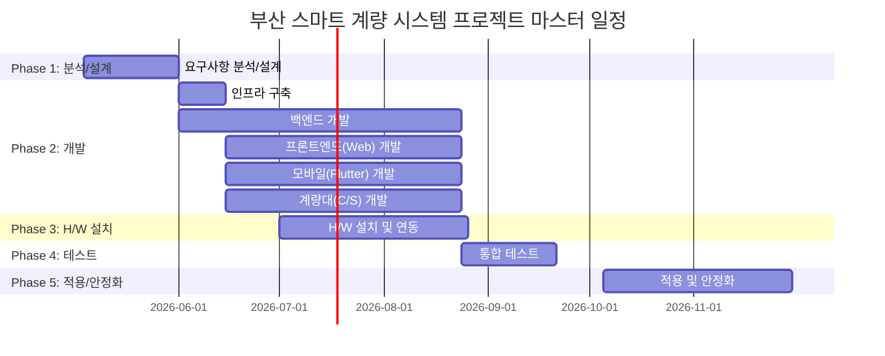

# 부산 스마트 계량 시스템 구축 제안서

**제안사**: 동국시스템즈
**수신**: 동국씨엠 귀중
**제안일**: 2026-01-27
**버전**: 1.0

---

## 1. 경영진 요약 (Executive Summary)

### 한눈에 보는 프로젝트

| 항목 | 내용 |
|------|------|
| **해결할 문제** | RFID·종이 계량표 기반 수작업 계량 프로세스로 인한 안전 위험, 처리 지연, 운영 비효율 |
| **우리의 솔루션** | LPR+AI 차량번호 자동인식, 모바일 APP, 전자 계량표를 통합한 스마트 계량 시스템 |
| **예상 기간** | 7개월 (2026년 5월 ~ 11월, 안정화 포함) |
| **투입 공수** | 20.8 Man-Months (버퍼 포함 25.0 M/M) |
| **핵심 기대효과** | 계량 처리 시간 30% 단축 및 종이 계량표 100% 제거(Paperless) |

> **왜 지금 해야 하는가?**
> 현재 계량대에서 운전자가 차량에서 내려 종이 계량표를 수령하는 과정은 매일 반복되는 안전 위험입니다. 다중 배차 시 복수의 RFID 카드를 관리해야 하는 현장 혼선과 복잡한 다차 계량에서의 오류는 더 이상 미룰 수 없는 과제입니다. 업계 스마트 팩토리 전환 흐름에서 뒤처지기 전에, 지금이 계량 프로세스를 혁신할 최적의 시점입니다.

---

## 2. 현재 상황: 왜 변화가 필요한가?

### 2.1 현재의 도전과 고통

**매일 수십 대의 차량이 부산공장 계량대를 오가지만, 운전자는 여전히 차에서 내려 종이 한 장을 받기 위해 기다립니다.**

현재 동국씨엠 부산공장은 다음과 같은 도전에 직면해 있습니다:

| 문제 영역 | 현상 | 비즈니스 영향 |
|----------|------|--------------|
| 안전 위험 | 운전자가 차량에서 하차하여 종이 계량표를 수취 | 대형 차량 사이에서의 보행 위험, 산업재해 가능성 |
| 운영 비효율 | RFID 카드 태깅 → 종이 출력 → 수취의 수작업 절차 | 계량 1건당 불필요한 대기 시간 발생, 일일 처리량 제한 |
| 다중 배차 혼선 | 동일 차량에 복수 RFID 카드를 사용하는 불편 | 카드 분실·혼동으로 인한 오배차, 재처리 발생 |
| 계량 오류 | 복잡한 1차/2차/3차 계량 시 수동 처리 에러 | 중량 데이터 오류, 재계량 불가로 인한 정산 분쟁 |
| 문의 집중 | 계량대 문제 발생 시 특정 부서에 전화 집중 | 담당 부서 업무 과중, 현장 대응 지연 |

### 2.2 변화하지 않으면?

> 현재 방식을 유지할 경우:
> - 종이 계량표 기반 프로세스가 지속되어 Paperless 경영 목표 달성 불가
> - 계량대 안전 사고 리스크가 상존하며, 산업안전 규제 강화에 대응 어려움
> - 수작업 오류로 인한 정산 분쟁과 고객 불만 지속
> - 타 공장 대비 디지털 전환 지연으로 운영 경쟁력 저하

### 2.3 변화했을 때의 미래

> 프로젝트 성공 후 모습:
> - 운전자는 차량에서 내리지 않고, 계량대 진입만으로 자동 인식·계량·전자표 수신까지 완료합니다
> - 모바일 APP 하나로 배차 확인, OTP 인증, 전자 계량표 공유까지 — 종이는 완전히 사라집니다
> - 물류관제실은 실시간 대시보드로 모든 계량 현황을 한눈에 파악하고, 데이터 기반 의사결정을 내립니다

---

## 3. 목표와 성공 기준

### 3.1 프로젝트 목표

| 구분 | 목표 | 성공 기준 | 측정 방법 |
|------|------|----------|----------|
| 핵심 목표 | LPR+AI 기반 무인 계량 자동화 | 차량번호 자동인식률 95% 이상 | LPR 인식 로그 분석 |
| 정량 목표 | 계량 처리 효율화 | 계량 처리 시간 30% 단축 | Before/After 처리 시간 비교 |
| 정량 목표 | 완전한 Paperless 전환 | 종이 계량표 사용량 100% 감소 | 종이 계량표 출력 건수 |
| 정성 목표 | 사용자 편의성·안전성 향상 | 사용자 만족도 80% 이상 | 사용자 설문조사 |

### 3.2 성공 KPI

> 프로젝트 성공은 다음 지표로 측정됩니다:

- **계량 처리 시간**: 현재 대비 → 30% 단축
- **종이 계량표 사용**: 현재 100% → 목표 0% (완전 Paperless)
- **차량번호 자동인식률**: 목표 95% 이상 달성
- **계량 오류율**: 현재 대비 → 50% 감소
- **사용자 만족도**: 목표 80% 이상 달성

---

## 4. 우리의 솔루션

### 4.1 솔루션 개요

**차량이 계량대에 들어서는 순간부터 전자 계량표가 모바일로 도착하는 순간까지, 모든 과정을 자동화합니다.**

```
"차량 진입 → LPR 자동인식 → 중량 자동 측정 → 전자 계량표 발급 → 모바일 실시간 확인"
운전자는 차에서 내릴 필요가 없습니다. 관리자는 모든 현황을 실시간으로 파악합니다.
```

### 4.2 작업 범위

#### 포함 범위 (In-Scope)

| 구분 | 내용 | 고객 가치 |
|------|------|----------|
| LPR+AI 시스템 | LPR 카메라 설치, AI 2차 검증 모듈 개발 | 수작업 없는 차량 자동인식으로 계량 시간 대폭 단축 |
| 스마트 계량 웹 시스템 | 배차등록, 기준정보, 계량관리, 출문관리, 대시보드 | 통합 관리 화면으로 운영 효율 극대화 |
| 계량관리 모바일 APP | iOS/Android 크로스플랫폼 APP (Flutter) | 운전자가 차량 내에서 안전하게 모든 업무 처리 |
| 계량대 C/S 프로그램 | 인디게이터·LPR·전광판·차단기 연동 현장 프로그램 | 자동/모바일/수동 3가지 계량 방식의 유연한 처리 |
| 전자 계량표 | 모바일 조회, 카카오톡·SMS 공유 | 종이 계량표 완전 제거, Paperless 달성 |
| 모바일 OTP 인증 | 번호인식 실패 시 OTP 대체 계량 | 인식 실패에도 계량 지연 없는 안정적 운영 |
| H/W 설치 | LPR, 전광판, 자동차단기, 레이더센서, 차량검지기 | 완전한 무인 자동 계량 환경 구현 |
| 인프라 구축 | 서버, DB, 모니터링, CI/CD 파이프라인 | 안정적이고 확장 가능한 시스템 운영 기반 |

#### 제외 범위 (Out of Scope)

> 다음 항목은 본 프로젝트 범위에 포함되지 않습니다:
> - 타 공장(포항 등) 계량 시스템 구축 — 부산공장 성공 후 Phase 2로 확대 검토 가능
> - ERP 시스템 전체 교체 — 기존 ERP와 연동 방식으로 대응
> - 계량대 물리적 구조 변경(토목 공사) — 기존 구조 내 장비 설치
> - 기존 터치스크린 방식 완전 폐기 — Failover를 위한 병행 운영 유지

---

## 5. 어떻게 만드는가: 기술 접근법

### 5.1 시스템 아키텍처

```
                              ┌─────────────────────────────────────────────────┐
                              │                 부산공장 계량대                     │
                              │                                                 │
  ┌──────────┐   TCP/IP       │  ┌──────────┐  RS-232C  ┌──────────────────┐   │
  │   LPR    │───────────────▶│  │ 계량대 PC │◄────────▶│   인디게이터      │   │
  │ (카메라)  │                │  │  (C/S)   │           │   (저울)         │   │
  └──────────┘                │  └─────┬────┘           └──────────────────┘   │
                              │        │ TCP/IP                                │
  ┌──────────┐   Serial       │        │          ┌──────────────────┐         │
  │ 레이더    │───────────────▶│        │          │   전광판          │         │
  │ 센서     │                │        ├─────────▶│  (OTP/안내표시)   │         │
  └──────────┘                │        │          └──────────────────┘         │
                              │        │                                       │
  ┌──────────┐   TCP/IP       │        │          ┌──────────────────┐         │
  │ 차량     │───────────────▶│        ├─────────▶│   자동차단기      │         │
  │ 검지기   │                │        │          └──────────────────┘         │
  └──────────┘                │        │                                       │
                              └────────┼───────────────────────────────────────┘
                                       │
                                       ▼ HTTPS
                           ┌───────────────────────┐
                           │       Nginx           │
                           │   (Reverse Proxy)     │
                           └───────────┬───────────┘
                                       │
                          ┌────────────┼────────────┐
                          ▼            ▼            ▼
                   ┌────────────┐ ┌────────┐ ┌──────────┐
                   │ Spring Boot│ │ Kafka  │ │ AI 서버   │
                   │ (REST API) │ │ Broker │ │ (LPR검증) │
                   └──────┬─────┘ └────────┘ └──────────┘
                          │
               ┌──────────┼──────────┐
               ▼          ▼          ▼
        ┌────────────┐ ┌──────┐ ┌────────────┐
        │ PostgreSQL │ │Redis │ │ File Store │
        │ (Primary)  │ │(OTP) │ │ (계량표)    │
        └────────────┘ └──────┘ └────────────┘

  ┌──────────────────┐          ┌──────────────────┐
  │  React Web App   │ HTTPS    │  Flutter Mobile   │ HTTPS
  │  (관리자 웹)      │────────▶│  (계량관리 APP)    │────────▶  Spring Boot API
  └──────────────────┘          └──────────────────┘
                                        │
                                        ▼
                              ┌──────────────────┐
                              │ 카카오 알림톡 API  │
                              │ FCM Push 서버     │
                              └──────────────────┘
```

### 5.2 기술 스택

| 구분 | 기술 | 왜 이 기술인가? |
|------|------|----------------|
| Frontend (Web) | React 18 + TypeScript + Ant Design | 풍부한 엔터프라이즈 컴포넌트로 관리 화면 빠른 구축, 필터·정렬·소계 등 업무 요구 기능 내장 |
| Frontend (Mobile) | Flutter 3.x + Dart | iOS/Android 단일 코드베이스로 개발비 절감, 네이티브 수준 성능 제공 |
| Backend | Spring Boot 3.2 + Java 17 | 엔터프라이즈 검증된 프레임워크, 장기 지원(LTS), 풍부한 생태계로 유지보수 용이 |
| Desktop (C/S) | C# .NET 8 WinForms | RS-232C 시리얼 통신 및 TCP/IP 장비 연동에 최적화, 기존 Windows PC 호환 |
| Database | PostgreSQL 16 + Redis 7 | ACID 트랜잭션으로 계량 데이터 정합성 보장, OTP 세션은 Redis TTL로 고속 처리 |
| AI/LPR | LPR 솔루션 + TensorFlow/ONNX | 1차 하드웨어 인식 + AI 2차 검증으로 95% 이상 인식률 달성 |
| Infrastructure | Docker + Nginx + Jenkins + Kafka | 컨테이너화로 배포 일관성, 비동기 이벤트 처리로 시스템 확장성 확보 |
| Monitoring | Prometheus + Grafana + ELK | 실시간 성능 모니터링 및 중앙 로그 관리로 장애 즉시 감지·대응 |

### 5.3 품질 보증

> 우리는 다음과 같은 품질 체계로 성공을 보장합니다:

- **개발 방법론**: Waterfall + Agile 하이브리드 — 설계·H/W는 Waterfall, S/W 개발은 Agile 반복 개발
- **코드 품질**: 코드 리뷰 의무화, JUnit5/React Testing Library 기반 자동화 테스트 (커버리지 80%+)
- **보안**: JWT 인증 + RBAC 권한관리, AES-256 개인정보 암호화, TLS 1.3 통신 암호화, OWASP Top 10 대응
- **성능**: REST API p95 응답시간 500ms 이내, LPR 인식 2초 이내, OTP 생성·검증 100ms 이내
- **가용성**: 시스템 가용률 99.5%, 장애 시 기존 터치스크린 Failover, 일일 데이터 백업

---

## 6. 언제 완료되는가: 일정 계획

### 6.1 전체 일정



### 6.2 마일스톤

| 마일스톤 | 완료 예정일 | 주요 산출물 | 고객 확인 포인트 |
|----------|-----------|------------|-----------------|
| M1: 분석/설계 완료 | 2026-05-29 | 업무 분석서, 시스템 아키텍처 설계서, H/W 구성 설계서, 화면 설계서, DB 설계서, API 명세서 | 설계 검토 및 승인 |
| M2: 개발 완료 | 2026-08-21 | Spring Boot API 서버, React 웹 시스템, Flutter 모바일 APP, C/S 계량대 프로그램, AI 연동 모듈 | 기능 데모 및 리뷰 |
| M3: H/W 설치 완료 | 2026-08-21 | LPR/전광판/차단기/센서 설치, 네트워크 구성, 장비 연동 테스트 결과서 | 현장 설치 확인 |
| M4: 통합 테스트 완료 | 2026-09-18 | 통합 테스트 결과서, 성능 테스트 보고서, 결함 수정 보고서 | UAT(사용자 인수 테스트) 참여 |
| M5: 시스템 오픈 | 2026-11-27 | 운영 배포, 교육자료, 운영 매뉴얼, 안정화 모니터링 보고서 | 최종 인수 및 프로젝트 종료 |

### 6.3 고객 점검 회의

- **월 1회 정기 점검회의** 진행 (개발 진척, 리스크, 이슈 공유)
- 각 마일스톤 완료 시 **고객 승인 게이트** 운영

---

## 7. 누가 만드는가: 프로젝트 팀

### 7.1 역할별 구성

| 역할 | 인원 | 핵심 역량 | 투입 기간 |
|------|------|----------|----------|
| PM/PL | 1명 | 프로젝트 관리, 고객 소통, 교육·보고 | 전 기간 (W1~W26) |
| 아키텍트/BA | 1명 | 시스템 설계, 업무 분석, 문서화 | Phase 1, Phase 5 (50%) |
| 백엔드 개발자 | 2명 | Spring Boot API, DB, Kafka, 알림 서비스 | Phase 2~4 (100%) |
| 프론트엔드 개발자 | 1명 | React 웹 시스템 전체 화면 개발 | Phase 2~4 (100%) |
| 모바일 개발자 | 1명 | Flutter APP 전체 화면, 앱스토어 배포 | Phase 2~5 (100%) |
| C/S 개발자 | 1명 | .NET WinForms 계량대 프로그램, 장비 연동 | Phase 2~4 (100%) |
| DevOps/인프라 | 0.5명 | 서버·네트워크, Docker, CI/CD, 모니터링 | 전 기간 (50%) |
| QA | 0.5명 | 테스트 계획, 통합/성능/보안 테스트 | Phase 4 (50%) |

**총 팀 규모: 8명**

### 7.2 공수 요약

| 구분 | 공수 (M/D) | 공수 (M/M) | 비율 |
|------|-----------|-----------|------|
| 분석/설계 (Phase 1) | 41 MD | 2.1 M/M | 10.4% |
| 개발 (Phase 2) | 264 MD | 13.2 M/M | 66.7% |
| H/W 설치 (Phase 3) | 33 MD | 1.7 M/M | 8.3% |
| 통합 테스트 (Phase 4) | 38 MD | 1.9 M/M | 9.6% |
| 적용/안정화 (Phase 5) | 40 MD | 2.0 M/M | 10.1% |
| **소계** | **416 MD** | **20.8 M/M** | **100%** |
| 버퍼 (20%) | 83 MD | 4.2 M/M | - |
| **총계** | **499 MD** | **25.0 M/M** | - |

### 7.3 프로젝트 조직

| 역할 | 담당자 | 소속 |
|------|--------|------|
| Project Leader | 홍춘식 부장 | 동국씨엠, 디지털혁신팀 |
| PM | 김준기 팀장 | 동국씨엠, 디지털혁신팀 |
| 개발 PM | 김의신 차장 | 동국시스템즈, DMES팀 |

---

## 8. 리스크 관리: 우리의 대비책

| 리스크 | 영향도 | 우리의 대응 | 고객 협조 사항 |
|--------|-------|------------|---------------|
| LPR 인식률 저하 (야간, 우천, 오염) | HIGH | AI 2차 검증으로 인식률 보완, 모바일 OTP 대체 경로 상시 가동, 보조 조명 설치 검토 | 계량대 조명 환경 개선 협조 |
| 계량대 네트워크 단절 | HIGH | 계량대 C/S 오프라인 모드(로컬 저장 후 자동 재전송), 기존 터치스크린 Failover | 네트워크 공사 일정 조율 |
| LPR 장비 납품 지연 | HIGH | W5 조기 발주, 대체 장비 후보 사전 확보 | 장비 발주 승인 신속 처리 |
| 모바일 APP 앱스토어 심사 반려 | MEDIUM | W14 사전 제출로 2주 여유 확보, 긴급 시 웹뷰 대체 방안 | - |
| RS-232C 장비 호환성 문제 | MEDIUM | W7 사전 프로토콜 분석, 기존 동작 장비 재사용, 테스트 기간 확보 | 기존 장비 접근 및 테스트 환경 제공 |
| 요구사항 변경 | HIGH | 변경 관리 프로세스 수립, 20% 공수 버퍼 활용 | 변경 요청 시 사전 협의 |
| AI 모델 정확도 미달 | MEDIUM | 부산공장 환경 데이터로 Fine-tuning, 인식 실패 시 자동 OTP 전환 | 현장 차량 이미지 데이터 제공 |
| 기존 시스템 데이터 마이그레이션 | MEDIUM | 단계별 마이그레이션, 병행 운영 기간 확보, 롤백 시나리오 준비 | 기존 데이터 접근 권한 제공 |

---

## 9. 전제 조건

> 본 제안은 다음 조건 하에 작성되었습니다:

**고객 협조 사항**
- 현업 담당자의 업무 분석 인터뷰 및 UAT 참여 (Phase 1, Phase 4)
- 계량대 H/W 설치를 위한 공간, 전원, 네트워크 환경 제공
- 기존 계량 시스템 데이터 및 장비(인디게이터, PC, RS-232C 컨버터) 접근 권한 제공
- 월 1회 정기 점검회의 참석 및 마일스톤별 승인
- 앱스토어 기업 계정(Apple Developer, Google Play Console) 제공 또는 등록 협조

**외부 의존성**
- LPR 차량번호 인식기 외주 납품 및 설치 (발주 후 4주 소요)
- AI 차량번호 인식 솔루션 라이선스
- 카카오 알림톡 비즈니스 채널 등록 및 API 키 발급
- 앱스토어(App Store, Google Play) 심사 및 배포 승인

---

## 10. 기대 효과: 프로젝트 성공 후 모습

### 10.1 정량적 효과

| 지표 | Before | After | 개선 효과 |
|------|--------|-------|----------|
| 계량 처리 시간 | 수작업 RFID+종이 기반 | LPR 자동인식+전자 계량표 | **30% 단축** |
| 종이 계량표 사용량 | 전량 종이 출력 | 전자 계량표 100% | **Paperless 100% 달성** |
| 차량번호 인식 | RFID 수동 태깅 | LPR+AI 자동인식 | **자동인식률 95% 이상** |
| 계량 오류율 | 수동 처리 오류 빈발 | 자동화+재계량 기능 | **50% 감소** |
| 사용자 만족도 | 하차 수취 불편 | 모바일 완결형 프로세스 | **80% 이상 달성** |

### 10.2 정성적 효과

> **업무 효율화**: 배차에서 계량, 출문까지 전 과정의 디지털 통합 관리로 물류관제 업무 효율이 극대화됩니다. 실시간 대시보드와 다양한 통계 차트로 데이터 기반 의사결정이 가능해집니다.
>
> **안전성 향상**: 운전자가 차량에서 내리지 않고 모바일로 모든 업무를 처리하여 현장 안전 사고 위험이 근본적으로 제거됩니다. 문의 유형별 직접 통화 연결로 특정 부서 업무 과중도 해소됩니다.
>
> **확장 가능성**: 부산공장 성공 사례를 기반으로 타 공장(포항 등)으로 확대 적용이 가능한 표준화된 아키텍처를 확보합니다. 품목·프로세스 추가도 유연하게 대응할 수 있습니다.

### 10.3 ROI (투자 대비 효과)

> **투자 회수 효과**:
> - 종이 계량표 인쇄·관리 비용 절감 (연간)
> - 계량 처리 시간 30% 단축에 따른 인건비·대기 비용 절감
> - 계량 오류 감소로 인한 재처리·정산 분쟁 비용 절감
> - 안전 사고 예방에 따른 잠재적 사고 비용 제거
> - 타 공장 확대 적용 시 동일 플랫폼 재활용으로 추가 구축 비용 절감

---

## 11. 다음 단계: 함께 시작합시다

### 11.1 후속 절차

| 단계 | 내용 | 예상 기간 |
|------|------|----------|
| 1단계 | 제안서 검토 및 Q&A | 1주 |
| 2단계 | 세부 협의 및 범위·일정 조정 | 1주 |
| 3단계 | 계약 체결 | 1주 |
| 4단계 | 킥오프 미팅 | - |
| 5단계 | **프로젝트 착수 (2026년 5월)** | - |

### 11.2 연락처

| 구분 | 담당자 | 소속 |
|------|--------|------|
| 프로젝트 총괄 | 홍춘식 부장 | 동국씨엠, 디지털혁신팀 |
| 프로젝트 관리 | 김준기 팀장 | 동국씨엠, 디지털혁신팀 |
| 기술 총괄 | 김의신 차장 | 동국시스템즈, DMES팀 |

---

> **동국씨엠의 스마트 팩토리 여정, 계량대에서 시작합니다.**
>
> 부산공장 계량 프로세스의 완전한 디지털 전환을 통해
> 더 안전하고, 더 빠르고, 더 정확한 계량 환경을 함께 만들어 가겠습니다.

---

*본 제안서는 동국시스템즈에서 작성하였으며, 제안 내용의 저작권은 동국시스템즈에 있습니다.*
