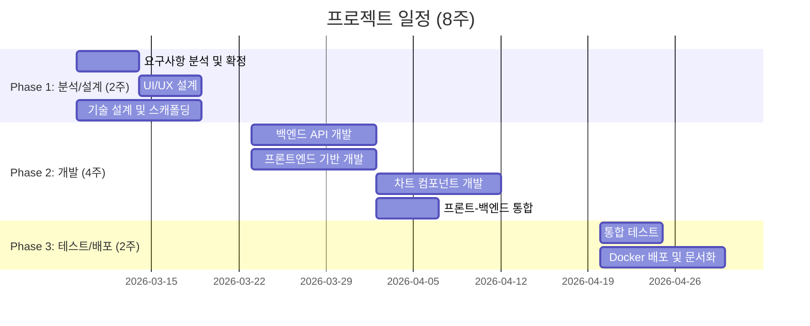

# 시스템 모니터링 웹 대시보드 제안서

**제안사**: PRD Generator
**수신**: 귀사 귀중
**제안일**: 2026-03-05
**버전**: 1.0

---

## 1. 경영진 요약 (Executive Summary)

### 한눈에 보는 프로젝트

| 항목 | 내용 |
|------|------|
| **해결할 문제** | 시스템 리소스 상태를 실시간으로 파악할 수 없어 장애 대응이 늦어지고, 성능 병목을 사전에 감지하지 못함 |
| **우리의 솔루션** | CPU, 메모리, 디스크, 네트워크를 3초 간격으로 실시간 시각화하는 경량 웹 대시보드 |
| **예상 기간** | 2개월 (8주) |
| **투입 공수** | 4.0 Man-Months |
| **핵심 기대효과** | 시스템 이상 징후 감지 시간 80% 단축 (분 단위 → 초 단위) |

> **왜 지금 해야 하는가?**
> 시스템 장애는 예고 없이 찾아옵니다. 터미널 명령어로 확인하는 방식은 문제가 이미 발생한 후에야 인지하게 합니다. 지금 대시보드를 구축하면, 장애가 발생하기 전에 징후를 포착하고 선제 대응할 수 있습니다.

---

## 2. 현재 상황: 왜 변화가 필요한가?

### 2.1 현재의 도전과 고통

| 문제 영역 | 현상 | 비즈니스 영향 |
|----------|------|--------------|
| 모니터링 사각지대 | 터미널 기반 도구(top, htop)로 수동 확인, 상시 모니터링 불가 | 장애 인지까지 평균 5~10분 소요, 서비스 중단 시간 증가 |
| 시각화 부재 | 텍스트 기반 수치만 확인, 추세 파악 불가 | CPU 스파이크, 메모리 누수 등 패턴 기반 이상 감지 불가능 |
| 접근성 한계 | 서버에 SSH 접속해야만 확인 가능 | 비개발 인력(PM, 관리자)의 시스템 현황 파악 불가 |
| 복잡한 도구 | 엔터프라이즈 모니터링 도구는 설정이 복잡하고 비용이 높음 | 소규모 팀에서 도입 부담, 학습 비용 발생 |

### 2.2 변화하지 않으면?

> ⚠️ 현재 방식을 유지할 경우:
> - **장애 대응 지연**: 서버 과부하를 인지하지 못해 서비스 장애가 반복되고, 복구 시간이 길어집니다
> - **디스크 공간 고갈 리스크**: 디스크 사용량을 주기적으로 확인하지 않아 예기치 않은 서비스 중단이 발생합니다
> - **비효율적 리소스 운영**: 리소스 사용 패턴을 분석할 수 없어, 과잉 또는 부족 프로비저닝이 반복됩니다

### 2.3 변화했을 때의 미래

> ✨ 프로젝트 성공 후 모습:
> - **브라우저만 열면 한눈에**: 사무실 어디서든 브라우저를 열면 서버 상태가 한눈에 들어옵니다. CPU가 80%를 넘으면 차트 색상이 즉시 경고합니다.
> - **팀 전체가 같은 그림을 봅니다**: 개발자뿐 아니라 PM, 관리자 모두가 실시간 시스템 현황을 공유하며, 의사결정 속도가 빨라집니다.
> - **퇴근 후에도 안심**: 대시보드를 켜두면 3초마다 시스템을 지켜보고 있어, 이상 징후를 놓치지 않습니다.

---

## 3. 목표와 성공 기준

### 3.1 프로젝트 목표

| 구분 | 목표 | 성공 기준 | 측정 방법 |
|------|------|----------|----------|
| 🎯 핵심 목표 | 4대 시스템 리소스 실시간 모니터링 | CPU, 메모리, 디스크, 네트워크 4종 차트 모두 정상 동작 | 대시보드 기능 테스트 |
| 📊 성능 목표 | 3초 간격 실시간 데이터 갱신 | 갱신 주기 3초 이내 달성률 99% 이상 | 자동화 성능 테스트 |
| 🎨 UX 목표 | 직관적인 다크 테마 대시보드 | 페이지 로딩 2초 이내, 차트 렌더링 500ms 이내 | Lighthouse 측정 |
| 📱 접근성 목표 | 다양한 화면에서 활용 가능 | 1024px 이상 화면에서 모든 차트 정상 표시 | 반응형 테스트 |

### 3.2 성공 KPI

- **이상 징후 감지 시간**: 현재 5~10분 → 목표 3초 이내 (감지 시간 **97% 단축**)
- **모니터링 접근성**: 현재 SSH 필요 → 목표 브라우저만으로 접근 (**접근 장벽 제거**)
- **데이터 갱신 주기**: 현재 수동 확인 → 목표 3초 자동 갱신 (**완전 자동화**)
- **모니터링 커버리지**: 현재 부분적 → 목표 4대 리소스 100% 커버 (**가시성 확보**)

---

## 4. 우리의 솔루션

### 4.1 솔루션 개요

브라우저만 열면 서버 상태가 한눈에 보이는 **경량 실시간 모니터링 대시보드**를 구축합니다.

4개의 시각화 패널이 하나의 화면에 배치되어, CPU 부하 추이, 메모리 사용 현황, 디스크 잔여 공간, 네트워크 트래픽을 동시에 모니터링합니다. 별도 프로그램 설치 없이 웹 브라우저만으로 접근하며, 다크 테마로 장시간 모니터링 시 눈의 피로를 줄입니다.

### 4.2 작업 범위

#### 포함 범위 (In-Scope)

| 구분 | 내용 | 고객 가치 |
|------|------|----------|
| CPU 모니터링 | 실시간 라인 차트, 시간축 트렌드 | 과부하 패턴 즉시 파악 |
| 메모리 모니터링 | 실시간 라인 차트, 전체 대비 사용량 | 메모리 누수 사전 감지 |
| 디스크 모니터링 | 파이 차트, 드라이브별 사용/잔여 | 디스크 공간 고갈 예방 |
| 네트워크 모니터링 | IN/OUT 구분 실시간 차트 | 비정상 트래픽 감지 |
| 실시간 갱신 | 3초 간격 자동 데이터 갱신 | 상시 최신 정보 유지 |
| 다크 테마 UI | 어두운 배경, 최적화된 색상 | 장시간 사용 시 눈 피로 감소 |
| 반응형 레이아웃 | 2x2 그리드, 화면 크기 자동 조정 | 다양한 디바이스에서 활용 |
| Docker 배포 | Docker Compose 기반 원클릭 배포 | 간편한 설치 및 운영 |

#### 제외 범위 (Out of Scope)

> - **사용자 인증/권한 관리** - 사유: 로컬 전용 시스템으로 내부 네트워크에서만 접근
> - **원격 서버 모니터링** - 사유: 1차 버전은 로컬 서버에 집중, 향후 확장 가능
> - **알림/경고 시스템** - 사유: 시각적 모니터링에 집중, 2차 버전에서 검토
> - **히스토리 데이터 저장** - 사유: 실시간 스냅샷 중심, 데이터 저장은 향후 확장
> - **프로세스별 상세 모니터링** - 사유: 시스템 레벨 리소스에 집중
> - **로그 수집/분석** - 사유: 별도 도메인, 전문 도구(ELK 등) 활용 권장

---

## 5. 어떻게 만드는가: 기술 접근법

### 5.1 시스템 아키텍처

**2계층 클라이언트-서버 아키텍처**를 채택하여 단순하면서도 안정적인 구조를 구현합니다.

```
┌─────────────────────────────────────┐
│          Browser (React App)        │
│  ┌─────┐ ┌─────┐ ┌─────┐ ┌─────┐  │
│  │ CPU │ │ MEM │ │DISK │ │ NET │  │
│  └──┬──┘ └──┬──┘ └──┬──┘ └──┬──┘  │
│     └───────┴───────┴───────┘      │
│           Polling (3초 간격)        │
└──────────────┬──────────────────────┘
               │ REST API (JSON)
┌──────────────▼──────────────────────┐
│       Backend (FastAPI + psutil)    │
│       시스템 메트릭 수집 및 API 제공  │
└──────────────┬──────────────────────┘
               │ psutil
┌──────────────▼──────────────────────┐
│         Operating System            │
│    CPU / Memory / Disk / Network    │
└─────────────────────────────────────┘
```

### 5.2 기술 스택

| 구분 | 기술 | 왜 이 기술인가? |
|------|------|----------------|
| 프론트엔드 | React 18 + TypeScript | 컴포넌트 기반 UI로 차트 4종을 독립적으로 관리하며, 빠른 렌더링 보장 |
| 차트 라이브러리 | Recharts 2.x | React 네이티브 차트 라이브러리로 라인/파이 차트를 손쉽게 구현 |
| 빌드 도구 | Vite 5.x | 빠른 개발 서버 시작과 번들링으로 개발 생산성 극대화 |
| 백엔드 | FastAPI (Python 3.11+) | 비동기 고성능 API 서버, 자동 API 문서 생성으로 유지보수 용이 |
| 시스템 정보 | psutil 5.9+ | 크로스 플랫폼 시스템 메트릭 수집, Python 표준 라이브러리급 안정성 |
| 배포 | Docker + Docker Compose | `docker compose up` 한 줄로 전체 시스템 실행, 환경 일관성 보장 |

---

## 6. 언제 완료되는가: 일정 계획

### 6.1 전체 일정



### 6.2 마일스톤

| 마일스톤 | 완료 예정일 | 주요 산출물 | 고객 확인 포인트 |
|----------|-----------|------------|-----------------|
| M0: 설계 완료 | 2026-03-20 (W2) | 요구사항 명세서, 와이어프레임, API 설계서 | 설계 리뷰 미팅 |
| M1: 백엔드 API 완성 | 2026-04-03 (W4) | 시스템 메트릭 API 5개 엔드포인트 | API 동작 데모 |
| M2: 대시보드 완성 | 2026-04-17 (W6) | 4개 차트 + 다크 테마 + 반응형 레이아웃 | 대시보드 데모 |
| M3: 프로젝트 완료 | 2026-05-01 (W8) | Docker 배포 패키지, 사용자 가이드 | 최종 인수 테스트 |

---

## 7. 누가 만드는가: 프로젝트 팀

### 7.1 역할별 구성

| 역할 | 인원 | 핵심 역량 | 투입 기간 |
|------|------|----------|----------|
| PM/PL | 1명 | 프로젝트 관리, 요구사항 분석, 품질 관리 | W1~W8 (전 기간) |
| 프론트엔드 개발자 | 1명 | React, TypeScript, Recharts, 반응형 UI | W1~W8 |
| 백엔드 개발자 | 1명 | Python, FastAPI, psutil, Docker | W1~W8 |
| UI/UX 디자이너 | 0.5명 | 다크 테마 디자인, 대시보드 레이아웃, 데이터 시각화 | W1~W2 |
| QA 엔지니어 | 0.5명 | 기능/성능/호환성 테스트, 자동화 테스트 | W7~W8 |

### 7.2 공수 요약

| 구분 | 공수 (M/D) | 공수 (M/M) | 비율 |
|------|-----------|-----------|------|
| 분석/설계 | 12.0 | 0.6 | 18% |
| 개발 | 31.0 | 1.6 | 47% |
| 테스트 | 10.0 | 0.5 | 15% |
| 배포/문서화 | 6.0 | 0.3 | 9% |
| 프로젝트 관리 | 7.0 | 0.4 | 11% |
| **소계** | **66.0** | **3.3** | 100% |
| 버퍼 (20%) | 13.2 | 0.7 | - |
| **총계** | **79.2** | **4.0** | - |

---

## 8. 리스크 관리: 우리의 대비책

| 리스크 | 영향도 | 우리의 대응 | 고객 협조 사항 |
|--------|-------|------------|---------------|
| 요구사항 변경 (미해결 사항 5건) | HIGH | Phase 1에서 전체 미해결 사항 조기 확정, 변경 시 영향 분석 | 미해결 사항 의사결정 참여 |
| 프론트엔드 차트 성능 이슈 | MEDIUM | 데이터 포인트 60개 제한, React.memo 최적화, 성능 모니터링 | 성능 기준 사전 합의 |
| OS별 psutil 동작 차이 | MEDIUM | 타겟 OS 확정 후 집중 테스트, OS별 분기 처리 | 운영 환경 OS 정보 제공 |
| 팀원 가용성 변동 | MEDIUM | 20% 공수 버퍼 확보, 크리티컬 패스 작업 우선 배정 | - |
| CORS 설정으로 인한 API 통신 이슈 | LOW | 개발 초기 CORS 설정 검증, Vite proxy 대안 보유 | - |

---

## 9. 전제 조건

**고객 협조 사항**
- Phase 1 설계 리뷰 및 미해결 사항 의사결정 참여 (UNR-001~005)
- 대시보드가 실행될 서버 환경 정보 제공 (OS, 사양)
- 마일스톤별 인수 확인 및 피드백 (M0, M1, M2, M3)

**외부 의존성**
- 오픈소스 라이브러리 안정 버전 유지 (React 18, FastAPI, psutil, Recharts)
- 서버에 Python 3.11+ 및 Node.js 18+ 실행 환경 (Docker 사용 시 불필요)

---

## 10. 기대 효과: 프로젝트 성공 후 모습

### 10.1 정량적 효과

| 지표 | Before | After | 개선 효과 |
|------|--------|-------|----------|
| 이상 징후 감지 시간 | 5~10분 (수동 확인) | 3초 (실시간 차트) | **97% 단축** |
| 모니터링 접근 방식 | SSH 터미널 접속 필요 | 웹 브라우저만으로 접근 | **접근 장벽 제거** |
| 모니터링 커버리지 | 부분적, 비정기적 | CPU/메모리/디스크/네트워크 100% | **완전한 가시성** |
| 데이터 갱신 주기 | 수동 (필요 시) | 3초 자동 갱신 | **완전 자동화** |
| 모니터링 학습 비용 | CLI 명령어 숙지 필요 | 학습 불필요 (직관적 차트) | **즉시 활용 가능** |

### 10.2 정성적 효과

- **팀 전체의 공통 시각**: 개발자, PM, 관리자 모두가 같은 대시보드를 보며 시스템 상태를 공유합니다. "서버 상태가 어떤가요?"라는 질문에 URL 하나로 답합니다.
- **선제적 운영 문화**: 사후 대응에서 사전 예방으로 운영 문화가 전환됩니다. 차트의 추세를 보고 문제가 발생하기 전에 조치할 수 있습니다.
- **운영 자신감 향상**: 시스템 상태를 항상 파악하고 있다는 확신이 팀의 운영 자신감을 높이고, 더 과감한 배포와 실험을 가능하게 합니다.
- **확장 가능한 기반**: 1차 버전 완성 후 알림 기능, 원격 서버 모니터링, 히스토리 분석 등으로 자연스럽게 확장할 수 있는 아키텍처 기반을 확보합니다.

---

## 11. 다음 단계: 함께 시작합시다

| 단계 | 내용 | 예상 기간 |
|------|------|----------|
| 1️⃣ | 제안서 검토 및 Q&A 세션 | 1주 |
| 2️⃣ | 세부 요구사항 협의 (미해결 사항 확정) | 1주 |
| 3️⃣ | 계약 체결 및 환경 준비 | 1주 |
| 4️⃣ | 킥오프 미팅 (팀 소개, 일정 확정) | 1일 |
| 5️⃣ | **프로젝트 착수** 🚀 | 2026-03-09 |

> 💬 **문의 및 연락**
> 본 제안서에 대한 질문이나 추가 논의가 필요하시면 언제든 연락해 주세요.
> 귀사의 시스템 운영이 한 단계 도약하는 여정에 함께하겠습니다.

---
*본 제안서는 PRD Generator에서 작성하였습니다.*
