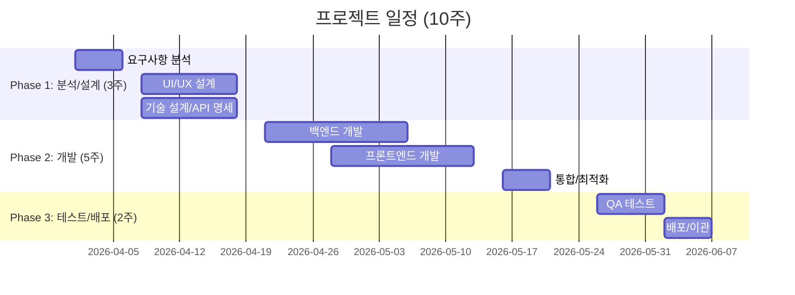

# 시스템 모니터링 웹 대시보드 제안서

**제안사**: D'Maker AI Solutions
**수신**: 귀사 귀중
**제안일**: 2026-03-24
**버전**: 1.0

---

## 1. 경영진 요약 (Executive Summary)

### 한눈에 보는 프로젝트

| 항목 | 내용 |
|------|------|
| **해결할 문제** | 서버 장애를 사후에 인지하여 대응이 늦어지고, 리소스 병목 원인 파악에 시간을 낭비하고 있습니다 |
| **우리의 솔루션** | 브라우저 하나로 CPU·메모리·디스크·네트워크를 3초마다 실시간 확인하는 모니터링 대시보드 |
| **예상 기간** | 2.5개월 (10주) |
| **투입 공수** | 5.5 Man-Months |
| **핵심 기대효과** | 장애 인지 시간 90% 단축 (수십 분 → 3초) |

> **왜 지금 해야 하는가?**
> 서버 장애가 발생할 때마다 SSH 접속과 수동 명령어로 상태를 확인하는 방식은, 문제를 인지하는 데만 수분에서 수십 분이 걸립니다. 이 시간이 곧 서비스 다운타임이고, 다운타임은 곧 비용입니다. 실시간 모니터링 대시보드는 이 지연을 0에 가깝게 줄여, 운영 품질을 근본적으로 개선합니다.

---

## 2. 현재 상황: 왜 변화가 필요한가?

### 2.1 현재의 도전과 고통

| 문제 영역 | 현상 | 비즈니스 영향 |
|----------|------|--------------|
| 장애 인지 지연 | SSH 접속 → top/free/df 명령어 수동 실행 | 장애 대응 시간 증가, 서비스 가용성 저하 |
| 리소스 추이 미파악 | 순간 스냅샷만 확인 가능, 트렌드 분석 불가 | 예방 정비 불가, 반복적 장애 발생 |
| 분산된 모니터링 | CPU·메모리·디스크·네트워크를 각각 별도 명령어로 확인 | 전체 상황 파악에 시간 소모, 상관관계 분석 어려움 |
| 접근성 부족 | 서버 SSH 접근 권한이 있는 인력만 모니터링 가능 | 의사결정자·개발자가 실시간 상태 확인 불가 |

### 2.2 변화하지 않으면?

> 현재 방식을 유지할 경우:
> - **장애 대응 지연이 누적**되어, 고객 불만과 서비스 신뢰도 하락으로 이어집니다
> - **리소스 병목을 사전에 감지하지 못해**, 갑작스러운 서버 다운이 반복됩니다
> - **운영 인력이 단순 모니터링에 시간을 소모**하여, 핵심 업무에 집중하지 못합니다

### 2.3 변화했을 때의 미래

> 프로젝트 성공 후 모습:
> - **브라우저를 열면 서버 상태가 한눈에 보입니다.** CPU가 급등하는 순간을 실시간 라인 차트로 바로 포착하고, 디스크가 90%에 도달하기 전에 조치합니다
> - **누구나 접근 가능합니다.** SSH 없이도 운영자, 개발자, 관리자 모두가 웹 브라우저로 서버 상태를 확인합니다
> - **트렌드 분석이 가능합니다.** 최근 5분간의 추이를 보며 "이 패턴이면 곧 문제가 생기겠다"고 예측할 수 있습니다

---

## 3. 목표와 성공 기준

### 3.1 프로젝트 목표

| 구분 | 목표 | 성공 기준 | 측정 방법 |
|------|------|----------|----------|
| 핵심 목표 | 4종 리소스 실시간 시각화 | CPU·메모리·디스크·네트워크 차트 100% 구현 | 기능 테스트 체크리스트 |
| 성능 목표 | 준실시간 데이터 갱신 | 3초 간격 갱신 준수율 99% 이상 | 프론트엔드 타이머 모니터링 |
| UX 목표 | 직관적 대시보드 | 교육 없이 사용 가능, 2초 내 로딩 | Lighthouse 측정, 사용자 피드백 |
| 운영 목표 | 안정적 배포 | Docker 기반 원클릭 배포 | 배포 자동화 테스트 |

### 3.2 성공 KPI

- **장애 인지 시간**: 현재 5~30분 → 목표 **3초** (99% 이상 단축)
- **대시보드 로딩**: 목표 **2초 이내**
- **API 응답 시간**: 목표 **200ms 이내** (p95)
- **운영 접근성**: SSH 필요 → **웹 브라우저만으로 접근** (접근 가능 인원 3배 이상 증가)

---

## 4. 우리의 솔루션

### 4.1 솔루션 개요
웹 브라우저 하나로 서버의 모든 핵심 리소스를 실시간으로 모니터링하는 대시보드를 구축합니다. 3초마다 자동으로 갱신되는 4종 차트(CPU 라인, 메모리 라인, 디스크 파이, 네트워크 라인)와 다크 테마 기반의 직관적 UI로, 별도 교육 없이 누구나 서버 상태를 한눈에 파악할 수 있습니다.

### 4.2 작업 범위

#### 포함 범위 (In-Scope)
| 구분 | 내용 | 고객 가치 |
|------|------|----------|
| CPU 모니터링 | 실시간 라인 차트, 시간축 트렌드 | 부하 급등 즉시 감지 |
| 메모리 모니터링 | 라인 차트 + 전체/사용량 표시 | 메모리 부족 사전 예방 |
| 디스크 모니터링 | 파이 차트, 드라이브별 사용량 | 디스크 풀 장애 방지 |
| 네트워크 모니터링 | IN/OUT 트래픽 구분 차트 | 이상 트래픽 즉시 발견 |
| 실시간 갱신 | 3초 자동 폴링, 에러 재시도 | 끊김 없는 연속 모니터링 |
| 다크 테마 UI | 반응형 그리드, 데스크톱/태블릿 | 장시간 모니터링 시 눈 피로 감소 |
| 백엔드 API | REST API (FastAPI+psutil) | 안정적 데이터 수집 |
| Docker 배포 | docker-compose 원클릭 배포 | 환경 독립적, 빠른 설치 |

#### 제외 범위 (Out of Scope)
> - 알림/경고 시스템 (이메일, SMS, Slack) - 사유: 2차 버전에서 확장 가능
> - 히스토리 데이터 저장 (DB 연동) - 사유: 현재 실시간 모니터링에 집중
> - 다중 서버 모니터링 - 사유: 1차 버전은 단일 서버 대상
> - 사용자 인증/권한 관리 - 사유: 내부 네트워크 사용 전제

---

## 5. 어떻게 만드는가: 기술 접근법

### 5.1 시스템 아키텍처

2-Tier 모놀리식 아키텍처로, 복잡한 인프라 없이 빠르게 구축하고 쉽게 유지보수할 수 있습니다.

```
┌──────────────────────────────────┐
│         Client (Browser)          │
│   React + Recharts 대시보드       │
│   3초 간격 자동 폴링              │
└────────────┬─────────────────────┘
             │ HTTP GET /api/v1/system/stats
┌────────────┴─────────────────────┐
│           Nginx                   │
│   / → React 정적 파일             │
│   /api → FastAPI 백엔드           │
└────────────┬─────────────────────┘
             │
┌────────────┴─────────────────────┐
│      FastAPI + psutil             │
│   SystemCollector (데이터 수집)    │
│   RingBuffer (최근 5분 캐시)      │
└──────────────────────────────────┘
```

### 5.2 기술 스택

| 구분 | 기술 | 왜 이 기술인가? |
|------|------|----------------|
| 프론트엔드 | React 18 + TypeScript | 컴포넌트 재사용으로 빠른 개발, 타입 안정성으로 버그 최소화 |
| 차트 | Recharts 2.x | React 네이티브 통합, 선언적 API로 복잡한 차트도 빠르게 구현 |
| 백엔드 | FastAPI + Python | 비동기 처리로 다수 동시 요청 처리, 자동 API 문서 생성 |
| 시스템 수집 | psutil 6.x | 크로스 플랫폼 지원, Linux/macOS/Windows 어디서나 동작 |
| 배포 | Docker + Nginx | 원클릭 배포, 환경 의존성 제거, 어디서나 동일하게 동작 |

### 5.3 기술적 차별점

- **인메모리 Ring Buffer**: DB 없이 최근 5분 데이터를 메모리에서 직접 제공하여 응답 시간 200ms 이내 달성
- **네트워크 delta 계산**: psutil의 누적 카운터를 초당 전송량으로 자동 변환
- **Graceful Fallback**: API 장애 시 이전 데이터 유지 + 자동 재연결

---

## 6. 언제 완료되는가: 일정 계획

### 6.1 전체 일정



### 6.2 마일스톤

| 마일스톤 | 완료 예정일 | 주요 산출물 | 고객 확인 포인트 |
|----------|-----------|------------|-----------------|
| M1: 설계 완료 | 2026-04-18 | 요구사항 정의서, 화면설계서, API 명세서 | 화면 설계 리뷰 및 승인 |
| M2: 개발 완료 | 2026-05-23 | 동작하는 대시보드 (통합 빌드) | 중간 데모 및 피드백 |
| M3: 배포 완료 | 2026-06-06 | Docker 이미지, 운영 가이드 | 인수 테스트 및 최종 승인 |

---

## 7. 누가 만드는가: 프로젝트 팀

### 7.1 역할별 구성

| 역할 | 인원 | 핵심 역량 | 투입 기간 |
|------|------|----------|----------|
| PM/PL | 1명 | 요구사항 관리, 일정/리스크 관리, 고객 커뮤니케이션 | 전 기간 (10주) |
| 프론트엔드 개발자 | 1명 | React, TypeScript, Recharts, 반응형 UI | W4~W10 (7주) |
| 백엔드 개발자 | 1명 | Python, FastAPI, psutil, Docker | W2~W10 (9주) |
| UI/UX 디자이너 | 0.5명 | 와이어프레임, 다크 테마, 대시보드 UX | W2~W3 (2주) |
| QA 엔지니어 | 0.5명 | 기능/성능/호환성 테스트 | W3, W9~W10 (3주) |

### 7.2 공수 요약

| 구분 | 공수 (M/M) | 비율 |
|------|-----------|------|
| 분석/설계 | 0.7 M/M | 12.7% |
| 백엔드 개발 | 0.6 M/M | 10.9% |
| 프론트엔드 개발 | 0.85 M/M | 15.5% |
| 통합/최적화 | 0.35 M/M | 6.4% |
| 테스트 | 0.6 M/M | 10.9% |
| 배포/이관 | 0.4 M/M | 7.3% |
| 프로젝트 관리 | 0.5 M/M | 9.1% |
| 버퍼 (20%) | 0.8 M/M | 14.5% |
| 리스크 대응 | 0.7 M/M | 12.7% |
| **총계** | **5.5 M/M** | **100%** |

---

## 8. 리스크 관리: 우리의 대비책

| 리스크 | 영향도 | 우리의 대응 | 고객 협조 사항 |
|--------|-------|------------|---------------|
| 고객 요구사항 변경 | HIGH | 20% 버퍼 확보 + 스프린트 단위 고객 리뷰 | 변경 요청은 스프린트 리뷰 시 전달 |
| psutil OS 호환성 이슈 | MEDIUM | W1에 대상 OS PoC 실시, graceful fallback 구현 | 대상 서버 OS 정보 사전 제공 |
| 장시간 운영 시 메모리 누수 | MEDIUM | Ring Buffer 패턴 + 24시간 안정성 테스트 | 테스트 서버 환경 제공 |
| 크로스 브라우저 호환성 | LOW | W9 크로스 브라우저 테스트 (Chrome, Firefox, Safari, Edge) | 사용 브라우저 목록 확인 |

---

## 9. 전제 조건

**고객 협조 사항**
- 대상 서버의 OS 종류 및 버전 정보 제공 (W1까지)
- 테스트 서버 환경 접근 권한 제공 (W4까지)
- 화면 설계 리뷰 참여 및 승인 (M1 시점)
- 중간 데모 참석 및 피드백 제공 (M2 시점)
- 인수 테스트 참여 및 최종 승인 (M3 시점)

**외부 의존성**
- Docker 27.x 실행 가능한 서버 환경 (2 vCPU, 4GB RAM 이상)
- 서버에서 포트 80 (HTTP) 접근 가능
- 대상 서버에서 psutil이 시스템 정보를 수집할 수 있는 권한

---

## 10. 기대 효과: 프로젝트 성공 후 모습

### 10.1 정량적 효과

| 지표 | Before | After | 개선 효과 |
|------|--------|-------|----------|
| 장애 인지 시간 | 5~30분 (SSH 접속 후 수동 확인) | 3초 (대시보드 자동 갱신) | **99% 단축** |
| 리소스 확인 접근성 | SSH 권한자 1~2명 | 브라우저 접근 가능한 전 인원 | **접근 인원 5배 증가** |
| 모니터링 도구 수 | 4개 이상 (top, free, df, ifstat) | 1개 (웹 대시보드) | **통합 모니터링** |
| 트렌드 분석 | 불가능 (순간 스냅샷만) | 최근 5분 트렌드 실시간 제공 | **예방 정비 가능** |

### 10.2 정성적 효과

- **운영 효율 향상**: 단순 모니터링에 소모하던 시간을 핵심 업무에 집중할 수 있습니다
- **빠른 의사결정**: 경영진과 개발팀이 동일한 데이터를 실시간으로 공유하여, 리소스 증설·최적화 결정을 즉시 내릴 수 있습니다
- **확장 기반 마련**: 1차 버전 완료 후, 알림 시스템·다중 서버·히스토리 DB 등으로 점진적 확장이 가능합니다
- **팀 역량 강화**: React+FastAPI+Docker 기반의 현대적 기술 스택 경험이 조직에 축적됩니다

---

## 11. 다음 단계: 함께 시작합시다

| 단계 | 내용 | 예상 기간 |
|------|------|----------|
| 1단계 | 제안서 검토 및 Q&A | 1주 |
| 2단계 | 기술 범위 세부 협의 및 대상 서버 환경 확인 | 1주 |
| 3단계 | 계약 체결 | 1주 |
| 4단계 | 킥오프 미팅 (양사 참여) | - |
| 5단계 | **프로젝트 착수** | 2026-04-01 |

> 서버가 말을 걸기 시작합니다. 3초마다, 쉬지 않고.
> 우리가 만드는 대시보드는 귀사의 서버가 운영자에게 자신의 상태를 실시간으로 알려주는 창입니다.
> **함께 시작하겠습니다.**

---
*본 제안서는 D'Maker AI Solutions에서 작성하였습니다.*
