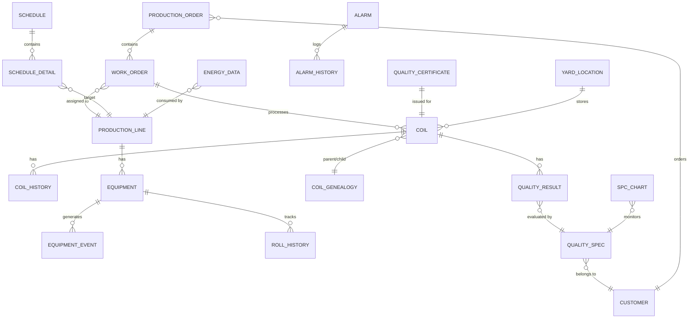

# 냉연 통합 MES/APS 시스템 (Project NEXUS) TRD (Technical Requirements Document)

**버전**: 1.0
**작성일**: 2026-02-06
**기반 PRD**: PRD-20260206-093046
**프로젝트 도메인**: 산업/IoT 시스템 (주) + 웹 애플리케이션 (보조)
**상태**: Draft

---

## 1. 기술 요약 (Executive Summary)

Project NEXUS는 냉연 공장의 MES(제조실행시스템)와 APS(고급계획스케줄링)를 단일 통합 플랫폼으로 재구축하는 PI(프로세스 혁신) 프로젝트이다. 9개 생산라인(PCM, BAF, CAL, EGL, CGL, SPM, RCL, SL, CCL)에서 발생하는 약 7,200개 OPC-UA 태그 데이터를 1초 주기로 수집하고, 15개 냉연 특화 제약조건을 반영한 APS 엔진으로 최적 생산계획을 수립하며, 코일 단위 전 공정 추적·품질 관리·설비 관리를 통합 제공한다.

기술 아키텍처는 마이크로서비스(MSA) + 이벤트 드리븐 아키텍처(EDA) 기반 하이브리드 클라우드로 설계한다. 실시간 데이터 수집·MES 트랜잭션·APS 엔진은 OT 네트워크 지연 최소화와 보안을 위해 On-premise(Kubernetes/Rancher)에 배치하고, BI/분석·리포팅·DR 환경은 클라우드(AWS EKS)로 이관한다. Apache Kafka를 중앙 이벤트 버스로 활용하여 서비스 간 느슨한 결합을 실현하고, Kong API Gateway로 내외부 인터페이스를 통합 관리한다.

Backend는 Java(Spring Boot)로 MES 핵심 트랜잭션을, Python으로 APS 엔진 및 AI/ML 관련 모듈을 구현한다. Frontend는 React + TypeScript 기반 SPA로, 현장 터치스크린(48px 버튼, 다크 모드)과 사무실 듀얼 모니터 환경을 모두 지원한다. 데이터베이스는 PostgreSQL(트랜잭션)과 TimescaleDB(시계열 태그 데이터)를 이중으로 운영하며, 일일 2TB의 데이터 처리와 500만 건의 트랜잭션을 수용한다.

---

## 2. 기술 스택 (Technology Stack)

### 2.1 Backend

| 구분 | 기술 | 버전 | 선정 사유 |
|------|------|------|----------|
| MES Core | Java + Spring Boot | Java 17 LTS, Spring Boot 3.2 | 대규모 트랜잭션 안정성, 엔터프라이즈 생태계, SAP RFC/BAPI 연동 용이 |
| APS Engine | Python | 3.11+ | 최적화 라이브러리(OR-Tools, scipy) 풍부, 휴리스틱/메타휴리스틱 알고리즘 구현 용이 |
| API Framework | Spring WebFlux + FastAPI | - | 리액티브 비동기 처리(WebFlux), Python 서비스용 고성능 REST(FastAPI) |
| Message Broker | Apache Kafka | 3.6 | 이벤트 드리븐 아키텍처 중심, 높은 처리량(일 500만건+), 내장 파티셔닝/복제 |
| API Gateway | Kong | 3.5 | 플러그인 기반 확장, OAuth 2.0/Rate Limiting/Circuit Breaker 내장 |
| OPC-UA Client | Eclipse Milo | 0.6.x | Java 기반 OPC-UA 클라이언트, 이벤트 구독/발행 지원 |

### 2.2 Frontend

| 구분 | 기술 | 버전 | 선정 사유 |
|------|------|------|----------|
| Framework | React | 18.x | 컴포넌트 기반 UI, 대규모 상태 관리, 생태계 풍부 |
| Language | TypeScript | 5.x | 타입 안전성, 대규모 팀 협업, IDE 지원 |
| 상태관리 | Zustand + React Query | - | 경량 전역 상태(Zustand), 서버 상태 캐싱(React Query) |
| 차트/시각화 | Apache ECharts + D3.js | - | 대용량 실시간 차트(ECharts), 커스텀 시각화(D3) |
| Gantt Chart | DHTMLX Gantt | 8.x | 드래그&드롭, 크리티컬 패스, 리소스 뷰 지원 |
| UI 프레임워크 | Ant Design | 5.x | 엔터프라이즈급 컴포넌트, 테이블/폼 강력, 다크 모드 |
| PWA | Workbox | 7.x | 모바일 오프라인 캐싱, 푸시 알림 |
| 데이터 그리드 | AG Grid Enterprise | 31.x | 대용량 데이터 처리, 필터/정렬/그룹핑/피벗 |

### 2.3 Database

| 구분 | 기술 | 버전 | 선정 사유 |
|------|------|------|----------|
| RDBMS | PostgreSQL | 16 | ACID 보장, 파티셔닝, JSON 지원, 높은 동시성 |
| 시계열 DB | TimescaleDB | 2.x | PostgreSQL 확장, 시계열 특화 압축·집계, 7200 태그 1초 주기 최적 |
| 캐시 | Redis | 7.x | 세션 관리, 실시간 대시보드 캐싱, 비상 모드 로컬 캐시 동기화 |
| 검색/로그 | Elasticsearch | 8.x | 감사 로그 검색, 클레임 역추적(30분), 전문 검색 |
| 메시지 큐 | Apache Kafka | 3.6 | 이벤트 소싱, CQRS 패턴, 서비스 간 비동기 통신 |

### 2.4 Infrastructure

| 구분 | 기술 | 버전 | 선정 사유 |
|------|------|------|----------|
| Container Orchestration (On-prem) | Kubernetes + Rancher | K8s 1.29, Rancher 2.8 | On-premise 클러스터 관리, 멀티 클러스터 |
| Container Orchestration (Cloud) | AWS EKS | - | 클라우드 관리형 K8s, BI/DR 환경 |
| CI/CD | GitLab CI + ArgoCD | - | GitOps 워크플로우, 무중단 배포(Blue-Green/Canary) |
| Monitoring | Grafana + Prometheus | - | 메트릭 수집(Prometheus), 시각화·알림(Grafana) |
| Logging | EFK (Elasticsearch + Fluentd + Kibana) | - | 분산 로그 수집·검색·시각화 |
| Tracing | Jaeger | - | 분산 트레이싱, MSA 서비스 간 지연 분석 |
| IaC | Terraform + Ansible | - | 인프라 코드화, 환경 일관성 |
| Container Registry | Harbor | - | On-premise 프라이빗 레지스트리, 보안 스캔 |

### 2.5 보안

| 구분 | 기술 | 버전 | 선정 사유 |
|------|------|------|----------|
| 인증/인가 | Keycloak | 23.x | OAuth 2.0/OIDC, RBAC, SSO, LDAP/AD 연동 |
| 암호화 (전송) | TLS 1.3 | - | 전송 구간 암호화 표준 |
| 암호화 (저장) | AES-256 | - | 저장 데이터 암호화 |
| 시크릿 관리 | HashiCorp Vault | - | 비밀번호·인증서·API 키 중앙 관리 |
| 네트워크 보안 | Data Diode + Firewall | - | OT/IT 단방향 통신, DMZ 구성 |

---

## 3. 시스템 아키텍처 (System Architecture)

### 3.1 전체 아키텍처

**아키텍처 스타일**: 마이크로서비스(MSA) + 이벤트 드리븐 아키텍처(EDA) + 하이브리드 클라우드

```
┌─────────────────────────────────────────────────────────────────────────────┐
│                           [Cloud - AWS EKS]                                 │
│  ┌──────────┐  ┌──────────┐  ┌──────────┐  ┌──────────┐                   │
│  │ BI/분석   │  │ 리포팅    │  │ DR 환경   │  │ Dev/Test  │                   │
│  │ Platform  │  │ Service   │  │ (Standby) │  │ 환경      │                   │
│  └──────────┘  └──────────┘  └──────────┘  └──────────┘                   │
└──────────────────────────┬──────────────────────────────────────────────────┘
                           │ VPN / Direct Connect
┌──────────────────────────┴──────────────────────────────────────────────────┐
│                      [On-Premise - Kubernetes/Rancher]                       │
│                                                                              │
│  ┌─────────────────────────────────────────────────────────────────────┐    │
│  │                    Kong API Gateway (DMZ)                            │    │
│  └───────────┬─────────────┬──────────────┬────────────┬───────────────┘    │
│              │             │              │            │                     │
│  ┌───────────▼──┐ ┌───────▼────┐ ┌───────▼────┐ ┌────▼────────┐           │
│  │ APS Service  │ │ MES Service │ │ Quality    │ │ Equipment   │           │
│  │ (Python)     │ │ (Java/SB)   │ │ Service    │ │ Service     │           │
│  │ ┌──────────┐ │ │ ┌─────────┐│ │ (Java/SB)  │ │ (Java/SB)   │           │
│  │ │Scheduler │ │ │ │WorkOrder││ │ ┌─────────┐│ │ ┌──────────┐│           │
│  │ │Engine    │ │ │ │Manager  ││ │ │SPC      ││ │ │OEE Calc  ││           │
│  │ ├──────────┤ │ │ ├─────────┤│ │ ├─────────┤│ │ ├──────────┤│           │
│  │ │Constraint│ │ │ │Coil     ││ │ │Claim    ││ │ │Maint     ││           │
│  │ │Plugin    │ │ │ │Tracker  ││ │ │Tracer   ││ │ │Scheduler ││           │
│  │ ├──────────┤ │ │ ├─────────┤│ │ ├─────────┤│ │ ├──────────┤│           │
│  │ │Simulator │ │ │ │WIP      ││ │ │Cert Gen ││ │ │Roll Mgmt ││           │
│  │ └──────────┘ │ │ │Manager  ││ │ └─────────┘│ │ └──────────┘│           │
│  └──────────────┘ │ └─────────┘│ └────────────┘ └─────────────┘           │
│              │             │              │            │                     │
│  ┌───────────▼─────────────▼──────────────▼────────────▼───────────────┐    │
│  │              Apache Kafka (Event Bus)                                │    │
│  │  Topics: work-orders | coil-events | quality-events | equip-events  │    │
│  │          schedule-changes | alarms | audit-logs                      │    │
│  └───────────┬─────────────┬──────────────┬────────────────────────────┘    │
│              │             │              │                                  │
│  ┌───────────▼──┐ ┌───────▼────┐ ┌───────▼────────────────────┐           │
│  │ Dashboard   │ │ Notification│ │ Integration Service         │           │
│  │ Service     │ │ Service     │ │ ┌─────┐┌─────┐┌─────┐┌───┐│           │
│  │ (React SPA) │ │ (Push/Email)│ │ │ ERP ││LIMS ││ WMS ││EMS││           │
│  └──────────────┘ └─────────────┘ │ │Adapt││Adapt││Adapt││Ad.││           │
│                                    │ └─────┘└─────┘└─────┘└───┘│           │
│                                    └───────────────────────────┘           │
│                                                                              │
│  ┌──────────────────────────────────────────────────────────────────────┐   │
│  │                  Data Layer                                          │   │
│  │  ┌────────────┐ ┌──────────────┐ ┌─────────┐ ┌──────────────────┐  │   │
│  │  │PostgreSQL  │ │TimescaleDB   │ │ Redis   │ │ Elasticsearch    │  │   │
│  │  │(트랜잭션)  │ │(시계열 태그) │ │(캐시)   │ │(로그/검색)       │  │   │
│  │  └────────────┘ └──────────────┘ └─────────┘ └──────────────────┘  │   │
│  └──────────────────────────────────────────────────────────────────────┘   │
│                                                                              │
│  ┌──────────────────────────────────────────────────────────────────────┐   │
│  │              OT Network (DMZ 분리)                                   │   │
│  │  ┌─────────────┐                                                     │   │
│  │  │ OPC-UA GW   │ ← Data Diode → [Level 2: PLC/HMI/SIS]            │   │
│  │  │ (Eclipse    │   (단방향)       PCM(2500) CAL(1800) EGL(1200)     │   │
│  │  │  Milo)      │                  CGL(1500) SPM(200)  BAF 등        │   │
│  │  └─────────────┘                  Total: ~7,200 Tags                │   │
│  └──────────────────────────────────────────────────────────────────────┘   │
└──────────────────────────────────────────────────────────────────────────────┘
```

### 3.2 계층별 설명

| 계층 | 설명 | 핵심 컴포넌트 |
|------|------|-------------|
| Presentation Layer | 웹 기반 사용자 인터페이스 (SPA) | React SPA, PWA, 55" 현황판 UI, 모바일 KPI |
| API Gateway Layer | 인증/인가, 라우팅, Rate Limiting, Circuit Breaker | Kong API Gateway, Keycloak |
| Application Layer | 비즈니스 로직 (마이크로서비스) | APS Service, MES Service, Quality Service, Equipment Service, Dashboard Service, Notification Service, Integration Service |
| Event Bus Layer | 서비스 간 비동기 이벤트 통신 | Apache Kafka (7개 토픽), Schema Registry |
| Data Layer | 데이터 영속화 및 캐싱 | PostgreSQL, TimescaleDB, Redis, Elasticsearch |
| OT Integration Layer | Level 2 데이터 수집 및 제어 | OPC-UA Gateway (Eclipse Milo), Data Diode |
| Infrastructure Layer | 컨테이너 오케스트레이션 및 운영 | Kubernetes/Rancher, EKS, Grafana/Prometheus |

### 3.3 데이터 흐름

**실시간 데이터 수집 흐름**:
```
Level 2 (PLC/HMI) → OPC-UA Gateway (1초 주기) → Kafka [tag-data] → TimescaleDB
                                                       ↓
                                              Stream Processor → 이상치 감지 → Kafka [alarms]
                                                                                    ↓
                                                                           Notification Service → 푸시/이메일
                                                                                    ↓
                                                                           Dashboard (WebSocket)
```

**생산계획 수립 흐름**:
```
ERP (수주) → Integration Service → Kafka [order-events] → APS Service
                                                              ↓
                                                    제약조건 엔진 (15개)
                                                              ↓
                                                    최적 스케줄 산출
                                                              ↓
                                                    Kafka [schedule-changes]
                                                              ↓
                                                    MES Service (작업지시 생성)
                                                              ↓
                                                    현장 작업지시 큐
```

**코일 추적 흐름**:
```
RFID Reader (PCM/CAL) → OPC-UA GW → Kafka [coil-events] → Coil Tracker
Barcode Scanner (기타) → REST API → MES Service                ↓
                                                       PostgreSQL (이력)
                                                               ↓
                                                       Dashboard (실시간 위치)
```

### 3.4 배포 다이어그램

**On-Premise 환경** (Production):
- Kubernetes 클러스터: Master 3노드 + Worker 12노드 (HA)
- PostgreSQL: Primary + Standby (Streaming Replication)
- TimescaleDB: 전용 노드 3대 (시계열 데이터 전담)
- Kafka 클러스터: 3 Broker + 3 ZooKeeper (KRaft 전환 예정)
- Redis Sentinel: 3노드 HA
- Elasticsearch: 3노드 클러스터

**Cloud 환경** (AWS):
- EKS: BI/분석, 리포팅, Dev/Test
- RDS PostgreSQL: BI 데이터 마트 (야간 ETL)
- S3: 백업, 아카이브 (10년 보관)
- CloudFront + Route53: DR 전환

**네트워크 구성**:
- OT Network: Level 2 ↔ OPC-UA Gateway (Data Diode 단방향)
- IT Network: MES/APS 서비스 ↔ 사용자
- DMZ: Kong API Gateway, Keycloak
- Cloud VPN: On-premise ↔ AWS Direct Connect

---

## 4. 데이터베이스 설계 (Database Design)

### 4.1 데이터베이스 유형 및 엔진
- **주 DB (트랜잭션)**: PostgreSQL 16 — MES 핵심 트랜잭션, 마스터 데이터
- **시계열 DB**: TimescaleDB 2.x — OPC-UA 태그 데이터 (7,200태그 × 1초)
- **캐시**: Redis 7.x — 세션, 대시보드 실시간 캐시
- **검색 엔진**: Elasticsearch 8.x — 감사 로그, 클레임 역추적

### 4.2 엔티티 관계도 (ERD)



### 4.3 엔티티 명세

#### PRODUCTION_ORDER (생산 주문)
| 속성 | 타입 | 설명 |
|------|------|------|
| order_id | BIGINT PK | 생산 주문 ID (자동 증가) |
| erp_order_no | VARCHAR(20) | SAP 수주 번호 |
| customer_id | BIGINT FK | 고객 ID |
| steel_grade | VARCHAR(20) | 강종 코드 |
| target_thickness | DECIMAL(6,3) | 목표 두께 (mm) |
| target_width | DECIMAL(7,1) | 목표 폭 (mm) |
| target_weight | DECIMAL(10,1) | 목표 중량 (kg) |
| due_date | TIMESTAMP | 납기일 |
| priority | SMALLINT | 우선순위 (1: 최고) |
| status | VARCHAR(20) | 상태 (RECEIVED/PLANNED/IN_PROGRESS/COMPLETED/SHIPPED) |
| created_at | TIMESTAMP | 생성일시 |
| updated_at | TIMESTAMP | 수정일시 |

#### WORK_ORDER (작업지시)
| 속성 | 타입 | 설명 |
|------|------|------|
| wo_id | BIGINT PK | 작업지시 ID |
| order_id | BIGINT FK | 생산 주문 ID |
| line_id | BIGINT FK | 라인 ID |
| sequence_no | INT | 작업 순서 |
| planned_start | TIMESTAMP | 계획 시작 |
| planned_end | TIMESTAMP | 계획 종료 |
| actual_start | TIMESTAMP | 실제 시작 |
| actual_end | TIMESTAMP | 실제 종료 |
| status | VARCHAR(20) | 상태 (WAITING/READY/RUNNING/COMPLETED/CLOSED) |
| operator_id | BIGINT FK | 작업자 ID |
| created_by | BIGINT FK | 생성자 |
| created_at | TIMESTAMP | 생성일시 |

#### COIL (코일)
| 속성 | 타입 | 설명 |
|------|------|------|
| coil_id | VARCHAR(20) PK | 코일 ID (업무 채번) |
| order_id | BIGINT FK | 생산 주문 ID |
| parent_coil_id | VARCHAR(20) FK | 모코일 ID (슬리팅 시) |
| steel_grade | VARCHAR(20) | 강종 |
| thickness | DECIMAL(6,3) | 두께 (mm) |
| width | DECIMAL(7,1) | 폭 (mm) |
| weight | DECIMAL(10,1) | 중량 (kg) |
| current_process | VARCHAR(10) | 현재 공정 (PCM/BAF/CAL/...) |
| current_location | VARCHAR(30) | 현재 위치 (야드 코드) |
| tracking_method | VARCHAR(10) | 추적 방식 (RFID/BARCODE) |
| status | VARCHAR(20) | 상태 (WIP/HOLD/PASSED/SHIPPED) |
| hold_reason | VARCHAR(200) | Hold 사유 |
| created_at | TIMESTAMP | 생성일시 |

#### COIL_HISTORY (코일 이력)
| 속성 | 타입 | 설명 |
|------|------|------|
| history_id | BIGINT PK | 이력 ID |
| coil_id | VARCHAR(20) FK | 코일 ID |
| line_id | BIGINT FK | 라인 ID |
| event_type | VARCHAR(20) | 이벤트 (ENTRY/EXIT/PROCESS/TRANSFER/SPLIT/MERGE) |
| event_timestamp | TIMESTAMP | 이벤트 발생 시각 |
| process_data | JSONB | 공정 데이터 (두께, 속도, 온도 등) |
| operator_id | BIGINT FK | 작업자 ID |

#### QUALITY_RESULT (품질 결과)
| 속성 | 타입 | 설명 |
|------|------|------|
| result_id | BIGINT PK | 결과 ID |
| coil_id | VARCHAR(20) FK | 코일 ID |
| spec_id | BIGINT FK | 품질 규격 ID |
| inspection_type | VARCHAR(20) | 검사 유형 (INLINE/OFFLINE/SIS) |
| measured_values | JSONB | 측정값 (15개 항목) |
| judgement | VARCHAR(10) | 판정 (PASS/FAIL/HOLD) |
| spc_status | VARCHAR(10) | SPC 상태 (NORMAL/WARNING/OUT_OF_CONTROL) |
| surface_images | TEXT[] | 표면검사 이미지 경로 배열 |
| inspected_at | TIMESTAMP | 검사일시 |
| inspector_id | BIGINT FK | 검사자 ID |

#### EQUIPMENT (설비)
| 속성 | 타입 | 설명 |
|------|------|------|
| equip_id | BIGINT PK | 설비 ID |
| line_id | BIGINT FK | 라인 ID |
| equip_code | VARCHAR(20) | 설비 코드 |
| equip_name | VARCHAR(100) | 설비명 |
| equip_type | VARCHAR(30) | 설비 유형 |
| status | VARCHAR(20) | 상태 (RUNNING/IDLE/MAINTENANCE/BREAKDOWN) |
| oee_target | DECIMAL(5,2) | OEE 목표 (%) |
| last_maintenance | TIMESTAMP | 최근 정비일 |

#### SCHEDULE (생산 스케줄)
| 속성 | 타입 | 설명 |
|------|------|------|
| schedule_id | BIGINT PK | 스케줄 ID |
| schedule_type | VARCHAR(10) | 유형 (MONTHLY/WEEKLY/DAILY) |
| plan_start | DATE | 계획 시작일 |
| plan_end | DATE | 계획 종료일 |
| status | VARCHAR(20) | 상태 (DRAFT/CONFIRMED/ACTIVE/CLOSED) |
| version | INT | 버전 (재스케줄링 시 증가) |
| created_by | BIGINT FK | 생성자 |
| created_at | TIMESTAMP | 생성일시 |
| constraints_applied | JSONB | 적용된 제약조건 목록 |

#### APS_CONSTRAINT (APS 제약조건)
| 속성 | 타입 | 설명 |
|------|------|------|
| constraint_id | VARCHAR(10) PK | 제약 ID (CR-001~015) |
| constraint_type | VARCHAR(20) | 유형 (설비능력/연속작업/설비정비/...) |
| target_process | VARCHAR(10) | 대상 공정 |
| name | VARCHAR(100) | 제약 명칭 |
| parameters | JSONB | 파라미터 (상세 설정값) |
| priority | VARCHAR(5) | 우선순위 (P1/P2) |
| is_active | BOOLEAN | 활성화 여부 |
| updated_at | TIMESTAMP | 최종 수정일 |

#### TAG_DATA (시계열 태그 — TimescaleDB)
| 속성 | 타입 | 설명 |
|------|------|------|
| time | TIMESTAMPTZ PK | 수집 시각 |
| tag_id | VARCHAR(50) PK | 태그 ID |
| line_id | SMALLINT | 라인 ID |
| value | DOUBLE PRECISION | 측정값 |
| quality | SMALLINT | 데이터 품질 (OPC-UA StatusCode) |

> TimescaleDB Hypertable: `time` 기준 1일 청크, `line_id` 기준 파티셔닝

### 4.4 인덱싱 전략

| 테이블 | 인덱스 | 용도 |
|--------|--------|------|
| COIL | `idx_coil_status_process` (status, current_process) | 공정별 WIP 조회 |
| COIL | `idx_coil_location` (current_location) | 야드 위치 검색 |
| COIL_HISTORY | `idx_history_coil_time` (coil_id, event_timestamp DESC) | 코일 이력 조회 |
| WORK_ORDER | `idx_wo_line_status` (line_id, status) | 라인별 작업 큐 |
| WORK_ORDER | `idx_wo_planned_start` (planned_start) | 일정별 작업지시 |
| QUALITY_RESULT | `idx_qr_coil` (coil_id) | 코일별 품질 조회 |
| QUALITY_RESULT | `idx_qr_spc` (spc_status, inspected_at) | SPC 이상 조회 |
| PRODUCTION_ORDER | `idx_po_due_date` (due_date, status) | 납기 위험 조회 |
| TAG_DATA | TimescaleDB 자동 인덱스 (time, tag_id) | 시계열 조회 |
| EQUIPMENT | `idx_equip_status` (status) | 설비 상태 조회 |

**파티셔닝 전략**:
- `COIL_HISTORY`: 월별 파티셔닝 (3년 온라인, 이후 아카이브)
- `QUALITY_RESULT`: 월별 파티셔닝
- `TAG_DATA`: TimescaleDB 자동 (일별 청크, 1년 상세 → 5년 요약 집계)
- 감사 로그: Elasticsearch 일별 인덱스 (ILM 정책 적용)

---

## 5. API 명세 (API Specification)

### 5.1 공통 사항
- **Base URL**: `/api/v1`
- **인증 방식**: OAuth 2.0 (Keycloak) — JWT Access Token + Refresh Token
- **공통 헤더**:
  - `Authorization: Bearer {access_token}`
  - `Content-Type: application/json`
  - `Accept-Language: ko-KR | en-US | ja-JP`
  - `X-Request-ID: {uuid}` (추적용)
- **에러 처리**:
```json
{
  "error": {
    "code": "ERR_001",
    "message": "코일을 찾을 수 없습니다",
    "details": "coil_id: C2026070001 does not exist",
    "timestamp": "2026-07-01T10:00:00Z",
    "request_id": "uuid"
  }
}
```
- **페이지네이션**: `?page=1&size=20&sort=created_at,desc`
- **Rate Limiting**: 인증 사용자 1000 req/min, 비인증 100 req/min

### 5.2 엔드포인트 목록

#### APS (생산계획) 서비스

| Method | Path | 설명 | 인증 | 관련 FR |
|--------|------|------|------|---------|
| GET | /schedules | 스케줄 목록 조회 | O | FR-001 |
| POST | /schedules | 스케줄 생성 (자동 계획 초안) | O | FR-001 |
| GET | /schedules/{id} | 스케줄 상세 조회 | O | FR-001 |
| PUT | /schedules/{id} | 스케줄 수정 (드래그&드롭) | O | FR-003 |
| POST | /schedules/{id}/confirm | 스케줄 확정 | O | FR-003 |
| POST | /schedules/{id}/reschedule | 재스케줄링 트리거 | O | FR-003 |
| POST | /schedules/simulate | What-if 시뮬레이션 | O | FR-003 |
| GET | /constraints | APS 제약조건 목록 | O | FR-002 |
| PUT | /constraints/{id} | 제약조건 파라미터 수정 | O | FR-002 |
| GET | /orders/erp-sync | ERP 수주 동기화 조회 | O | FR-004 |
| GET | /orders/{id}/progress | 수주별 진행 상황 | O | FR-004 |
| GET | /capacity | 잔여 능력 조회 | O | FR-004 |

#### MES (생산실행) 서비스

| Method | Path | 설명 | 인증 | 관련 FR |
|--------|------|------|------|---------|
| GET | /work-orders | 작업지시 목록 | O | FR-005 |
| GET | /work-orders/queue/{line_id} | 라인별 작업 큐 | O | FR-005 |
| PUT | /work-orders/{id}/status | 작업 상태 변경 | O | FR-005 |
| POST | /work-orders/{id}/insert | 긴급 작업 삽입 | O | FR-005 |
| GET | /coils/{id} | 코일 상세 조회 | O | FR-006 |
| GET | /coils/{id}/history | 코일 전 공정 이력 | O | FR-006 |
| GET | /coils/{id}/genealogy | 코일 계보 (모-자) | O | FR-006 |
| POST | /coils/{id}/scan | 코일 스캔 (RFID/바코드) | O | FR-006 |
| GET | /coils/location-map | 코일 위치 맵 | O | FR-006 |
| GET | /wip/summary | 재공 현황 요약 | O | FR-010 |
| GET | /wip/bottleneck | 병목 공정 조회 | O | FR-010 |
| GET | /wip/dwell-alerts | 체류 시간 초과 알림 | O | FR-010 |

#### 데이터 수집 서비스

| Method | Path | 설명 | 인증 | 관련 FR |
|--------|------|------|------|---------|
| GET | /tags/{tag_id}/realtime | 태그 실시간 값 | O | FR-007 |
| GET | /tags/{tag_id}/trend | 태그 트렌드 데이터 | O | FR-007 |
| GET | /tags/line/{line_id} | 라인별 태그 목록 | O | FR-007 |
| WebSocket | /ws/tags/{line_id} | 실시간 태그 스트림 | O | FR-007 |

#### 품질 서비스

| Method | Path | 설명 | 인증 | 관련 FR |
|--------|------|------|------|---------|
| GET | /quality/results/{coil_id} | 코일 품질 결과 | O | FR-008 |
| POST | /quality/inspect | 품질 검사 등록 | O | FR-008 |
| GET | /quality/spc/{spec_id} | SPC 관리도 데이터 | O | FR-008 |
| POST | /quality/hold/{coil_id} | 코일 Hold 처리 | O | FR-008 |
| GET | /quality/claim-trace/{coil_id} | 클레임 역추적 | O | FR-008 |
| GET | /quality/surface-images/{coil_id} | 표면검사 이미지 | O | FR-008 |
| POST | /quality/certificates | 품질 성적서 생성 | O | FR-016 |
| GET | /quality/certificates/{id}/pdf | 성적서 PDF 다운로드 | O | FR-016 |

#### 설비 서비스

| Method | Path | 설명 | 인증 | 관련 FR |
|--------|------|------|------|---------|
| GET | /equipment/{id}/status | 설비 상태 조회 | O | FR-009 |
| GET | /equipment/{id}/oee | 설비 OEE 조회 | O | FR-009 |
| POST | /equipment/{id}/breakdown | 고장 등록 → APS 재스케줄링 | O | FR-009 |
| GET | /equipment/{id}/maintenance | 정비 일정 조회 | O | FR-009 |
| GET | /equipment/{id}/rolls | 롤 이력 조회 | O | FR-009 |

#### 대시보드/KPI 서비스

| Method | Path | 설명 | 인증 | 관련 FR |
|--------|------|------|------|---------|
| GET | /dashboard/factory | 공장 전체 현황 | O | FR-011 |
| GET | /dashboard/line/{id} | 라인별 현황 | O | FR-011 |
| WebSocket | /ws/dashboard | 실시간 대시보드 스트림 | O | FR-011 |
| GET | /kpi/summary | KPI 요약 (일/주/월) | O | FR-012 |
| GET | /kpi/{metric}/trend | KPI 트렌드 | O | FR-012 |
| GET | /reports/daily | 일일 리포트 | O | FR-013 |
| GET | /reports/export | 리포트 Excel/PDF 내보내기 | O | FR-013 |

#### 에너지 서비스

| Method | Path | 설명 | 인증 | 관련 FR |
|--------|------|------|------|---------|
| GET | /energy/realtime | 실시간 에너지 사용량 | O | FR-015 |
| GET | /energy/unit-cost | 에너지 원단위 조회 | O | FR-015 |
| GET | /energy/peak-status | 피크 시간 상태 | O | FR-015 |

#### 알림 서비스

| Method | Path | 설명 | 인증 | 관련 FR |
|--------|------|------|------|---------|
| GET | /notifications | 알림 목록 | O | FR-017 |
| PUT | /notifications/{id}/read | 알림 읽음 처리 | O | FR-017 |
| POST | /notifications/subscribe | 알림 구독 설정 | O | FR-017 |

#### 시스템 관리

| Method | Path | 설명 | 인증 | 관련 FR |
|--------|------|------|------|---------|
| GET | /admin/users | 사용자 목록 | O | - |
| POST | /admin/users | 사용자 생성 | O | - |
| PUT | /admin/users/{id}/roles | 역할 할당 | O | NFR-008 |
| GET | /admin/audit-logs | 감사 로그 조회 | O | NFR-011 |
| GET | /system/health | 시스템 헬스 체크 | X | NFR-006 |
| GET | /system/emergency-mode | 비상 모드 상태 | O | FR-018 |

### 5.3 상세 명세 (주요 API)

#### POST /api/v1/schedules/simulate
**설명**: What-if 시뮬레이션 실행

**Request**:
```json
{
  "base_schedule_id": 12345,
  "scenario": {
    "type": "EQUIPMENT_BREAKDOWN",
    "line_id": 1,
    "start_time": "2026-07-15T10:00:00Z",
    "duration_hours": 8
  },
  "constraints_override": {
    "CR-013": { "peak_avoidance": false }
  }
}
```

**Response** (200 OK):
```json
{
  "simulation_id": "SIM-20260715-001",
  "result": {
    "affected_coils": 24,
    "delay_impact": {
      "average_delay_hours": 4.2,
      "max_delay_hours": 12,
      "at_risk_orders": 3
    },
    "schedule_changes": [
      {
        "wo_id": 50001,
        "original_start": "2026-07-15T14:00:00Z",
        "new_start": "2026-07-15T22:00:00Z",
        "line_change": null,
        "reason": "PCM breakdown reroute"
      }
    ],
    "kpi_impact": {
      "oee_change": -2.1,
      "delivery_risk_increase": 1.5
    }
  },
  "computed_at": "2026-07-15T10:01:23Z",
  "computation_time_ms": 83000
}
```

#### GET /api/v1/quality/claim-trace/{coil_id}
**설명**: 클레임 역추적 (30분 이내 전 공정 데이터 추출)

**Response** (200 OK):
```json
{
  "coil_id": "C2026070001",
  "trace_result": {
    "process_history": [
      {
        "process": "PCM",
        "line": "PCM-1",
        "start": "2026-07-01T08:00:00Z",
        "end": "2026-07-01T08:15:00Z",
        "parameters": {
          "rolling_speed": 850,
          "tension": 42.5,
          "thickness_deviation": 0.012
        },
        "operator": "김철수",
        "roll_id": "WR-2026-0501"
      }
    ],
    "quality_results": [],
    "surface_defects": [],
    "genealogy": { "parent": null, "children": [] },
    "total_dwell_time_hours": 36.5
  },
  "trace_time_ms": 1823,
  "data_completeness": 0.98
}
```

---

## 6. 보안 요구사항 (Security Requirements)

| 카테고리 | 요구사항 | 구현 방식 | 우선순위 |
|----------|---------|----------|---------|
| 인증 | 통합 인증(SSO) | Keycloak (OAuth 2.0 / OIDC), LDAP/AD 연동 | HIGH |
| 인가 | 역할 기반 접근 제어 (RBAC) | Keycloak Realm Roles + Spring Security | HIGH |
| 네트워크 분리 | OT/IT DMZ 구성 | Data Diode (단방향), 방화벽, VLAN | HIGH |
| 전송 암호화 | 전 구간 암호화 | TLS 1.3 (내부/외부 모두) | HIGH |
| 저장 암호화 | 민감 데이터 암호화 | AES-256, PostgreSQL pgcrypto | HIGH |
| 시크릿 관리 | 비밀번호/인증서/API키 | HashiCorp Vault, K8s Secrets 연동 | HIGH |
| 감사 로그 | 전수 기록 | Elasticsearch, 변경 불가(append-only) | HIGH |
| 세션 관리 | 세션 타임아웃 | Redis 기반, 현장 4시간/사무실 30분 | MEDIUM |
| API 보안 | Rate Limiting, CORS | Kong 플러그인 | MEDIUM |
| 취약점 관리 | 컨테이너/의존성 스캔 | Harbor(이미지), Trivy(CVE), Snyk(의존성) | MEDIUM |
| ISMS-P | 정보보호 관리체계 준수 | 연 1회 인증 심사 대응 | HIGH |

---

## 7. 성능 요구사항 (Performance Requirements)

| 메트릭 | 목표값 | 측정 방법 | 관련 컴포넌트 |
|--------|--------|----------|-------------|
| 화면 응답 시간 (P95) | < 3초 | Grafana + Prometheus (HTTP 메트릭) | Kong, 전체 서비스 |
| 실시간 데이터 수집 지연 | < 2초 | Kafka Consumer Lag + 커스텀 메트릭 | OPC-UA GW, TimescaleDB |
| APS 스케줄링 연산 | < 5분 (1주일 계획) | APS Service 내부 타이머 | APS Service |
| 동시 사용자 | 300명+ | k6 부하 테스트 | 전체 (Kong → 서비스) |
| 일일 트랜잭션 | 500만건+ | Prometheus Counter | MES Service, PostgreSQL |
| 일일 데이터량 | ~2TB | 스토리지 모니터링 | TimescaleDB, Elasticsearch |
| 데이터 손실률 | < 0.01% | Kafka offset 비교 | OPC-UA GW → Kafka |
| Kafka 처리량 | 10,000 msg/sec | Kafka JMX 메트릭 | Kafka 클러스터 |
| DB 쿼리 (P95) | < 500ms | PostgreSQL pg_stat | PostgreSQL |
| WebSocket 동시 연결 | 500+ | Grafana 메트릭 | Dashboard Service |
| 클레임 역추적 | < 30분 전 공정 데이터 추출 | API 응답 시간 | Quality Service, Elasticsearch |
| ERP 연동 응답 | < 3초 | Integration Service 메트릭 | SAP RFC 커넥터 |

---

## 8. 인프라 요구사항 (Infrastructure Requirements)

### On-Premise

| 카테고리 | 사양 | 수량 | 용도 |
|----------|------|------|------|
| K8s Master | 16 vCPU, 32GB RAM, 500GB SSD | 3 | Kubernetes Control Plane (HA) |
| K8s Worker (MES/APS) | 32 vCPU, 64GB RAM, 1TB SSD | 8 | MES/APS/Quality/Equipment 서비스 |
| K8s Worker (Data) | 16 vCPU, 32GB RAM, 2TB NVMe | 4 | Kafka, Elasticsearch, Redis |
| PostgreSQL Primary | 32 vCPU, 128GB RAM, 4TB NVMe RAID10 | 1 | 주 트랜잭션 DB |
| PostgreSQL Standby | 32 vCPU, 128GB RAM, 4TB NVMe RAID10 | 1 | 대기 DB (Streaming Replication) |
| TimescaleDB | 32 vCPU, 128GB RAM, 8TB NVMe | 3 | 시계열 태그 데이터 (HA) |
| OPC-UA Gateway | 8 vCPU, 16GB RAM, 256GB SSD | 2 | Level 2 데이터 수집 (Active-Standby) |
| Network Switch (OT) | 산업용 L3, 10GbE | 4 | OT 네트워크 |
| Network Switch (IT) | L3, 25GbE | 4 | IT 네트워크 |
| Firewall/DMZ | 차세대 방화벽 | 2 | OT-IT 분리, DMZ |
| Data Diode | 물리적 단방향 장치 | 2 | OT→IT 단방향 통신 |
| RFID Reader | 산업용 UHF RFID | 36 | PCM/CAL 라인 입출측 |
| NAS (백업) | 100TB | 1 | 로컬 백업 |
| GPU 서버 (향후) | NVIDIA A100 | 1 | AI/ML 품질 예측 (2차 범위) |

### Cloud (AWS)

| 카테고리 | 사양 | 수량 | 용도 |
|----------|------|------|------|
| EKS Cluster | m6i.xlarge (4 vCPU, 16GB) | 4 노드 | BI/분석, 리포팅, Dev/Test |
| RDS PostgreSQL | db.r6g.xlarge | 1 | BI 데이터 마트 |
| S3 Standard | - | 1 버킷 | 백업, 아카이브 |
| S3 Glacier | - | 1 버킷 | 장기 보관 (10년) |
| Direct Connect | 1Gbps 전용선 | 1 | On-premise ↔ AWS |
| Route53 + CloudFront | - | 1 | DR 전환, CDN |

### 네트워크 대역폭

| 구간 | 대역폭 | 비고 |
|------|--------|------|
| OT ↔ OPC-UA GW | 1Gbps | 7,200태그 × 1초 |
| OPC-UA GW ↔ Kafka | 10Gbps | 데이터 버스트 대비 |
| K8s 내부 | 25Gbps | Pod 간 통신 |
| On-prem ↔ Cloud | 1Gbps | Direct Connect |

---

## 9. 기술 리스크 (Technical Risks)

| ID | 리스크 | 영향도 | 대응 방안 | 대안 (Contingency) |
|----|--------|--------|----------|-------------------|
| TR-001 | APS 엔진에서 15개 커스텀 제약조건 플러그인 구현 불가 | HIGH | PoC 단계에서 핵심 3개 제약조건 우선 검증. 상용 엔진 2종 벤치마크(7/15까지). | 자체 APS 엔진 개발 (Python OR-Tools + 메타휴리스틱) — 일정 2개월 추가 |
| TR-002 | 내열 RFID 태그 BAF 출측(200℃) 환경 내구성 부족 | HIGH | RFID 벤더 3사 내열 태그 PoC (PCM/CAL 우선). 비용 재산출(6/30). | RFID 전면 폐기 → 카메라 기반 AI 코일 마킹 인식 대안 |
| TR-003 | TimescaleDB 7,200태그 × 1초 주기 수집 시 쓰기 성능 병목 | MEDIUM | 배치 삽입(1,000건/배치), 압축 정책 적용, 전용 NVMe 노드 3대 구성. | InfluxDB 또는 QuestDB로 대체 |
| TR-004 | OPC-DA → OPC-UA 프로토콜 전환 지연 (ABB/Siemens 벤더 협조) | HIGH | M2 기반 구축 단계에서 전환 수행. ABB/Siemens 조기 협의(7월). | OPC-DA Wrapper 게이트웨이 임시 운영 |
| TR-005 | Kafka 단일 장애점 — 이벤트 버스 장애 시 전체 서비스 영향 | MEDIUM | 3 Broker HA, ISR 2, 파티션 복제 3. 모니터링 강화(Consumer Lag 알림). | 서비스별 로컬 큐(RabbitMQ) 폴백 |
| TR-006 | 데이터 마이그레이션 품질 — MES 3년+히스토리안 5년 데이터 정합성 | HIGH | 마스터 클렌징 2개월 선행(M2). ETL 검증 자동화 스크립트. | 마이그레이션 범위 축소 (1년 + 선별 이관) |
| TR-007 | 비상 운영 모드(4시간 독립 운영) 로컬 캐시 동기화 충돌 | MEDIUM | M1에서 상세 설계 — 캐시 범위 정의, Conflict Resolution 규칙(Last-Writer-Wins + 수동 검증). | 비상 모드 축소 (읽기 전용 캐시, 입력은 수동 보정) |
| TR-008 | 300명 동시 접속 시 WebSocket 연결 안정성 | MEDIUM | WebSocket 게이트웨이 별도 구성, Sticky Session, 연결 풀 관리. | SSE(Server-Sent Events)로 대체 |
| TR-009 | 하이브리드 클라우드 네트워크 지연 — Direct Connect 장애 시 BI/DR 접근 불가 | LOW | Direct Connect 이중화, VPN 백업 경로. | S2S VPN 페일오버 (지연 증가 감수) |
| TR-010 | APS 스케줄링 5분 목표 미달 — 15개 제약조건 + 9개 라인 복잡도 | MEDIUM | 알고리즘 최적화(병렬 처리, 캐싱), 제약조건 우선순위별 단계적 적용. | 스케줄링 범위 분할 (라인 그룹별 병렬 연산) |

---

## 10. 참고 문서

- 기반 PRD: `workspace/outputs/prd/PRD-20260206-093046.json`
- 소스 문서: 14개 입력 파일 (`workspace/inputs/projects/`)
  - 냉연_통합MES_APS_요구사항.md
  - 현장_인터뷰_메모.txt
  - AS-IS_문제점_분석.txt
  - PI_킥오프_회의록.md
  - 2차_요구사항_검토_회의록.txt
  - 기능_요구사항_매트릭스.csv
  - APS_제약조건_상세정의.csv
  - 시스템_인터페이스_정의.json
  - 경영진_보고_핵심지표.json
  - 품질_설비_데이터_요건.xlsx
  - RFP_요약서.docx
  - 프로젝트_소개.pptx
  - 시스템_구성도.png
  - 변화관리_요구사항.md

---
*이 문서는 TRD 자동 생성 시스템에 의해 작성되었습니다.*
