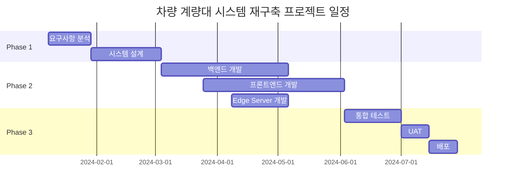

# 차량 계량대 시스템 재구축 WBS (Work Breakdown Structure)

**버전**: 1.0
**작성일**: 2026-01-25
**기반 문서**: PRD-20260125-143000, TRD-20260125-150000
**상태**: Draft

---

## 프로젝트 요약

| 항목 | 값 |
|------|-----|
| 총 작업 기간 | 28주 (7개월) |
| 총 공수 | 320 Man-Days (16 Man-Months) |
| 팀 규모 | 6명 |
| 방법론 | Agile (Scrum) |
| 스프린트 주기 | 2주 |
| 버퍼 비율 | 20% |

---

## 1. 프로젝트 단계 (Phases)



### Phase 1: 분석 및 설계 (W1~W8)
- **기간**: 2024-01-08 ~ 2024-03-01 (8주)
- **목표**: 상세 요구사항 확정 및 시스템/DB/API 설계 완료
- **산출물**:
  - 상세 요구사항 정의서
  - 시스템 아키텍처 설계서
  - 데이터베이스 설계서 (ERD)
  - API 명세서 (OpenAPI 3.0)
  - UI/UX 디자인 시안 (Figma)

### Phase 2: 개발 (W9~W22)
- **기간**: 2024-03-04 ~ 2024-06-28 (14주)
- **목표**: 백엔드 API, 프론트엔드 (웹/모바일), Edge Server 개발 완료
- **산출물**:
  - FastAPI 백엔드 서버
  - React 웹 대시보드
  - Flutter 모바일 앱 (iOS/Android)
  - Edge Server 데이터 수집 프로그램
  - 외부 시스템 연동 모듈 (인디케이터/ERP/전광판)

### Phase 3: 테스트 및 배포 (W23~W28)
- **기간**: 2024-07-01 ~ 2024-08-09 (6주)
- **목표**: 시스템 통합 테스트, UAT 수행 및 운영 환경 배포
- **산출물**:
  - 테스트 결과 보고서
  - 사용자 매뉴얼
  - 운영 환경 배포
  - 안정화 지원

---

## 2. 작업 패키지 (Work Packages)

### WP-1: 요구사항 분석
| ID | 작업명 | 담당 역할 | 예상 공수 | 선행 작업 | 우선순위 |
|----|--------|----------|----------|----------|---------|
| WP-1.1 | PRD 기반 상세 요구사항 정리 | PM/BA | 5MD | - | HIGH |
| WP-1.2 | 인디케이터 프로토콜 분석 | 백엔드 | 3MD | - | HIGH |
| WP-1.3 | ERP 연동 API 스펙 분석 | 백엔드 | 2MD | - | HIGH |
| WP-1.4 | 사용자 인터뷰 및 워크플로우 분석 | PM/BA | 3MD | WP-1.1 | MEDIUM |

**소계**: 13 Man-Days

---

### WP-2: 시스템 설계
| ID | 작업명 | 담당 역할 | 예상 공수 | 선행 작업 | 우선순위 |
|----|--------|----------|----------|----------|---------|
| WP-2.1 | 시스템 아키텍처 설계 | 백엔드 | 5MD | WP-1.1 | HIGH |
| WP-2.2 | 데이터베이스 설계 (ERD) | 백엔드 | 5MD | WP-2.1 | HIGH |
| WP-2.3 | API 명세서 작성 | 백엔드 | 5MD | WP-2.2 | HIGH |
| WP-2.4 | UI/UX 와이어프레임 | 디자이너 | 8MD | WP-1.4 | HIGH |
| WP-2.5 | UI/UX 디자인 시안 | 디자이너 | 10MD | WP-2.4 | HIGH |
| WP-2.6 | 보안 설계 | 백엔드 | 3MD | WP-2.1 | HIGH |

**소계**: 36 Man-Days

---

### WP-3: 인프라 구축
| ID | 작업명 | 담당 역할 | 예상 공수 | 선행 작업 | 우선순위 |
|----|--------|----------|----------|----------|---------|
| WP-3.1 | AWS 인프라 구축 (VPC, ECS, RDS, ElastiCache) | DevOps | 5MD | WP-2.1 | HIGH |
| WP-3.2 | CI/CD 파이프라인 구축 (GitHub Actions) | DevOps | 3MD | WP-3.1 | HIGH |
| WP-3.3 | 모니터링 환경 구축 (CloudWatch, Grafana) | DevOps | 3MD | WP-3.1 | MEDIUM |
| WP-3.4 | Edge Server 환경 구성 | DevOps | 2MD | WP-3.1 | HIGH |

**소계**: 13 Man-Days

---

### WP-4: 백엔드 개발 - 공통
| ID | 작업명 | 담당 역할 | 예상 공수 | 선행 작업 | 우선순위 |
|----|--------|----------|----------|----------|---------|
| WP-4.1 | FastAPI 프로젝트 셋업 | 백엔드 | 2MD | WP-2.3 | HIGH |
| WP-4.2 | DB 스키마 생성 (Alembic 마이그레이션) | 백엔드 | 3MD | WP-2.2 | HIGH |
| WP-4.3 | 인증/인가 모듈 (JWT, RBAC) | 백엔드 | 5MD | WP-4.1 | HIGH |
| WP-4.4 | 공통 모듈 (로깅, 에러 핸들링, 암호화) | 백엔드 | 3MD | WP-4.1 | HIGH |

**소계**: 13 Man-Days

---

### WP-5: 백엔드 개발 - 핵심 기능
| ID | 작업명 | 담당 역할 | 예상 공수 | 선행 작업 | 우선순위 |
|----|--------|----------|----------|----------|---------|
| WP-5.1 | 대시보드 API (FR-001) | 백엔드 | 5MD | WP-4.3 | HIGH |
| WP-5.2 | 계량 이력 API (FR-002) | 백엔드 | 4MD | WP-4.3 | HIGH |
| WP-5.3 | 엑셀 내보내기 API (FR-003) | 백엔드 | 3MD | WP-5.2 | MEDIUM |
| WP-5.4 | 차량 관리 API (FR-004) | 백엔드 | 3MD | WP-4.3 | HIGH |
| WP-5.5 | 운전기사 관리 API (FR-005) | 백엔드 | 4MD | WP-4.3 | HIGH |
| WP-5.6 | 통계 리포트 API (FR-006) | 백엔드 | 5MD | WP-5.2 | MEDIUM |
| WP-5.7 | 이상치 알림 API (FR-007) | 백엔드 | 3MD | WP-5.1 | MEDIUM |

**소계**: 27 Man-Days

---

### WP-6: 백엔드 개발 - 모바일 API
| ID | 작업명 | 담당 역할 | 예상 공수 | 선행 작업 | 우선순위 |
|----|--------|----------|----------|----------|---------|
| WP-6.1 | 대기 순번 조회 API (FR-008) | 백엔드 | 3MD | WP-4.3 | HIGH |
| WP-6.2 | 푸시 알림 서비스 (FR-009, FCM) | 백엔드 | 4MD | WP-6.1 | HIGH |
| WP-6.3 | 계량 결과 조회 API (FR-010) | 백엔드 | 3MD | WP-5.2 | HIGH |
| WP-6.4 | 전자 전표 API (FR-011) | 백엔드 | 4MD | WP-6.3 | HIGH |
| WP-6.5 | WebSocket 실시간 통신 | 백엔드 | 4MD | WP-6.1 | HIGH |

**소계**: 18 Man-Days

---

### WP-7: 백엔드 개발 - 외부 연동
| ID | 작업명 | 담당 역할 | 예상 공수 | 선행 작업 | 우선순위 |
|----|--------|----------|----------|----------|---------|
| WP-7.1 | 인디케이터 데이터 수신 API (FR-012) | 백엔드 | 3MD | WP-4.3 | HIGH |
| WP-7.2 | ERP 연동 배치 (FR-013) | 백엔드 | 5MD | WP-5.2 | MEDIUM |
| WP-7.3 | 전광판 연동 서비스 (FR-014) | 백엔드 | 3MD | WP-6.1 | HIGH |

**소계**: 11 Man-Days

---

### WP-8: Edge Server 개발
| ID | 작업명 | 담당 역할 | 예상 공수 | 선행 작업 | 우선순위 |
|----|--------|----------|----------|----------|---------|
| WP-8.1 | 시리얼 통신 모듈 (A사 인디케이터) | 백엔드 | 4MD | WP-1.2 | HIGH |
| WP-8.2 | 시리얼 통신 모듈 (B사 인디케이터) | 백엔드 | 4MD | WP-1.2 | HIGH |
| WP-8.3 | 로컬 버퍼링 (SQLite) | 백엔드 | 3MD | WP-8.1 | HIGH |
| WP-8.4 | 서버 전송 모듈 | 백엔드 | 3MD | WP-8.3, WP-7.1 | HIGH |
| WP-8.5 | 전광판 제어 모듈 | 백엔드 | 3MD | WP-7.3 | HIGH |
| WP-8.6 | 프로세스 관리 및 로깅 | DevOps | 2MD | WP-8.4 | MEDIUM |

**소계**: 19 Man-Days

---

### WP-9: 프론트엔드 개발 - 웹 (React)
| ID | 작업명 | 담당 역할 | 예상 공수 | 선행 작업 | 우선순위 |
|----|--------|----------|----------|----------|---------|
| WP-9.1 | React 프로젝트 셋업 (Vite) | 프론트엔드 | 2MD | WP-2.5 | HIGH |
| WP-9.2 | 공통 컴포넌트 및 레이아웃 | 프론트엔드 | 4MD | WP-9.1 | HIGH |
| WP-9.3 | 인증 화면 (로그인) | 프론트엔드 | 2MD | WP-9.2 | HIGH |
| WP-9.4 | 실시간 대시보드 (FR-001) | 프론트엔드 | 6MD | WP-9.2, WP-5.1 | HIGH |
| WP-9.5 | 계량 이력 조회 (FR-002) | 프론트엔드 | 4MD | WP-9.2, WP-5.2 | HIGH |
| WP-9.6 | 엑셀 내보내기 (FR-003) | 프론트엔드 | 1MD | WP-9.5 | MEDIUM |
| WP-9.7 | 차량 관리 (FR-004) | 프론트엔드 | 4MD | WP-9.2, WP-5.4 | HIGH |
| WP-9.8 | 운전기사 관리 (FR-005) | 프론트엔드 | 4MD | WP-9.2, WP-5.5 | HIGH |
| WP-9.9 | 통계 리포트 (FR-006) | 프론트엔드 | 5MD | WP-9.2, WP-5.6 | MEDIUM |
| WP-9.10 | 이상치 알림 설정 (FR-007) | 프론트엔드 | 2MD | WP-9.4 | MEDIUM |
| WP-9.11 | 다크모드 지원 | 프론트엔드 | 2MD | WP-9.2 | MEDIUM |

**소계**: 36 Man-Days

---

### WP-10: 프론트엔드 개발 - 모바일 (Flutter)
| ID | 작업명 | 담당 역할 | 예상 공수 | 선행 작업 | 우선순위 |
|----|--------|----------|----------|----------|---------|
| WP-10.1 | Flutter 프로젝트 셋업 | 모바일 | 2MD | WP-2.5 | HIGH |
| WP-10.2 | 공통 컴포넌트 및 테마 | 모바일 | 3MD | WP-10.1 | HIGH |
| WP-10.3 | 인증 화면 (로그인, 생체인증) | 모바일 | 4MD | WP-10.2 | HIGH |
| WP-10.4 | 대기 순번 화면 (FR-008) | 모바일 | 5MD | WP-10.2, WP-6.1 | HIGH |
| WP-10.5 | 푸시 알림 연동 (FR-009) | 모바일 | 4MD | WP-10.1, WP-6.2 | HIGH |
| WP-10.6 | 계량 결과 조회 (FR-010) | 모바일 | 4MD | WP-10.2, WP-6.3 | HIGH |
| WP-10.7 | 전자 전표 (FR-011) | 모바일 | 5MD | WP-10.2, WP-6.4 | HIGH |
| WP-10.8 | 전표 공유 기능 | 모바일 | 3MD | WP-10.7 | HIGH |
| WP-10.9 | 오프라인 캐싱 | 모바일 | 3MD | WP-10.6 | MEDIUM |
| WP-10.10 | 고대비 모드/큰 글씨 | 모바일 | 2MD | WP-10.2 | MEDIUM |

**소계**: 35 Man-Days

---

### WP-11: 테스트
| ID | 작업명 | 담당 역할 | 예상 공수 | 선행 작업 | 우선순위 |
|----|--------|----------|----------|----------|---------|
| WP-11.1 | 백엔드 단위 테스트 | 백엔드 | 5MD | WP-7 완료 | HIGH |
| WP-11.2 | 프론트엔드 단위 테스트 | 프론트엔드/모바일 | 4MD | WP-9,10 완료 | HIGH |
| WP-11.3 | API 통합 테스트 | QA | 5MD | WP-11.1 | HIGH |
| WP-11.4 | E2E 테스트 | QA | 5MD | WP-11.3 | HIGH |
| WP-11.5 | 성능 테스트 (부하 테스트) | QA | 3MD | WP-11.3 | MEDIUM |
| WP-11.6 | 보안 테스트 | QA | 3MD | WP-11.3 | HIGH |
| WP-11.7 | 모바일 앱 테스트 (iOS/Android) | QA | 4MD | WP-10 완료 | HIGH |

**소계**: 29 Man-Days

---

### WP-12: UAT 및 배포
| ID | 작업명 | 담당 역할 | 예상 공수 | 선행 작업 | 우선순위 |
|----|--------|----------|----------|----------|---------|
| WP-12.1 | UAT 환경 준비 | DevOps | 2MD | WP-11.4 | HIGH |
| WP-12.2 | UAT 수행 및 피드백 반영 | PM/전체 | 8MD | WP-12.1 | HIGH |
| WP-12.3 | 앱 스토어 심사 제출 | 모바일 | 2MD | WP-11.7 | HIGH |
| WP-12.4 | 프로덕션 배포 | DevOps | 3MD | WP-12.2 | HIGH |
| WP-12.5 | 모니터링/알람 설정 | DevOps | 2MD | WP-12.4 | HIGH |
| WP-12.6 | 사용자 매뉴얼 작성 | PM | 5MD | WP-12.2 | MEDIUM |
| WP-12.7 | 운영 인수인계 | PM/DevOps | 3MD | WP-12.4 | HIGH |

**소계**: 25 Man-Days

---

## 3. 세부 작업 목록 (Task List)

### 3.1 분석/설계 단계 (W1~W8)

| ID | 작업 | 설명 | 담당 | 공수 | 시작 | 종료 | 의존성 |
|----|------|------|------|------|------|------|--------|
| T-001 | PRD 기반 상세 요구사항 정리 | 기능/비기능 요구사항 상세화, 우선순위 확정 | PM/BA | 5MD | W1 | W2 | - |
| T-002 | 인디케이터 프로토콜 분석 | A사/B사 시리얼 통신 프로토콜 분석, 테스트 | 백엔드 | 3MD | W1 | W2 | - |
| T-003 | ERP 연동 API 스펙 분석 | ERP팀 협의, OAuth 2.0 인증 방식 확정 | 백엔드 | 2MD | W1 | W1 | - |
| T-004 | 사용자 워크플로우 분석 | 현장 방문, 계량팀/운전기사 인터뷰 | PM/BA | 3MD | W2 | W2 | T-001 |
| T-005 | 시스템 아키텍처 설계 | AWS 인프라, 컴포넌트 구성도 작성 | 백엔드 | 5MD | W3 | W4 | T-001 |
| T-006 | 데이터베이스 설계 | ERD, 테이블 정의서, 인덱스 설계 | 백엔드 | 5MD | W4 | W5 | T-005 |
| T-007 | API 명세서 작성 | OpenAPI 3.0 기반 전체 API 명세 | 백엔드 | 5MD | W5 | W6 | T-006 |
| T-008 | UI/UX 와이어프레임 | 웹/모바일 화면 구성, 플로우 정의 | 디자이너 | 8MD | W3 | W5 | T-004 |
| T-009 | UI/UX 디자인 시안 | Figma 기반 고해상도 디자인 | 디자이너 | 10MD | W5 | W7 | T-008 |
| T-010 | 보안 설계 | 인증/인가, 암호화, 네트워크 보안 정책 | 백엔드 | 3MD | W4 | W5 | T-005 |
| T-011 | AWS 인프라 구축 | VPC, ECS, RDS, ElastiCache, S3 | DevOps | 5MD | W5 | W6 | T-005 |
| T-012 | CI/CD 파이프라인 구축 | GitHub Actions 워크플로우 | DevOps | 3MD | W6 | W7 | T-011 |
| T-013 | 모니터링 환경 구축 | CloudWatch, Grafana 대시보드 | DevOps | 3MD | W7 | W8 | T-011 |

### 3.2 개발 단계 (W9~W22)

| ID | 작업 | 설명 | 담당 | 공수 | 시작 | 종료 | 의존성 |
|----|------|------|------|------|------|------|--------|
| T-101 | FastAPI 프로젝트 셋업 | 프로젝트 구조, 의존성, 설정 | 백엔드 | 2MD | W9 | W9 | T-007 |
| T-102 | DB 스키마 생성 | Alembic 마이그레이션, 초기 데이터 | 백엔드 | 3MD | W9 | W10 | T-006 |
| T-103 | 인증/인가 모듈 | JWT, Refresh Token, RBAC | 백엔드 | 5MD | W9 | W11 | T-101 |
| T-104 | 공통 모듈 개발 | 로깅, 에러 핸들링, AES 암호화 | 백엔드 | 3MD | W10 | W11 | T-101 |
| T-105 | 대시보드 API | 실시간 현황, WebSocket 통신 | 백엔드 | 5MD | W11 | W13 | T-103 |
| T-106 | 계량 이력 API | CRUD, 검색, 페이징 | 백엔드 | 4MD | W11 | W12 | T-103 |
| T-107 | 엑셀 내보내기 API | openpyxl 기반 엑셀 생성 | 백엔드 | 3MD | W12 | W13 | T-106 |
| T-108 | 차량 관리 API | CRUD, 검색 | 백엔드 | 3MD | W12 | W13 | T-103 |
| T-109 | 운전기사 관리 API | CRUD, 앱 계정 자동 생성 | 백엔드 | 4MD | W13 | W14 | T-103 |
| T-110 | 통계 리포트 API | 일/주/월간 통계, PDF 생성 | 백엔드 | 5MD | W14 | W16 | T-106 |
| T-111 | 이상치 알림 API | 임계값 설정, 이메일 발송 | 백엔드 | 3MD | W14 | W15 | T-105 |
| T-112 | 대기 순번 API | 대기열 관리, 순번 조회 | 백엔드 | 3MD | W13 | W14 | T-103 |
| T-113 | 푸시 알림 서비스 | FCM 연동, SMS 대안 | 백엔드 | 4MD | W14 | W16 | T-112 |
| T-114 | 계량 결과 조회 API (모바일) | 금일/30일 이력 조회 | 백엔드 | 3MD | W15 | W16 | T-106 |
| T-115 | 전자 전표 API | 전표 생성, 이미지 변환, 공유 | 백엔드 | 4MD | W15 | W17 | T-114 |
| T-116 | WebSocket 실시간 통신 | Socket.io 기반 양방향 통신 | 백엔드 | 4MD | W16 | W18 | T-112 |
| T-117 | 인디케이터 데이터 수신 API | Edge Server 연동 | 백엔드 | 3MD | W14 | W15 | T-103 |
| T-118 | ERP 연동 배치 | Celery 배치, 재시도 정책 | 백엔드 | 5MD | W16 | W18 | T-106 |
| T-119 | 전광판 연동 서비스 | TCP/IP 통신 | 백엔드 | 3MD | W15 | W16 | T-112 |
| T-120 | Edge Server - A사 인디케이터 | pyserial 시리얼 통신 | 백엔드 | 4MD | W12 | W14 | T-002 |
| T-121 | Edge Server - B사 인디케이터 | pyserial 시리얼 통신 | 백엔드 | 4MD | W14 | W16 | T-002 |
| T-122 | Edge Server - 로컬 버퍼링 | SQLite 오프라인 저장 | 백엔드 | 3MD | W15 | W16 | T-120 |
| T-123 | Edge Server - 서버 전송 | httpx 비동기 전송 | 백엔드 | 3MD | W16 | W17 | T-122, T-117 |
| T-124 | Edge Server - 전광판 제어 | TCP/IP 순번 표시 | 백엔드 | 3MD | W17 | W18 | T-119 |
| T-125 | Edge Server - 프로세스 관리 | Supervisor 설정 | DevOps | 2MD | W18 | W18 | T-123 |
| T-201 | React 프로젝트 셋업 | Vite, Zustand, Ant Design | 프론트엔드 | 2MD | W11 | W11 | T-009 |
| T-202 | 웹 공통 컴포넌트 | 레이아웃, 사이드바, 헤더 | 프론트엔드 | 4MD | W11 | W12 | T-201 |
| T-203 | 웹 인증 화면 | 로그인, 로그아웃 | 프론트엔드 | 2MD | W12 | W12 | T-202 |
| T-204 | 웹 실시간 대시보드 | 계량대 상태, 차트, WebSocket | 프론트엔드 | 6MD | W13 | W15 | T-202, T-105 |
| T-205 | 웹 계량 이력 조회 | 검색, 테이블, 페이징 | 프론트엔드 | 4MD | W14 | W15 | T-202, T-106 |
| T-206 | 웹 엑셀 내보내기 | 다운로드 버튼 | 프론트엔드 | 1MD | W15 | W15 | T-205 |
| T-207 | 웹 차량 관리 | CRUD 화면 | 프론트엔드 | 4MD | W15 | W16 | T-202, T-108 |
| T-208 | 웹 운전기사 관리 | CRUD, 계정 발급 | 프론트엔드 | 4MD | W16 | W17 | T-202, T-109 |
| T-209 | 웹 통계 리포트 | 차트, PDF 다운로드 | 프론트엔드 | 5MD | W17 | W19 | T-202, T-110 |
| T-210 | 웹 이상치 알림 설정 | 임계값 설정 UI | 프론트엔드 | 2MD | W17 | W17 | T-204 |
| T-211 | 웹 다크모드 | 테마 토글 | 프론트엔드 | 2MD | W18 | W18 | T-202 |
| T-301 | Flutter 프로젝트 셋업 | Riverpod, Dio, Firebase | 모바일 | 2MD | W11 | W11 | T-009 |
| T-302 | 앱 공통 컴포넌트 | 테마, 위젯 | 모바일 | 3MD | W11 | W12 | T-301 |
| T-303 | 앱 인증 화면 | 로그인, 생체 인증 | 모바일 | 4MD | W12 | W13 | T-302 |
| T-304 | 앱 대기 순번 화면 | 실시간 순번, 예상 시간 | 모바일 | 5MD | W13 | W15 | T-302, T-112 |
| T-305 | 앱 푸시 알림 연동 | FCM 설정 및 핸들링 | 모바일 | 4MD | W14 | W16 | T-301, T-113 |
| T-306 | 앱 계량 결과 조회 | 금일/이력 조회 | 모바일 | 4MD | W15 | W17 | T-302, T-114 |
| T-307 | 앱 전자 전표 | 전표 표시, 이미지 저장 | 모바일 | 5MD | W16 | W18 | T-302, T-115 |
| T-308 | 앱 전표 공유 | 카카오톡, 문자, 이메일 | 모바일 | 3MD | W18 | W19 | T-307 |
| T-309 | 앱 오프라인 캐싱 | Hive 로컬 저장 | 모바일 | 3MD | W19 | W20 | T-306 |
| T-310 | 앱 접근성 | 고대비, 큰 글씨 | 모바일 | 2MD | W19 | W19 | T-302 |

### 3.3 테스트 단계 (W23~W26)

| ID | 작업 | 설명 | 담당 | 공수 | 시작 | 종료 | 의존성 |
|----|------|------|------|------|------|------|--------|
| T-401 | 백엔드 단위 테스트 | pytest, 커버리지 80% 이상 | 백엔드 | 5MD | W21 | W22 | 개발 완료 |
| T-402 | 프론트엔드 단위 테스트 | Jest, React Testing Library | 프론트엔드 | 2MD | W21 | W22 | 개발 완료 |
| T-403 | 모바일 단위 테스트 | Flutter test | 모바일 | 2MD | W21 | W22 | 개발 완료 |
| T-404 | API 통합 테스트 | 시나리오 기반 테스트 | QA | 5MD | W23 | W24 | T-401 |
| T-405 | E2E 테스트 | Playwright 웹 테스트 | QA | 5MD | W24 | W25 | T-404 |
| T-406 | 성능 테스트 | k6/JMeter 부하 테스트 | QA | 3MD | W24 | W25 | T-404 |
| T-407 | 보안 테스트 | OWASP ZAP 스캔 | QA | 3MD | W25 | W25 | T-404 |
| T-408 | 모바일 앱 테스트 | iOS/Android 디바이스 테스트 | QA | 4MD | W25 | W26 | T-403 |

### 3.4 UAT 및 배포 단계 (W27~W28)

| ID | 작업 | 설명 | 담당 | 공수 | 시작 | 종료 | 의존성 |
|----|------|------|------|------|------|------|--------|
| T-501 | UAT 환경 준비 | 스테이징 환경, 테스트 데이터 | DevOps | 2MD | W26 | W26 | T-405 |
| T-502 | UAT 수행 | 계량팀/운전기사 참여 테스트 | PM/전체 | 8MD | W27 | W28 | T-501 |
| T-503 | 앱 스토어 심사 제출 | iOS App Store, Google Play | 모바일 | 2MD | W26 | W27 | T-408 |
| T-504 | 프로덕션 배포 | Blue-Green 배포 | DevOps | 3MD | W28 | W28 | T-502 |
| T-505 | 모니터링/알람 설정 | 운영 알람 설정 | DevOps | 2MD | W28 | W28 | T-504 |
| T-506 | 사용자 매뉴얼 작성 | 관리자/운전기사 매뉴얼 | PM | 5MD | W27 | W28 | T-502 |
| T-507 | 운영 인수인계 | 운영팀 교육 및 인수인계 | PM/DevOps | 3MD | W28 | W28 | T-504 |

---

## 4. 크리티컬 패스 (Critical Path)

프로젝트 일정에 가장 큰 영향을 미치는 작업 경로:

```
T-001 → T-005 → T-006 → T-007 → T-101 → T-103 → T-105 → T-116 → T-204 → T-405 → T-502 → T-504
```

| 단계 | 작업 ID | 작업명 | 공수 | 누적 |
|------|---------|--------|------|------|
| 1 | T-001 | PRD 기반 상세 요구사항 정리 | 5MD | 5MD |
| 2 | T-005 | 시스템 아키텍처 설계 | 5MD | 10MD |
| 3 | T-006 | 데이터베이스 설계 | 5MD | 15MD |
| 4 | T-007 | API 명세서 작성 | 5MD | 20MD |
| 5 | T-101 | FastAPI 프로젝트 셋업 | 2MD | 22MD |
| 6 | T-103 | 인증/인가 모듈 | 5MD | 27MD |
| 7 | T-105 | 대시보드 API | 5MD | 32MD |
| 8 | T-116 | WebSocket 실시간 통신 | 4MD | 36MD |
| 9 | T-204 | 웹 실시간 대시보드 | 6MD | 42MD |
| 10 | T-405 | E2E 테스트 | 5MD | 47MD |
| 11 | T-502 | UAT 수행 | 8MD | 55MD |
| 12 | T-504 | 프로덕션 배포 | 3MD | 58MD |

**총 크리티컬 패스 길이**: 58 Man-Days

> **주의**: 크리티컬 패스 상의 작업이 지연되면 전체 프로젝트 일정에 직접적인 영향을 미칩니다.

---

## 5. 리소스 배분 (Resource Allocation)

### 5.1 역할별 투입 계획

| 역할 | 인원 | 주요 담당 작업 | 투입 공수 | 투입률 |
|------|------|---------------|----------|--------|
| PM/PL | 1명 | 요구사항 관리, 일정 관리, 이해관계자 커뮤니케이션, 매뉴얼 | 38MD | 100% |
| 백엔드 개발자 | 2명 | API 개발, DB 설계, Edge Server 개발, 외부 연동 | 122MD | 100% |
| 프론트엔드 개발자 | 1명 | React 웹 대시보드 개발 | 38MD | 100% |
| 모바일 개발자 | 1명 | Flutter iOS/Android 앱 개발 | 37MD | 100% |
| DevOps | 0.5명 | 인프라 구축, CI/CD, 배포, 모니터링 | 20MD | 50% |
| QA | 0.5명 | 테스트 계획 및 실행, 결함 관리 | 25MD | 50% |
| UI/UX 디자이너 | 0.5명 | 화면 설계, 디자인 시안 | 18MD | 50% |

### 5.2 주차별 투입 현황

| 주차 | PM | 백엔드 | 프론트엔드 | 모바일 | DevOps | QA | 디자이너 |
|------|-----|--------|-----------|--------|--------|-----|---------|
| W1-W2 | ● | ○ | - | - | - | - | - |
| W3-W4 | ● | ● | - | - | - | - | ● |
| W5-W6 | ○ | ●● | - | - | ● | - | ● |
| W7-W8 | ○ | ● | - | - | ● | - | ● |
| W9-W10 | ○ | ●● | - | - | ○ | - | - |
| W11-W12 | ○ | ●● | ● | ● | - | - | - |
| W13-W14 | ○ | ●● | ● | ● | - | - | - |
| W15-W16 | ○ | ●● | ● | ● | - | - | - |
| W17-W18 | ○ | ●● | ● | ● | ○ | - | - |
| W19-W20 | ○ | ● | ● | ● | - | - | - |
| W21-W22 | ○ | ● | ○ | ○ | - | - | - |
| W23-W24 | ○ | ○ | ○ | ○ | - | ● | - |
| W25-W26 | ○ | ○ | ○ | ○ | ● | ● | - |
| W27-W28 | ● | ○ | ○ | ○ | ● | ○ | - |

(● 전담, ●● 2명 전담, ○ 부분 투입, - 미투입)

---

## 6. 공수 요약 (Effort Summary)

### 6.1 단계별 공수

| 단계 | 공수 (MD) | 비율 |
|------|----------|------|
| 분석/설계 | 62 | 23.3% |
| 개발 | 159 | 59.6% |
| 테스트 | 29 | 10.9% |
| UAT/배포 | 25 | 9.4% |
| **소계** | **266** | 100% |
| 버퍼 (20%) | 54 | - |
| **총계** | **320** | - |

### 6.2 역할별 공수

| 역할 | 공수 (MD) | 비율 |
|------|----------|------|
| PM/PL | 38 | 14.3% |
| 백엔드 | 122 | 45.9% |
| 프론트엔드 | 38 | 14.3% |
| 모바일 | 37 | 13.9% |
| DevOps | 20 | 7.5% |
| QA | 25 | 9.4% |
| 디자이너 | 18 | 6.8% |
| **총계 (버퍼 전)** | **266** | 100% |

### 6.3 Man-Month 환산

- 1 Man-Month = 20 Man-Days (주 5일 기준)
- **총 공수**: 320 Man-Days = **16 Man-Months**

---

## 7. 리스크 및 가정사항

### 가정사항
- 팀원 풀타임 100% 투입 가정 (DevOps, QA, 디자이너 제외)
- 외부 의존성 (ERP API, 인디케이터 프로토콜) 일정 준수 가정
- 요구사항 변경 최소화 가정
- B사 인디케이터 프로토콜 문서 2월 중 수령 가정

### 일정 리스크

| 리스크 | 영향 | 대응 방안 |
|--------|------|----------|
| B사 인디케이터 프로토콜 미확정 | HIGH | 범용 파서 구조로 설계, 프로토콜 문서 수령 일정 선추적 |
| 요구사항 변경 | HIGH | 변경 관리 프로세스, 버퍼 활용, 스프린트 내 범위 조정 |
| 외부 API (ERP) 연동 지연 | MEDIUM | 목 서버 활용, ERP Staging 환경 조기 확보 |
| 인력 이탈 | HIGH | 문서화 강화, 지식 공유, 크로스 트레이닝 |
| iOS 앱 스토어 심사 지연 | MEDIUM | 조기 심사 제출, 사전 리젝 사유 검토 |
| Edge Server 네트워크 불안정 | MEDIUM | 로컬 버퍼링 테스트 강화, 복구 시나리오 검증 |

---

## 8. 참고 문서

- 기반 PRD: `workspace/outputs/prd/PRD-20260125-143000.md`
- 기반 TRD: `workspace/outputs/trd/TRD-20260125-150000.md`

---
*이 문서는 WBS 자동 생성 시스템에 의해 작성되었습니다.*
