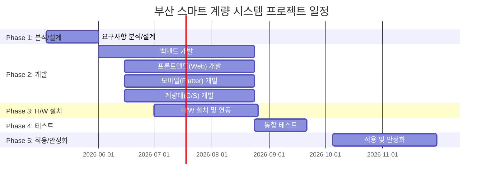

# 부산 스마트 계량 시스템 WBS (Work Breakdown Structure)

**버전**: 1.0
**작성일**: 2026-01-27
**기반 문서**: PRD-20260127-142114, TRD-20260127-143049
**상태**: Draft

---

## 프로젝트 요약

| 항목 | 값 |
|------|-----|
| 총 작업 기간 | 26주 (6.5개월) |
| 총 공수 | 396 Man-Days (19.8 Man-Months) |
| 버퍼 포함 총 공수 | 475 Man-Days (23.8 Man-Months) |
| 팀 규모 | 8명 |
| 방법론 | Waterfall + Agile (하이브리드) |
| 개발 점검회의 | 월 1회 |
| 버퍼 비율 | 20% |
| 프로젝트 기간 | 2026년 5월 ~ 2026년 11월 |

---

## 1. 프로젝트 단계 (Phases)



### Phase 1: 분석 및 설계
- **기간**: 2026-05-04 ~ 2026-05-29 (4주)
- **목표**: 스마트 계량 프로세스 분석, 시스템/H/W 설계 완료
- **산출물**: 업무 분석서, 프로세스 설계서, 시스템 아키텍처 설계서, H/W 구성 설계서, 화면 설계서, DB 설계서, API 명세서

### Phase 2: 개발
- **기간**: 2026-06-01 ~ 2026-08-21 (12주)
- **목표**: 전체 시스템(WEB/APP/C/S) 개발 및 단위 테스트 완료
- **산출물**: Spring Boot API 서버, React 웹 시스템, Flutter 모바일 APP, C/S 계량대 프로그램, AI 연동 모듈

### Phase 3: H/W 설치 및 인프라 구축
- **기간**: 2026-07-01 ~ 2026-08-21 (8주, Phase 2와 병행)
- **목표**: 계량대 H/W 설치 및 네트워크, 장비 연동 완료
- **산출물**: LPR/전광판/차단기/센서 설치 완료, 네트워크 구성, 장비 연동 테스트 결과서

### Phase 4: 통합 테스트
- **기간**: 2026-08-24 ~ 2026-09-18 (4주)
- **목표**: 시스템 통합 테스트 및 성능/보안 테스트 완료
- **산출물**: 통합 테스트 결과서, 성능 테스트 보고서, 결함 수정 보고서

### Phase 5: 적용 및 안정화
- **기간**: 2026-10-05 ~ 2026-11-27 (8주)
- **목표**: 현장 적용, 사용자 교육, 안정화 모니터링 후 시스템 오픈
- **산출물**: 교육자료, 운영 매뉴얼, 안정화 모니터링 보고서, 시스템 오픈

---

## 2. 작업 패키지 (Work Packages)

### WP-1: 분석 및 설계

| ID | 작업명 | 담당 역할 | 예상 공수 | 선행 작업 | 우선순위 |
|----|--------|----------|----------|----------|---------|
| WP-1.1 | 업무 프로세스 분석 | PM/BA | 5MD | - | HIGH |
| WP-1.2 | 품목별 계량 프로세스 설계 | PM/BA | 5MD | WP-1.1 | HIGH |
| WP-1.3 | 시스템 아키텍처 설계 | 아키텍트 | 3MD | WP-1.1 | HIGH |
| WP-1.4 | H/W 구성 설계 | 인프라 | 3MD | WP-1.1 | HIGH |
| WP-1.5 | DB 설계 (ERD/테이블) | 백엔드 | 5MD | WP-1.2 | HIGH |
| WP-1.6 | API 명세서 작성 | 백엔드 | 5MD | WP-1.5 | HIGH |
| WP-1.7 | 화면 설계 (Web) | UI/UX | 5MD | WP-1.2 | HIGH |
| WP-1.8 | 화면 설계 (Mobile) | UI/UX | 5MD | WP-1.2 | HIGH |
| WP-1.9 | 화면 설계 (C/S) | UI/UX | 3MD | WP-1.2 | HIGH |
| WP-1.10 | 설계 검토 및 승인 | PM | 2MD | WP-1.6~WP-1.9 | HIGH |

**소계**: 41 Man-Days

---

### WP-2: 인프라 및 개발환경 구축

| ID | 작업명 | 담당 역할 | 예상 공수 | 선행 작업 | 우선순위 |
|----|--------|----------|----------|----------|---------|
| WP-2.1 | 개발 서버 구축 | DevOps | 3MD | WP-1.3 | HIGH |
| WP-2.2 | PostgreSQL / Redis 구축 | DevOps | 2MD | WP-2.1 | HIGH |
| WP-2.3 | Docker / Docker Compose 설정 | DevOps | 2MD | WP-2.1 | HIGH |
| WP-2.4 | Jenkins CI/CD 파이프라인 구성 | DevOps | 3MD | WP-2.3 | HIGH |
| WP-2.5 | Nginx 리버스 프록시 설정 | DevOps | 1MD | WP-2.1 | MEDIUM |
| WP-2.6 | Kafka 브로커 구축 | DevOps | 2MD | WP-2.1 | MEDIUM |
| WP-2.7 | 모니터링 구축 (Prometheus+Grafana) | DevOps | 3MD | WP-2.1 | LOW |
| WP-2.8 | ELK 로그 시스템 구축 | DevOps | 2MD | WP-2.1 | LOW |

**소계**: 18 Man-Days

---

### WP-3: 백엔드 개발 (Spring Boot)

| ID | 작업명 | 담당 역할 | 예상 공수 | 선행 작업 | 우선순위 |
|----|--------|----------|----------|----------|---------|
| WP-3.1 | 프로젝트 구조 셋업 (Spring Boot) | 백엔드 | 2MD | WP-2.2 | HIGH |
| WP-3.2 | DB 스키마 생성 / JPA 엔티티 | 백엔드 | 5MD | WP-1.5, WP-3.1 | HIGH |
| WP-3.3 | 인증/인가 모듈 (JWT + Spring Security) | 백엔드 | 5MD | WP-3.2 | HIGH |
| WP-3.4 | 기준정보 API (업체/차량/운전자/품목) | 백엔드 | 8MD | WP-3.3 | HIGH |
| WP-3.5 | 배차 관리 API | 백엔드 | 8MD | WP-3.4 | HIGH |
| WP-3.6 | 계량 처리 API | 백엔드 | 10MD | WP-3.5 | HIGH |
| WP-3.7 | OTP 생성/검증 API (Redis 연동) | 백엔드 | 5MD | WP-3.3, WP-2.2 | HIGH |
| WP-3.8 | 전자 계량표 API | 백엔드 | 5MD | WP-3.6 | HIGH |
| WP-3.9 | 출문 관리 API | 백엔드 | 3MD | WP-3.5 | MEDIUM |
| WP-3.10 | 대시보드/통계 API | 백엔드 | 5MD | WP-3.6 | MEDIUM |
| WP-3.11 | Kafka 이벤트 처리 (계량 이벤트) | 백엔드 | 5MD | WP-3.6, WP-2.6 | MEDIUM |
| WP-3.12 | 알림 서비스 (Push/카카오 알림톡) | 백엔드 | 5MD | WP-3.11 | MEDIUM |
| WP-3.13 | 모바일 전용 API | 백엔드 | 5MD | WP-3.6 | HIGH |
| WP-3.14 | 백엔드 단위 테스트 | 백엔드 | 8MD | WP-3.4~WP-3.13 | HIGH |

**소계**: 79 Man-Days

---

### WP-4: 프론트엔드 개발 (React Web)

| ID | 작업명 | 담당 역할 | 예상 공수 | 선행 작업 | 우선순위 |
|----|--------|----------|----------|----------|---------|
| WP-4.1 | React 프로젝트 셋업 (Vite+TS) | 프론트엔드 | 2MD | WP-2.4 | HIGH |
| WP-4.2 | 공통 컴포넌트 / 레이아웃 | 프론트엔드 | 5MD | WP-4.1, WP-1.7 | HIGH |
| WP-4.3 | 로그인/인증 화면 | 프론트엔드 | 3MD | WP-4.2, WP-3.3 | HIGH |
| WP-4.4 | 기준정보 관리 화면 (CRUD) | 프론트엔드 | 8MD | WP-4.2, WP-3.4 | HIGH |
| WP-4.5 | 배차 관리 화면 | 프론트엔드 | 8MD | WP-4.2, WP-3.5 | HIGH |
| WP-4.6 | 계량 모니터링 화면 (실시간) | 프론트엔드 | 8MD | WP-4.2, WP-3.6 | HIGH |
| WP-4.7 | 출문 관리 화면 | 프론트엔드 | 3MD | WP-4.2, WP-3.9 | MEDIUM |
| WP-4.8 | 대시보드 (차트/통계) | 프론트엔드 | 8MD | WP-4.2, WP-3.10 | MEDIUM |
| WP-4.9 | 계량표 조회/출력 화면 | 프론트엔드 | 3MD | WP-4.2, WP-3.8 | MEDIUM |
| WP-4.10 | 프론트엔드 단위 테스트 | 프론트엔드 | 5MD | WP-4.3~WP-4.9 | HIGH |

**소계**: 53 Man-Days

---

### WP-5: 모바일 개발 (Flutter)

| ID | 작업명 | 담당 역할 | 예상 공수 | 선행 작업 | 우선순위 |
|----|--------|----------|----------|----------|---------|
| WP-5.1 | Flutter 프로젝트 셋업 | 모바일 | 2MD | WP-2.4 | HIGH |
| WP-5.2 | 공통 위젯 / 네비게이션 | 모바일 | 5MD | WP-5.1, WP-1.8 | HIGH |
| WP-5.3 | 로그인 (인증번호 2차 인증) | 모바일 | 5MD | WP-5.2, WP-3.3 | HIGH |
| WP-5.4 | 배차 조회 / 다중 배차 선택 | 모바일 | 8MD | WP-5.2, WP-3.13 | HIGH |
| WP-5.5 | 모바일 OTP 계량 | 모바일 | 5MD | WP-5.2, WP-3.7 | HIGH |
| WP-5.6 | 전자 계량표 (조회/공유) | 모바일 | 5MD | WP-5.2, WP-3.8 | HIGH |
| WP-5.7 | Push 알림 (FCM 연동) | 모바일 | 3MD | WP-5.2, WP-3.12 | MEDIUM |
| WP-5.8 | 배차/계량 실적 조회 | 모바일 | 5MD | WP-5.2, WP-3.13 | MEDIUM |
| WP-5.9 | 문의 유형별 통화 기능 | 모바일 | 3MD | WP-5.2 | MEDIUM |
| WP-5.10 | 오프라인 캐싱 (Hive) | 모바일 | 3MD | WP-5.4 | LOW |
| WP-5.11 | 모바일 단위 테스트 | 모바일 | 5MD | WP-5.3~WP-5.10 | HIGH |
| WP-5.12 | 앱스토어 배포 준비 | 모바일 | 3MD | WP-5.11 | HIGH |

**소계**: 52 Man-Days

---

### WP-6: 계량대 C/S 프로그램 개발

| ID | 작업명 | 담당 역할 | 예상 공수 | 선행 작업 | 우선순위 |
|----|--------|----------|----------|----------|---------|
| WP-6.1 | .NET 8 WinForms 프로젝트 셋업 | C/S개발자 | 2MD | WP-1.9 | HIGH |
| WP-6.2 | RS-232C 인디게이터 연동 | C/S개발자 | 8MD | WP-6.1 | HIGH |
| WP-6.3 | LPR 장비 연동 (TCP/IP) | C/S개발자 | 8MD | WP-6.1 | HIGH |
| WP-6.4 | AI 검증 모듈 연동 | C/S개발자 | 5MD | WP-6.3 | HIGH |
| WP-6.5 | 전광판 제어 (OTP/안내표시) | C/S개발자 | 5MD | WP-6.1 | HIGH |
| WP-6.6 | 자동차단기 제어 | C/S개발자 | 3MD | WP-6.1 | HIGH |
| WP-6.7 | 레이더센서 연동 (차량감지) | C/S개발자 | 3MD | WP-6.1 | HIGH |
| WP-6.8 | 계량 메인 화면 (자동/모바일/수동) | C/S개발자 | 10MD | WP-6.2~WP-6.7 | HIGH |
| WP-6.9 | 재계량 / 초기화 기능 | C/S개발자 | 3MD | WP-6.8 | HIGH |
| WP-6.10 | 서버 API 연동 (계량실적 전송) | C/S개발자 | 5MD | WP-6.8, WP-3.6 | HIGH |
| WP-6.11 | 기존 터치스크린 병행 운영 | C/S개발자 | 5MD | WP-6.8 | MEDIUM |
| WP-6.12 | C/S 단위 테스트 | C/S개발자 | 5MD | WP-6.8~WP-6.11 | HIGH |

**소계**: 62 Man-Days

---

### WP-7: H/W 설치 및 인프라

| ID | 작업명 | 담당 역할 | 예상 공수 | 선행 작업 | 우선순위 |
|----|--------|----------|----------|----------|---------|
| WP-7.1 | LPR 장비 발주 및 납품 | 인프라/외주 | 5MD | WP-1.4 | HIGH |
| WP-7.2 | 전광판/차단기/센서 발주 및 납품 | 인프라/외주 | 3MD | WP-1.4 | HIGH |
| WP-7.3 | 계량대 H/W 설치 공사 | 인프라/외주 | 10MD | WP-7.1, WP-7.2 | HIGH |
| WP-7.4 | 네트워크 공사 (계량대↔서버) | 인프라 | 5MD | WP-7.3 | HIGH |
| WP-7.5 | 운영 서버 구축 (Prod/Staging) | DevOps | 3MD | WP-2.1 | HIGH |
| WP-7.6 | H/W 개별 장비 연동 테스트 | 인프라 | 5MD | WP-7.3, WP-7.4 | HIGH |
| WP-7.7 | 보안 설정 (SSL, 방화벽) | DevOps | 2MD | WP-7.5 | HIGH |

**소계**: 33 Man-Days

---

### WP-8: 통합 테스트

| ID | 작업명 | 담당 역할 | 예상 공수 | 선행 작업 | 우선순위 |
|----|--------|----------|----------|----------|---------|
| WP-8.1 | 통합 테스트 계획 수립 | QA/PM | 3MD | WP-3.14, WP-4.10 | HIGH |
| WP-8.2 | API 통합 테스트 | QA | 5MD | WP-8.1 | HIGH |
| WP-8.3 | Web ↔ API 통합 테스트 | QA | 3MD | WP-8.1 | HIGH |
| WP-8.4 | Mobile ↔ API 통합 테스트 | QA | 3MD | WP-8.1 | HIGH |
| WP-8.5 | C/S ↔ API ↔ H/W 통합 테스트 | QA | 5MD | WP-8.1, WP-7.6 | HIGH |
| WP-8.6 | 성능 테스트 (부하/응답시간) | QA | 3MD | WP-8.2 | HIGH |
| WP-8.7 | 보안 테스트 (OTP/인증/암호화) | QA | 3MD | WP-8.2 | HIGH |
| WP-8.8 | 결함 수정 및 재테스트 | 개발팀 | 8MD | WP-8.2~WP-8.7 | HIGH |
| WP-8.9 | UAT (사용자 인수 테스트) | PM/현업 | 5MD | WP-8.8 | HIGH |

**소계**: 38 Man-Days

---

### WP-9: 적용 및 안정화

| ID | 작업명 | 담당 역할 | 예상 공수 | 선행 작업 | 우선순위 |
|----|--------|----------|----------|----------|---------|
| WP-9.1 | 데이터 마이그레이션 (기존→신규) | 백엔드/DBA | 5MD | WP-8.9 | HIGH |
| WP-9.2 | 운영 환경 배포 (프로덕션) | DevOps | 3MD | WP-9.1 | HIGH |
| WP-9.3 | 교육자료 작성 | PM/BA | 5MD | WP-8.9 | HIGH |
| WP-9.4 | 사용자 교육 (차량기사/운송사) | PM | 3MD | WP-9.3 | HIGH |
| WP-9.5 | 사용자 교육 (계량담당자/관리자) | PM | 2MD | WP-9.3 | HIGH |
| WP-9.6 | 운영 매뉴얼 작성 | PM/BA | 3MD | WP-8.9 | MEDIUM |
| WP-9.7 | 안정화 모니터링 (4주) | 개발팀 | 10MD | WP-9.2 | HIGH |
| WP-9.8 | 안정화 기간 결함 수정 | 개발팀 | 5MD | WP-9.7 | HIGH |
| WP-9.9 | 앱스토어 배포 (iOS/Android) | 모바일 | 3MD | WP-9.2, WP-5.12 | HIGH |
| WP-9.10 | 프로젝트 완료 보고 | PM | 1MD | WP-9.7 | HIGH |

**소계**: 40 Man-Days

---

## 3. 세부 작업 목록 (Task List)

### 3.1 Phase 1: 분석/설계 (W1~W4)

| ID | 작업 | 설명 | 담당 | 공수 | 시작 | 종료 | 의존성 |
|----|------|------|------|------|------|------|--------|
| T-001 | 업무 프로세스 분석 | 현행 계량 업무 분석, 현업 인터뷰 | PM/BA | 5MD | W1 | W1 | - |
| T-002 | 품목별 계량 프로세스 설계 | 부산물/폐기물/부재료/반출/일반 프로세스 | PM/BA | 5MD | W2 | W2 | T-001 |
| T-003 | 시스템 아키텍처 설계 | 전체 시스템 구조, 컴포넌트, 통신 방식 | 아키텍트 | 3MD | W2 | W2 | T-001 |
| T-004 | H/W 구성 설계 | LPR/전광판/차단기/센서 배치 설계 | 인프라 | 3MD | W2 | W2 | T-001 |
| T-005 | DB 설계 | ERD, 테이블 명세, 인덱스 설계 | 백엔드 | 5MD | W2 | W3 | T-002 |
| T-006 | API 명세서 작성 | RESTful API 엔드포인트 설계 | 백엔드 | 5MD | W3 | W3 | T-005 |
| T-007 | 화면 설계 (Web) | 관리자 웹 와이어프레임/프로토타입 | UI/UX | 5MD | W2 | W3 | T-002 |
| T-008 | 화면 설계 (Mobile) | 모바일 APP 와이어프레임/프로토타입 | UI/UX | 5MD | W2 | W3 | T-002 |
| T-009 | 화면 설계 (C/S) | 계량대 프로그램 화면 설계 | UI/UX | 3MD | W3 | W3 | T-002 |
| T-010 | 설계 검토 및 승인 | 설계 문서 리뷰, PMO 승인 | PM | 2MD | W4 | W4 | T-006~T-009 |

### 3.2 Phase 2: 개발 (W5~W16)

#### 인프라 구축 (W5~W6)

| ID | 작업 | 설명 | 담당 | 공수 | 시작 | 종료 | 의존성 |
|----|------|------|------|------|------|------|--------|
| T-101 | 개발 서버 구축 | 개발/스테이징 서버 세팅 | DevOps | 3MD | W5 | W5 | T-003 |
| T-102 | DB/Redis 구축 | PostgreSQL 16 + Redis 7 설치/구성 | DevOps | 2MD | W5 | W5 | T-101 |
| T-103 | Docker/Compose 설정 | 컨테이너화, docker-compose 작성 | DevOps | 2MD | W5 | W5 | T-101 |
| T-104 | CI/CD 파이프라인 구성 | Jenkins 자동 빌드/배포 파이프라인 | DevOps | 3MD | W5 | W6 | T-103 |
| T-105 | Nginx 설정 | 리버스 프록시, SSL 인증서 | DevOps | 1MD | W5 | W5 | T-101 |
| T-106 | Kafka 브로커 구축 | 이벤트 메시지 브로커 설치/구성 | DevOps | 2MD | W6 | W6 | T-101 |
| T-107 | 모니터링 시스템 구축 | Prometheus + Grafana + 알림 설정 | DevOps | 3MD | W6 | W6 | T-101 |
| T-108 | ELK 로그 시스템 구축 | Elasticsearch + Logstash + Kibana | DevOps | 2MD | W6 | W6 | T-101 |

#### 백엔드 개발 (W5~W14)

| ID | 작업 | 설명 | 담당 | 공수 | 시작 | 종료 | 의존성 |
|----|------|------|------|------|------|------|--------|
| T-201 | Spring Boot 프로젝트 셋업 | 프로젝트 구조, 의존성, 설정 | 백엔드 | 2MD | W5 | W5 | T-102 |
| T-202 | DB 스키마 / JPA 엔티티 | 12개 테이블 생성, 엔티티 매핑 | 백엔드 | 5MD | W5 | W6 | T-005, T-201 |
| T-203 | 인증/인가 모듈 | JWT + Spring Security + RBAC | 백엔드 | 5MD | W6 | W6 | T-202 |
| T-204 | 기준정보 API | 업체/차량/운전자/품목/계량대 CRUD | 백엔드 | 8MD | W7 | W8 | T-203 |
| T-205 | 배차 관리 API | 배차 등록/수정/삭제/상태변경/조회 | 백엔드 | 8MD | W7 | W8 | T-204 |
| T-206 | 계량 처리 API | 계량 등록/수정/재계량/실시간현황 | 백엔드 | 10MD | W9 | W10 | T-205 |
| T-207 | OTP API (Redis) | OTP 생성/검증, Redis TTL 3분 | 백엔드 | 5MD | W7 | W7 | T-203, T-102 |
| T-208 | 전자 계량표 API | 계량표 생성/조회/PDF/공유 | 백엔드 | 5MD | W10 | W11 | T-206 |
| T-209 | 출문 관리 API | 출문 기록 등록/조회 | 백엔드 | 3MD | W9 | W9 | T-205 |
| T-210 | 대시보드/통계 API | 요약 통계, 차트 데이터, 실적 조회 | 백엔드 | 5MD | W11 | W11 | T-206 |
| T-211 | Kafka 이벤트 처리 | 계량 완료 이벤트 발행/소비 | 백엔드 | 5MD | W11 | W12 | T-206, T-106 |
| T-212 | 알림 서비스 | FCM Push + 카카오 알림톡 | 백엔드 | 5MD | W12 | W12 | T-211 |
| T-213 | 모바일 전용 API | 모바일 최적화 API 엔드포인트 | 백엔드 | 5MD | W10 | W11 | T-206 |
| T-214 | 백엔드 단위 테스트 | JUnit5, 커버리지 80% 이상 | 백엔드 | 8MD | W13 | W14 | T-204~T-213 |

#### 프론트엔드 Web 개발 (W7~W14)

| ID | 작업 | 설명 | 담당 | 공수 | 시작 | 종료 | 의존성 |
|----|------|------|------|------|------|------|--------|
| T-301 | React 프로젝트 셋업 | Vite + TypeScript + Ant Design 구성 | 프론트엔드 | 2MD | W7 | W7 | T-104 |
| T-302 | 공통 컴포넌트/레이아웃 | 사이드바, 헤더, 테이블, 폼 컴포넌트 | 프론트엔드 | 5MD | W7 | W7 | T-301, T-007 |
| T-303 | 로그인/인증 화면 | 로그인, 토큰 관리, 권한 라우팅 | 프론트엔드 | 3MD | W8 | W8 | T-302, T-203 |
| T-304 | 기준정보 관리 화면 | 업체/차량/운전자/품목 CRUD 화면 | 프론트엔드 | 8MD | W8 | W9 | T-302, T-204 |
| T-305 | 배차 관리 화면 | 배차 등록/조회/상태관리 화면 | 프론트엔드 | 8MD | W9 | W10 | T-302, T-205 |
| T-306 | 계량 모니터링 화면 | 실시간 계량 현황, 계량 이력 | 프론트엔드 | 8MD | W11 | W12 | T-302, T-206 |
| T-307 | 출문 관리 화면 | 출문 기록 조회/등록 | 프론트엔드 | 3MD | W10 | W10 | T-302, T-209 |
| T-308 | 대시보드 | ECharts 차트, 요약 통계 | 프론트엔드 | 8MD | W12 | W13 | T-302, T-210 |
| T-309 | 계량표 조회/출력 화면 | 계량표 목록, 상세, PDF 출력 | 프론트엔드 | 3MD | W12 | W12 | T-302, T-208 |
| T-310 | 프론트엔드 단위 테스트 | React Testing Library | 프론트엔드 | 5MD | W13 | W14 | T-303~T-309 |

#### 모바일 Flutter 개발 (W7~W15)

| ID | 작업 | 설명 | 담당 | 공수 | 시작 | 종료 | 의존성 |
|----|------|------|------|------|------|------|--------|
| T-401 | Flutter 프로젝트 셋업 | Riverpod + Dio + 라우팅 설정 | 모바일 | 2MD | W7 | W7 | T-104 |
| T-402 | 공통 위젯/네비게이션 | 탭바, 앱바, 카드, 입력 위젯 | 모바일 | 5MD | W7 | W8 | T-401, T-008 |
| T-403 | 로그인 (인증번호 2차 인증) | 운전자/담당자 구분 로그인, SMS 인증 | 모바일 | 5MD | W8 | W9 | T-402, T-203 |
| T-404 | 배차 조회/다중 배차 선택 | 배차 지시 현황, 다중 선택 계량 진행 | 모바일 | 8MD | W9 | W10 | T-402, T-213 |
| T-405 | 모바일 OTP 계량 | OTP 입력, 전화번호 매칭, 계량 진행 | 모바일 | 5MD | W9 | W10 | T-402, T-207 |
| T-406 | 전자 계량표 (조회/공유) | 계량표 보기, 카카오톡/SMS 공유 | 모바일 | 5MD | W11 | W11 | T-402, T-208 |
| T-407 | Push 알림 (FCM) | FCM 연동, 알림 수신/표시 | 모바일 | 3MD | W12 | W12 | T-402, T-212 |
| T-408 | 배차/계량 실적 조회 | 월별/일별 실적, 기간 설정 | 모바일 | 5MD | W11 | W12 | T-402, T-213 |
| T-409 | 문의 유형별 통화 기능 | 부서별 전화 연결 | 모바일 | 3MD | W12 | W12 | T-402 |
| T-410 | 오프라인 캐싱 (Hive) | 배차 데이터 로컬 캐싱 | 모바일 | 3MD | W13 | W13 | T-404 |
| T-411 | 모바일 단위 테스트 | Widget Test + Integration Test | 모바일 | 5MD | W13 | W14 | T-403~T-410 |
| T-412 | 앱스토어 배포 준비 | 스토어 등록 정보, 스크린샷, 빌드 | 모바일 | 3MD | W14 | W15 | T-411 |

#### 계량대 C/S 개발 (W7~W15)

| ID | 작업 | 설명 | 담당 | 공수 | 시작 | 종료 | 의존성 |
|----|------|------|------|------|------|------|--------|
| T-501 | .NET 8 WinForms 셋업 | 프로젝트 구조, 의존성 | C/S개발자 | 2MD | W7 | W7 | T-009 |
| T-502 | RS-232C 인디게이터 연동 | 시리얼 통신 (9600bps, 8N1) | C/S개발자 | 8MD | W7 | W8 | T-501 |
| T-503 | LPR 장비 연동 | TCP/IP 소켓 통신, 이미지 수신 | C/S개발자 | 8MD | W8 | W9 | T-501 |
| T-504 | AI 검증 모듈 연동 | AI 서버 API 호출, 검증 결과 처리 | C/S개발자 | 5MD | W9 | W10 | T-503 |
| T-505 | 전광판 제어 | OTP 표시, 안내 메시지 전송 | C/S개발자 | 5MD | W9 | W9 | T-501 |
| T-506 | 자동차단기 제어 | 차단기 개폐 신호 전송 | C/S개발자 | 3MD | W9 | W10 | T-501 |
| T-507 | 레이더센서 연동 | 차량 진입 감지 이벤트 수신 | C/S개발자 | 3MD | W10 | W10 | T-501 |
| T-508 | 계량 메인 화면 | 자동/모바일/수동 계량 통합 화면 | C/S개발자 | 10MD | W10 | W12 | T-502~T-507 |
| T-509 | 재계량/초기화 기능 | 재계량 프로세스, 데이터 초기화 | C/S개발자 | 3MD | W12 | W12 | T-508 |
| T-510 | 서버 API 연동 | 계량실적 전송, 배차 정보 조회 | C/S개발자 | 5MD | W12 | W13 | T-508, T-206 |
| T-511 | 기존 터치스크린 병행 운영 | 수동 계량 모드, 데이터 통합 | C/S개발자 | 5MD | W13 | W13 | T-508 |
| T-512 | C/S 단위 테스트 | 장비 연동 테스트, 기능 테스트 | C/S개발자 | 5MD | W14 | W15 | T-508~T-511 |

### 3.3 Phase 3: H/W 설치 (W9~W14, Phase 2와 병행)

| ID | 작업 | 설명 | 담당 | 공수 | 시작 | 종료 | 의존성 |
|----|------|------|------|------|------|------|--------|
| T-601 | LPR 장비 발주/납품 | LPR 카메라 발주, 납품 확인 | 인프라/외주 | 5MD | W5 | W8 | T-004 |
| T-602 | 전광판/차단기/센서 발주/납품 | 주변 장비 발주, 납품 확인 | 인프라/외주 | 3MD | W5 | W8 | T-004 |
| T-603 | 계량대 H/W 설치 공사 | 장비 설치, 배선, 전원 공사 | 인프라/외주 | 10MD | W9 | W11 | T-601, T-602 |
| T-604 | 네트워크 공사 | 계량대↔서버 네트워크 구성 | 인프라 | 5MD | W11 | W12 | T-603 |
| T-605 | 운영 서버 구축 | Production/Staging 서버 세팅 | DevOps | 3MD | W12 | W12 | T-101 |
| T-606 | H/W 개별 장비 연동 테스트 | LPR, 전광판, 차단기, 센서 동작 확인 | 인프라 | 5MD | W12 | W13 | T-603, T-604 |
| T-607 | 보안 설정 | SSL, 방화벽 규칙, VPN 설정 | DevOps | 2MD | W13 | W13 | T-605 |

### 3.4 Phase 4: 통합 테스트 (W17~W20)

| ID | 작업 | 설명 | 담당 | 공수 | 시작 | 종료 | 의존성 |
|----|------|------|------|------|------|------|--------|
| T-701 | 통합 테스트 계획 수립 | 테스트 시나리오, 체크리스트 작성 | QA/PM | 3MD | W17 | W17 | T-214, T-310 |
| T-702 | API 통합 테스트 | 전체 API 엔드포인트 통합 검증 | QA | 5MD | W17 | W18 | T-701 |
| T-703 | Web ↔ API 통합 테스트 | 웹 시스템 E2E 테스트 | QA | 3MD | W18 | W18 | T-701 |
| T-704 | Mobile ↔ API 통합 테스트 | 모바일 APP E2E 테스트 | QA | 3MD | W18 | W18 | T-701 |
| T-705 | C/S ↔ API ↔ H/W 통합 테스트 | 현장 계량 전체 프로세스 검증 | QA | 5MD | W18 | W19 | T-701, T-606 |
| T-706 | 성능 테스트 | 부하 테스트, 응답시간 측정 | QA | 3MD | W19 | W19 | T-702 |
| T-707 | 보안 테스트 | OTP 보안, 인증, 암호화 검증 | QA | 3MD | W19 | W19 | T-702 |
| T-708 | 결함 수정 및 재테스트 | 발견된 버그 수정, 회귀 테스트 | 개발팀 | 8MD | W19 | W20 | T-702~T-707 |
| T-709 | UAT (사용자 인수 테스트) | 현업 담당자 인수 테스트 | PM/현업 | 5MD | W20 | W20 | T-708 |

### 3.5 Phase 5: 적용 및 안정화 (W21~W26)

| ID | 작업 | 설명 | 담당 | 공수 | 시작 | 종료 | 의존성 |
|----|------|------|------|------|------|------|--------|
| T-801 | 데이터 마이그레이션 | 기존 시스템 데이터 이관 | 백엔드/DBA | 5MD | W21 | W21 | T-709 |
| T-802 | 운영 환경 배포 | 프로덕션 서버 최종 배포 | DevOps | 3MD | W21 | W22 | T-801 |
| T-803 | 교육자료 작성 | 사용자별 교육 자료 제작 | PM/BA | 5MD | W21 | W22 | T-709 |
| T-804 | 사용자 교육 (차량기사/운송사) | 모바일 APP 사용법 집체 교육 | PM | 3MD | W22 | W22 | T-803 |
| T-805 | 사용자 교육 (계량담당자/관리자) | 웹 시스템, C/S 프로그램 교육 | PM | 2MD | W22 | W23 | T-803 |
| T-806 | 운영 매뉴얼 작성 | 시스템 운영, 장애 대응 매뉴얼 | PM/BA | 3MD | W22 | W23 | T-709 |
| T-807 | 안정화 모니터링 (4주) | 일일 모니터링, 이슈 트래킹 | 개발팀 | 10MD | W23 | W26 | T-802 |
| T-808 | 안정화 기간 결함 수정 | 운영 중 발견 결함 수정 | 개발팀 | 5MD | W23 | W26 | T-807 |
| T-809 | 앱스토어 배포 | iOS App Store, Google Play 등록 | 모바일 | 3MD | W22 | W23 | T-802, T-412 |
| T-810 | 프로젝트 완료 보고 | 최종 보고서 작성 및 보고 | PM | 1MD | W26 | W26 | T-807 |

---

## 4. 크리티컬 패스 (Critical Path)

프로젝트 일정에 가장 큰 영향을 미치는 작업 경로:

```
T-001 → T-002 → T-005 → T-202 → T-203 → T-205 → T-206 → T-208 → T-214
→ T-701 → T-702 → T-708 → T-709 → T-801 → T-802 → T-807 → T-810
```

| 단계 | 작업 ID | 작업명 | 공수 | 누적 |
|------|---------|--------|------|------|
| 분석 | T-001 | 업무 프로세스 분석 | 5MD | 5MD |
| 설계 | T-002 | 품목별 프로세스 설계 | 5MD | 10MD |
| 설계 | T-005 | DB 설계 | 5MD | 15MD |
| 개발 | T-202 | DB 스키마/JPA 엔티티 | 5MD | 20MD |
| 개발 | T-203 | 인증/인가 모듈 | 5MD | 25MD |
| 개발 | T-205 | 배차 관리 API | 8MD | 33MD |
| 개발 | T-206 | 계량 처리 API | 10MD | 43MD |
| 개발 | T-208 | 전자 계량표 API | 5MD | 48MD |
| 테스트 | T-214 | 백엔드 단위 테스트 | 8MD | 56MD |
| 테스트 | T-701 | 통합 테스트 계획 | 3MD | 59MD |
| 테스트 | T-702 | API 통합 테스트 | 5MD | 64MD |
| 테스트 | T-708 | 결함 수정/재테스트 | 8MD | 72MD |
| 테스트 | T-709 | UAT | 5MD | 77MD |
| 배포 | T-801 | 데이터 마이그레이션 | 5MD | 82MD |
| 배포 | T-802 | 운영 환경 배포 | 3MD | 85MD |
| 안정화 | T-807 | 안정화 모니터링 | 10MD | 95MD |
| 완료 | T-810 | 프로젝트 완료 보고 | 1MD | 96MD |

**총 크리티컬 패스 길이**: 96 Man-Days

> 크리티컬 패스 상의 작업이 지연되면 전체 프로젝트 일정에 직접적인 영향을 미칩니다.
> 특히 백엔드 계량 처리 API(T-206)와 H/W 설치(T-603)의 병행 진행이 핵심입니다.

---

## 5. 리소스 배분 (Resource Allocation)

### 5.1 역할별 투입 계획

| 역할 | 인원 | 주요 담당 작업 | 투입 공수 | 투입률 |
|------|------|---------------|----------|--------|
| PM/PL | 1명 | 프로젝트 관리, 요구사항, 교육, 보고 | 42MD | 100% |
| 아키텍트/BA | 1명 | 시스템 설계, 업무 분석, 문서화 | 21MD | 50% (Phase 1,5) |
| 백엔드 개발자 | 2명 | Spring Boot API, DB, Kafka, 알림 | 84MD | 100% |
| 프론트엔드 개발자 | 1명 | React 웹 시스템 전체 화면 | 53MD | 100% |
| 모바일 개발자 | 1명 | Flutter APP 전체 화면, 앱스토어 배포 | 55MD | 100% |
| C/S 개발자 | 1명 | .NET WinForms 계량대 프로그램 | 62MD | 100% |
| DevOps/인프라 | 0.5명 | 서버/네트워크, Docker, CI/CD, 모니터링 | 51MD | 50% |
| QA | 0.5명 | 테스트 계획, 통합/성능/보안 테스트 | 28MD | 50% (Phase 4) |

### 5.2 주차별 투입 현황

| 주차 | PM | 아키/BA | 백엔드(x2) | 프론트 | 모바일 | C/S | DevOps | QA |
|------|-----|--------|-----------|--------|--------|-----|--------|-----|
| W1~W4 | ● | ● | ○ | - | - | - | ○ | - |
| W5~W6 | ● | - | ●● | - | - | - | ● | - |
| W7~W8 | ● | - | ●● | ● | ● | ● | ○ | - |
| W9~W12 | ● | - | ●● | ● | ● | ● | ○ | - |
| W13~W14 | ● | - | ●● | ● | ● | ● | ○ | - |
| W15~W16 | ● | - | ○ | ○ | ● | ● | ○ | - |
| W17~W20 | ● | - | ○ | ○ | ○ | ○ | ○ | ● |
| W21~W22 | ● | ● | ○ | - | ○ | - | ● | - |
| W23~W26 | ● | - | ○ | - | - | - | ○ | - |

(● 전담, ○ 부분 투입, - 미투입)

---

## 6. 공수 요약 (Effort Summary)

### 6.1 단계별 공수

| 단계 | 공수 (MD) | 비율 |
|------|----------|------|
| Phase 1: 분석/설계 | 41 | 10.4% |
| Phase 2-인프라: 인프라 구축 | 18 | 4.5% |
| Phase 2-BE: 백엔드 개발 | 79 | 19.9% |
| Phase 2-FE: 프론트엔드 Web | 53 | 13.4% |
| Phase 2-MB: 모바일 Flutter | 52 | 13.1% |
| Phase 2-CS: 계량대 C/S | 62 | 15.7% |
| Phase 3: H/W 설치 | 33 | 8.3% |
| Phase 4: 통합 테스트 | 38 | 9.6% |
| Phase 5: 적용/안정화 | 40 | 10.1% |
| **소계** | **416** | **100%** |
| 버퍼 (20%) | 83 | - |
| **총계** | **499** | - |

### 6.2 역할별 공수

| 역할 | 공수 (MD) | 비율 |
|------|----------|------|
| PM/PL | 42 | 10.1% |
| 아키텍트/BA | 21 | 5.0% |
| 백엔드 개발자 (x2) | 84 | 20.2% |
| 프론트엔드 개발자 | 53 | 12.7% |
| 모바일 개발자 | 55 | 13.2% |
| C/S 개발자 | 62 | 14.9% |
| DevOps/인프라 | 51 | 12.3% |
| QA | 28 | 6.7% |
| 외주 (H/W 설치) | 20 | 4.8% |
| **총계** | **416** | **100%** |

### 6.3 Man-Month 환산

- 1 Man-Month = 20 Man-Days (주 5일 기준)
- **총 공수**: 416 Man-Days = **20.8 Man-Months**
- **버퍼 포함**: 499 Man-Days = **25.0 Man-Months**

---

## 7. 리스크 및 가정사항

### 가정사항
- 팀원 계획된 투입률로 투입 가능
- LPR 장비 납품 일정 (발주 후 4주) 준수
- 기존 계량대 H/W 설치 공간 및 전원 확보 완료
- 현업 담당자 업무 분석 및 UAT 협조 가능
- 앱스토어 심사 기간 2주 이내
- 카카오 알림톡 API 발급 일정 준수

### 일정 리스크

| 리스크 | 영향 | 대응 방안 |
|--------|------|----------|
| LPR 장비 납품 지연 | HIGH | 조기 발주 (W5), 대체 장비 후보 확보 |
| H/W 설치 공사 지연 | HIGH | 우선 S/W 개발 완료, H/W 연동은 단계적 수행 |
| 요구사항 변경 | HIGH | 변경 관리 프로세스 수립, 20% 버퍼 활용 |
| RS-232C 장비 호환성 문제 | MEDIUM | 사전 프로토콜 분석 (W7), 테스트 기간 확보 |
| 앱스토어 심사 반려 | MEDIUM | W14에 사전 제출, 반려 시 웹뷰 대체 |
| 인력 이탈 | HIGH | 문서화 철저, 지식 공유, 크로스 트레이닝 |
| 기존 시스템 데이터 정합성 | MEDIUM | 마이그레이션 사전 검증, 병행 운영 기간 확보 |
| AI 모델 정확도 미달 | MEDIUM | 현장 데이터 Fine-tuning, OTP 대체 경로 확보 |

---

## 8. 참고 문서

- **기반 PRD**: `workspace/outputs/prd/PRD-20260127-142114.md`
- **기반 TRD**: `workspace/outputs/trd/TRD-20260127-143049.md`
- **원본 자료**: 부산 스마트 계량 시스템 구축 - 수행계획서.pptx

---

*이 문서는 WBS 자동 생성 시스템에 의해 작성되었습니다.*
