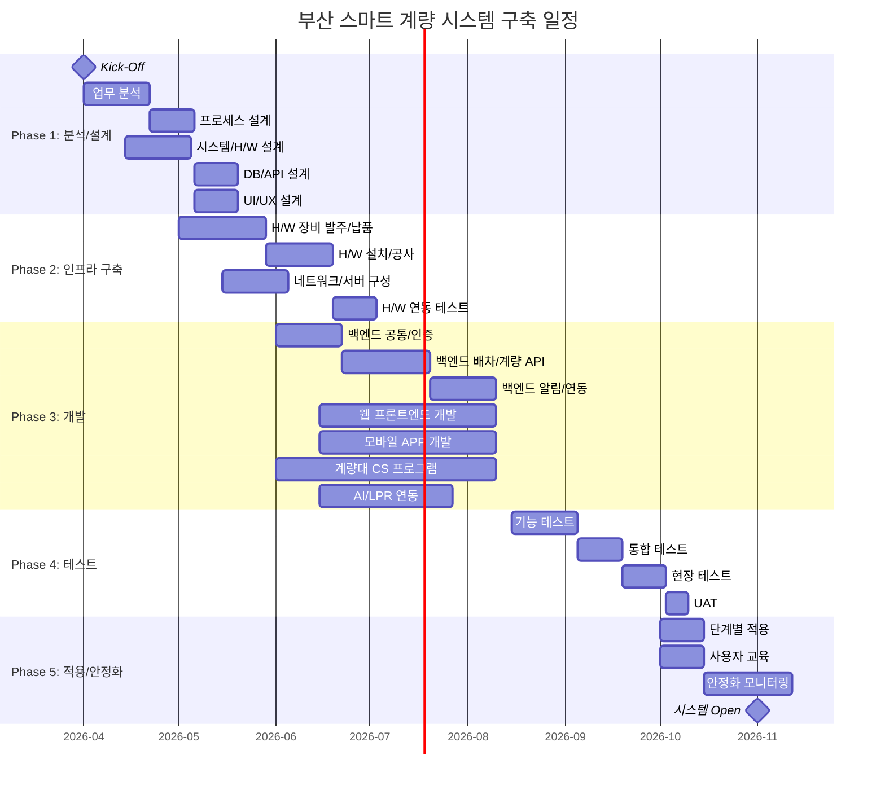

# 부산 스마트 계량 시스템 구축 WBS (Work Breakdown Structure)

**버전**: 1.0
**작성일**: 2026-01-27
**기반 문서**: PRD-20260127-154446, TRD-20260127-155235
**상태**: Draft

---

## 프로젝트 요약

| 항목 | 값 |
|------|-----|
| 총 작업 기간 | 32주 (8개월: 2026.04 ~ 2026.11) |
| 총 공수 | 498 Man-Days (24.9 Man-Months) |
| 버퍼 포함 총 공수 | 598 Man-Days (29.9 Man-Months) |
| 팀 규모 | 9명 (전담 6 + 부분 투입 3) |
| 방법론 | Hybrid (Waterfall 기반 + Agile 개발 스프린트) |
| 스프린트 주기 | 2주 |
| 버퍼 비율 | 20% |
| 개발 점검회의 | 월 1회 (PMO/개발팀) |

---

## 1. 프로젝트 단계 (Phases)



### Phase 1: 분석 및 설계 (2026.04.01 ~ 2026.05.31, 9주)
- **기간**: 9주
- **목표**: 스마트 계량 프로세스 분석, 시스템/H/W 설계, DB/API/UI 설계 완료
- **산출물**: 업무 분석서, 프로세스 설계서, H/W 구성 설계서, DB 설계서(ERD), API 명세서, UI/UX 와이어프레임

### Phase 2: 인프라 구축 (2026.05.01 ~ 2026.07.15, 11주)
- **기간**: 11주 (Phase 1과 일부 병행)
- **목표**: H/W 장비 설치, 서버/네트워크 구성, H/W 연동 검증
- **산출물**: H/W 설치 완료 보고서, 네트워크 구성도, 서버 환경 구축, H/W 연동 테스트 결과

### Phase 3: 프로그램 개발 (2026.06.01 ~ 2026.09.15, 15주)
- **기간**: 15주
- **목표**: 계량 WEB/CS/APP 프로그램 개발 완료
- **산출물**: 웹 관리 시스템, 모바일 API, 계량대 CS 프로그램, 계량관리 모바일 APP, AI/LPR 연동 모듈

### Phase 4: 테스트 (2026.08.15 ~ 2026.09.30, 7주)
- **기간**: 7주 (Phase 3 후반과 병행)
- **목표**: 기능/통합/현장 테스트 및 UAT 완료
- **산출물**: 테스트 계획서, 테스트 결과 보고서, 결함 보고서, UAT 승인서

### Phase 5: 적용 및 안정화 (2026.10.01 ~ 2026.11.30, 9주)
- **기간**: 9주
- **목표**: 시스템 적용, 사용자 교육, 안정화 운영, 시스템 Open
- **산출물**: 적용 결과 보고서, 교육 자료, 안정화 모니터링 보고서, 시스템 Open 보고서

---

## 2. 작업 패키지 (Work Packages)

### WP-1: 프로젝트 관리
| ID | 작업명 | 담당 역할 | 예상 공수 | 선행 작업 | 우선순위 |
|----|--------|----------|----------|----------|---------|
| WP-1.1 | Kick-Off 및 프로젝트 계획 수립 | PM/PL | 5MD | - | HIGH |
| WP-1.2 | 월간 점검회의 (8회) | PM/PL | 8MD | WP-1.1 | HIGH |
| WP-1.3 | 이해관계자 커뮤니케이션 | PM/PL | 10MD | WP-1.1 | HIGH |
| WP-1.4 | 리스크 관리 및 이슈 추적 | PM/PL | 8MD | WP-1.1 | HIGH |
| WP-1.5 | 품질 관리 (산출물 검토/승인) | PM/PL | 5MD | WP-1.1 | MEDIUM |
| WP-1.6 | 프로젝트 종료 보고 | PM/PL | 3MD | - | HIGH |

**소계**: 39 Man-Days

---

### WP-2: 분석 및 설계
| ID | 작업명 | 담당 역할 | 예상 공수 | 선행 작업 | 우선순위 |
|----|--------|----------|----------|----------|---------|
| WP-2.1 | 현행 계량 프로세스 분석 | BA/PM | 5MD | WP-1.1 | HIGH |
| WP-2.2 | 품목별 프로세스 설계 (부산물/폐기물/부재료/반출/일반) | BA/PM | 8MD | WP-2.1 | HIGH |
| WP-2.3 | H/W 구성 설계 (LPR, 센서, 전광판, 차단기) | 인프라 | 5MD | WP-2.1 | HIGH |
| WP-2.4 | DB 설계 (ERD, 테이블, 인덱스) | 백엔드 | 5MD | WP-2.2 | HIGH |
| WP-2.5 | API 설계 (명세서, 인증/인가 설계) | 백엔드 | 5MD | WP-2.4 | HIGH |
| WP-2.6 | 시스템 아키텍처 설계 | 백엔드/인프라 | 3MD | WP-2.1 | HIGH |
| WP-2.7 | UI/UX 설계 (웹 와이어프레임) | 디자이너 | 8MD | WP-2.2 | HIGH |
| WP-2.8 | UI/UX 설계 (모바일 와이어프레임) | 디자이너 | 6MD | WP-2.2 | HIGH |
| WP-2.9 | 데이터 마이그레이션 설계 | BA/백엔드 | 3MD | WP-2.4 | MEDIUM |
| WP-2.10 | 설계 검토 및 승인 | PM/현업 | 2MD | WP-2.5, WP-2.7 | HIGH |

**소계**: 50 Man-Days

---

### WP-3: 인프라 구축
| ID | 작업명 | 담당 역할 | 예상 공수 | 선행 작업 | 우선순위 |
|----|--------|----------|----------|----------|---------|
| WP-3.1 | H/W 장비 발주 및 납품 관리 | 인프라/PM | 5MD | WP-2.3 | HIGH |
| WP-3.2 | LPR 장비 설치 및 공사 | 인프라/협력사 | 8MD | WP-3.1 | HIGH |
| WP-3.3 | 전광판/차단기/센서 설치 | 인프라/협력사 | 5MD | WP-3.1 | HIGH |
| WP-3.4 | 인터폰 설치 (자기/모기) | 인프라/협력사 | 2MD | WP-3.1 | MEDIUM |
| WP-3.5 | 서버 환경 구축 (Dev/Staging/Production) | 인프라 | 5MD | WP-2.6 | HIGH |
| WP-3.6 | DB 서버 구축 (PostgreSQL Primary + Standby) | 인프라/DBA | 3MD | WP-3.5 | HIGH |
| WP-3.7 | Redis 서버 구축 | 인프라 | 2MD | WP-3.5 | HIGH |
| WP-3.8 | Nginx/Docker/CI/CD 구성 | 인프라 | 5MD | WP-3.5 | HIGH |
| WP-3.9 | 네트워크/VPN 구성 (계량대↔서버) | 인프라 | 3MD | WP-3.5 | HIGH |
| WP-3.10 | 모니터링 환경 구축 (Prometheus/Grafana/ELK) | 인프라 | 5MD | WP-3.5 | MEDIUM |
| WP-3.11 | H/W 연동 테스트 (LPR, 센서, 전광판, 차단기) | 인프라/CS개발자 | 5MD | WP-3.2, WP-3.3 | HIGH |

**소계**: 48 Man-Days

---

### WP-4: 백엔드 개발 (Spring Boot)
| ID | 작업명 | 담당 역할 | 예상 공수 | 선행 작업 | 우선순위 |
|----|--------|----------|----------|----------|---------|
| WP-4.1 | 프로젝트 셋업 (Spring Boot, 공통 모듈) | 백엔드 | 3MD | WP-3.5 | HIGH |
| WP-4.2 | DB 스키마 생성 및 마이그레이션 | 백엔드 | 3MD | WP-2.4, WP-3.6 | HIGH |
| WP-4.3 | 인증/인가 모듈 (JWT, RBAC, OTP) | 백엔드 | 8MD | WP-4.1 | HIGH |
| WP-4.4 | 배차관리 API (CRUD, 상태관리) | 백엔드 | 8MD | WP-4.2 | HIGH |
| WP-4.5 | 계량관리 API (계량시작/완료/재계량) | 백엔드 | 10MD | WP-4.4 | HIGH |
| WP-4.6 | LPR/AI 연동 API (차량번호 인식 연동) | 백엔드 | 8MD | WP-4.5 | HIGH |
| WP-4.7 | OTP 생성/검증 API | 백엔드 | 5MD | WP-4.3 | HIGH |
| WP-4.8 | 전자 계량표 API (생성, 조회, 공유) | 백엔드 | 5MD | WP-4.5 | HIGH |
| WP-4.9 | 알림 서비스 (Push, 알림톡, SMS) | 백엔드 | 8MD | WP-4.5 | MEDIUM |
| WP-4.10 | 기준정보 관리 API (운송사, 차량, 코드) | 백엔드 | 5MD | WP-4.2 | HIGH |
| WP-4.11 | 출문관리 API | 백엔드 | 3MD | WP-4.5 | MEDIUM |
| WP-4.12 | WebSocket 실시간 계량 현황 | 백엔드 | 5MD | WP-4.5 | HIGH |
| WP-4.13 | 카카오 API/SMS 연동 (계량표 공유) | 백엔드 | 5MD | WP-4.8 | MEDIUM |
| WP-4.14 | 통계/대시보드 API | 백엔드 | 5MD | WP-4.5 | MEDIUM |
| WP-4.15 | 데이터 마이그레이션 개발 | 백엔드/BA | 5MD | WP-2.9, WP-4.2 | MEDIUM |
| WP-4.16 | 백엔드 단위 테스트 | 백엔드 | 8MD | WP-4.5 | HIGH |

**소계**: 94 Man-Days

---

### WP-5: 웹 프론트엔드 개발 (React)
| ID | 작업명 | 담당 역할 | 예상 공수 | 선행 작업 | 우선순위 |
|----|--------|----------|----------|----------|---------|
| WP-5.1 | 프로젝트 셋업 (React + Vite + TypeScript) | 프론트엔드 | 2MD | WP-3.8 | HIGH |
| WP-5.2 | 공통 레이아웃/컴포넌트 (Ant Design) | 프론트엔드 | 5MD | WP-5.1 | HIGH |
| WP-5.3 | 로그인/인증 화면 | 프론트엔드 | 3MD | WP-5.2, WP-4.3 | HIGH |
| WP-5.4 | 배차관리 화면 (등록/조회/수정) | 프론트엔드 | 8MD | WP-5.2, WP-4.4 | HIGH |
| WP-5.5 | 계량관리 화면 (현황/조회/상세) | 프론트엔드 | 8MD | WP-5.2, WP-4.5 | HIGH |
| WP-5.6 | 실시간 계량 대시보드 (WebSocket + ECharts) | 프론트엔드 | 8MD | WP-5.5, WP-4.12 | HIGH |
| WP-5.7 | 기준정보 관리 화면 (운송사/차량/코드) | 프론트엔드 | 5MD | WP-5.2, WP-4.10 | MEDIUM |
| WP-5.8 | 출문관리 화면 | 프론트엔드 | 3MD | WP-5.2, WP-4.11 | MEDIUM |
| WP-5.9 | 통계/리포트 화면 | 프론트엔드 | 5MD | WP-5.2, WP-4.14 | MEDIUM |
| WP-5.10 | 프론트엔드 단위/통합 테스트 | 프론트엔드 | 5MD | WP-5.6 | HIGH |

**소계**: 52 Man-Days

---

### WP-6: 모바일 APP 개발 (Flutter)
| ID | 작업명 | 담당 역할 | 예상 공수 | 선행 작업 | 우선순위 |
|----|--------|----------|----------|----------|---------|
| WP-6.1 | 프로젝트 셋업 (Flutter + Riverpod) | 모바일 | 2MD | WP-3.8 | HIGH |
| WP-6.2 | 로그인 화면 (담당자/운전자, 안전 로그인) | 모바일 | 5MD | WP-6.1, WP-4.3 | HIGH |
| WP-6.3 | 배차조회 화면 (배차지시 현황, 다중 배차 선택) | 모바일 | 5MD | WP-6.2, WP-4.4 | HIGH |
| WP-6.4 | 계량진행 화면 (모바일 계량) | 모바일 | 8MD | WP-6.3, WP-4.5 | HIGH |
| WP-6.5 | 모바일 OTP 화면 (OTP 입력, 보안 계량) | 모바일 | 5MD | WP-6.4, WP-4.7 | HIGH |
| WP-6.6 | 전자 계량표 화면 (조회, 공유) | 모바일 | 5MD | WP-6.4, WP-4.8 | HIGH |
| WP-6.7 | 배차실적 조회 화면 (월별/일별, 기간설정) | 모바일 | 5MD | WP-6.3 | MEDIUM |
| WP-6.8 | 전달사항/문의통화 기능 | 모바일 | 3MD | WP-6.2 | MEDIUM |
| WP-6.9 | Push 알림 연동 (FCM) | 모바일 | 3MD | WP-6.1, WP-4.9 | HIGH |
| WP-6.10 | 카카오톡/SMS 공유 연동 | 모바일 | 3MD | WP-6.6, WP-4.13 | MEDIUM |
| WP-6.11 | 오프라인 캐싱 (Hive) | 모바일 | 3MD | WP-6.4 | MEDIUM |
| WP-6.12 | 모바일 단위/통합 테스트 | 모바일 | 5MD | WP-6.6 | HIGH |

**소계**: 52 Man-Days

---

### WP-7: 계량대 CS 프로그램 개발 (C# .NET)
| ID | 작업명 | 담당 역할 | 예상 공수 | 선행 작업 | 우선순위 |
|----|--------|----------|----------|----------|---------|
| WP-7.1 | 프로젝트 셋업 (C# .NET, WinForms/WPF) | CS개발자 | 2MD | - | HIGH |
| WP-7.2 | RS-232C 인디게이터 통신 모듈 | CS개발자 | 8MD | WP-7.1 | HIGH |
| WP-7.3 | LPR 카메라 연동 모듈 (TCP/UDP) | CS개발자 | 8MD | WP-7.1, WP-3.11 | HIGH |
| WP-7.4 | LiDAR/레이더 센서 연동 | CS개발자 | 5MD | WP-7.1, WP-3.11 | HIGH |
| WP-7.5 | 차량검지기 연동 | CS개발자 | 3MD | WP-7.1, WP-3.11 | HIGH |
| WP-7.6 | 전광판 제어 모듈 (OTP 표시) | CS개발자 | 5MD | WP-7.1, WP-3.11 | HIGH |
| WP-7.7 | 자동 차단기 제어 모듈 | CS개발자 | 3MD | WP-7.1, WP-3.11 | HIGH |
| WP-7.8 | 계량 메인 화면 (터치스크린 UI) | CS개발자 | 8MD | WP-7.2 | HIGH |
| WP-7.9 | LPR 자동 계량 프로세스 | CS개발자 | 8MD | WP-7.3, WP-7.8, WP-4.6 | HIGH |
| WP-7.10 | 모바일 OTP 계량 프로세스 | CS개발자 | 5MD | WP-7.6, WP-7.8, WP-4.7 | HIGH |
| WP-7.11 | 수동 계량 프로세스 (기존 방식 병행) | CS개발자 | 3MD | WP-7.8 | HIGH |
| WP-7.12 | 초기화/재계량 기능 | CS개발자 | 3MD | WP-7.8 | HIGH |
| WP-7.13 | API 서버 연동 (계량실적 전송, 배차 조회) | CS개발자 | 5MD | WP-7.8, WP-4.5 | HIGH |
| WP-7.14 | 로컬 캐싱/오프라인 모드 | CS개발자 | 5MD | WP-7.13 | MEDIUM |
| WP-7.15 | CS 프로그램 테스트 | CS개발자 | 5MD | WP-7.9, WP-7.10 | HIGH |

**소계**: 76 Man-Days

---

### WP-8: 테스트
| ID | 작업명 | 담당 역할 | 예상 공수 | 선행 작업 | 우선순위 |
|----|--------|----------|----------|----------|---------|
| WP-8.1 | 테스트 계획 수립 | QA | 3MD | WP-2.10 | HIGH |
| WP-8.2 | 기능 테스트 (웹) | QA/프론트엔드 | 5MD | WP-5.10 | HIGH |
| WP-8.3 | 기능 테스트 (모바일 APP) | QA/모바일 | 5MD | WP-6.12 | HIGH |
| WP-8.4 | 기능 테스트 (CS 프로그램) | QA/CS개발자 | 5MD | WP-7.15 | HIGH |
| WP-8.5 | API 통합 테스트 | QA/백엔드 | 5MD | WP-4.16 | HIGH |
| WP-8.6 | E2E 통합 테스트 (전체 프로세스) | QA/전체 | 8MD | WP-8.2~WP-8.5 | HIGH |
| WP-8.7 | 현장 테스트 (계량대 실차 테스트) | QA/인프라/현업 | 8MD | WP-8.6 | HIGH |
| WP-8.8 | 성능 테스트 (LPR 인식률, API 응답) | QA/인프라 | 5MD | WP-8.6 | HIGH |
| WP-8.9 | 보안 테스트 (OTP, 인증, 취약점) | QA/백엔드 | 3MD | WP-8.6 | HIGH |
| WP-8.10 | UAT (사용자 인수 테스트) | PM/현업 | 5MD | WP-8.7 | HIGH |
| WP-8.11 | 결함 수정 및 재테스트 | 전체 개발팀 | 10MD | WP-8.7 | HIGH |

**소계**: 62 Man-Days

---

### WP-9: 적용 및 안정화
| ID | 작업명 | 담당 역할 | 예상 공수 | 선행 작업 | 우선순위 |
|----|--------|----------|----------|----------|---------|
| WP-9.1 | 데이터 마이그레이션 실행 | 백엔드/BA | 5MD | WP-4.15, WP-8.10 | HIGH |
| WP-9.2 | 단계별 시스템 적용 (품목별 순차) | 전체팀 | 8MD | WP-9.1 | HIGH |
| WP-9.3 | 사용자 교육 자료 작성 | PM/BA | 5MD | WP-8.10 | HIGH |
| WP-9.4 | 사용자 집체 교육 (차량기사/운송사/담당자) | PM/BA | 5MD | WP-9.3 | HIGH |
| WP-9.5 | 안정화 모니터링 (1개월) | 전체팀 | 15MD | WP-9.2 | HIGH |
| WP-9.6 | 안정화 기간 결함 대응 | 전체 개발팀 | 10MD | WP-9.2 | HIGH |
| WP-9.7 | 운영 이관 (매뉴얼, 운영 가이드) | PM/인프라 | 5MD | WP-9.5 | HIGH |
| WP-9.8 | 시스템 Open 및 프로젝트 종료 | PM/PL | 2MD | WP-9.7 | HIGH |

**소계**: 55 Man-Days

---

## 3. 세부 작업 목록 (Task List)

### 3.1 Phase 1: 분석/설계 단계 (W1~W9)

| ID | 작업 | 설명 | 담당 | 공수 | 시작 | 종료 | 의존성 |
|----|------|------|------|------|------|------|--------|
| T-001 | Kick-Off 및 프로젝트 계획 | 프로젝트 착수, 팀 구성, 일정 확정 | PM/PL | 5MD | W1 | W1 | - |
| T-002 | 현행 계량 프로세스 분석 | AS-IS 업무 분석, 현장 방문, 이해관계자 인터뷰 | BA/PM | 5MD | W1 | W3 | T-001 |
| T-003 | 품목별 프로세스 설계 | 부산물/폐기물/부재료/반출/일반 TO-BE 프로세스 | BA/PM | 8MD | W3 | W5 | T-002 |
| T-004 | H/W 구성 설계 | LPR, 센서, 전광판, 차단기, 인터폰 구성 설계 | 인프라 | 5MD | W2 | W4 | T-002 |
| T-005 | 시스템 아키텍처 설계 | 전체 시스템 구성도, 통신 방식, 서버 구성 | 백엔드/인프라 | 3MD | W3 | W4 | T-002 |
| T-006 | DB 설계 | ERD, 테이블 명세, 인덱스 전략 (13개 테이블) | 백엔드 | 5MD | W5 | W6 | T-003 |
| T-007 | API 설계 | API 명세서 작성 (30+ 엔드포인트, 10개 도메인) | 백엔드 | 5MD | W6 | W7 | T-006 |
| T-008 | UI/UX 웹 설계 | 웹 와이어프레임 (배차, 계량, 기준정보, 출문, 대시보드) | 디자이너 | 8MD | W5 | W7 | T-003 |
| T-009 | UI/UX 모바일 설계 | 모바일 APP 와이어프레임 (로그인, 배차, 계량, OTP, 계량표) | 디자이너 | 6MD | W5 | W7 | T-003 |
| T-010 | 데이터 마이그레이션 설계 | 기존 시스템 데이터 분석, 매핑 설계 | BA/백엔드 | 3MD | W7 | W8 | T-006 |
| T-011 | 설계 검토 및 승인 | 전체 설계 문서 PMO/현업 검토, 승인 | PM/현업 | 2MD | W8 | W9 | T-007, T-008 |

### 3.2 Phase 2: 인프라 구축 단계 (W5~W15)

| ID | 작업 | 설명 | 담당 | 공수 | 시작 | 종료 | 의존성 |
|----|------|------|------|------|------|------|--------|
| T-101 | H/W 장비 발주/납품 | LPR, 전광판, 차단기, 센서, 인터폰 발주·납품 관리 | 인프라/PM | 5MD | W5 | W8 | T-004 |
| T-102 | LPR 장비 설치/공사 | LPR 카메라 설치, 관련 전기/통신 공사 | 인프라/협력사 | 8MD | W9 | W12 | T-101 |
| T-103 | 전광판/차단기/센서 설치 | 대형전광판, 자동차단기, 레이더센서, 차량검지기 설치 | 인프라/협력사 | 5MD | W9 | W11 | T-101 |
| T-104 | 인터폰 설치 | 인터폰 자기/모기 각 1대 설치 | 인프라/협력사 | 2MD | W9 | W10 | T-101 |
| T-105 | 서버 환경 구축 | Dev/Staging/Production 서버, Docker 환경 | 인프라 | 5MD | W6 | W8 | T-005 |
| T-106 | DB 서버 구축 | PostgreSQL Primary+Standby, 초기 스키마 배포 | 인프라/DBA | 3MD | W8 | W9 | T-105 |
| T-107 | Redis 서버 구축 | Redis 설치, OTP/캐시/세션 설정 | 인프라 | 2MD | W8 | W9 | T-105 |
| T-108 | Nginx/Docker/CI/CD 구성 | Reverse Proxy, SSL, Jenkins 파이프라인 | 인프라 | 5MD | W8 | W10 | T-105 |
| T-109 | 네트워크/VPN 구성 | 계량대↔서버 VPN, 방화벽, 포트 설정 | 인프라 | 3MD | W7 | W9 | T-105 |
| T-110 | 모니터링 환경 구축 | Prometheus, Grafana, ELK Stack 설치·설정 | 인프라 | 5MD | W10 | W12 | T-105 |
| T-111 | H/W 연동 테스트 | LPR, 센서, 전광판, 차단기 장비 통신 테스트 | 인프라/CS개발자 | 5MD | W13 | W15 | T-102, T-103 |

### 3.3 Phase 3: 개발 단계 (W9~W24)

| ID | 작업 | 설명 | 담당 | 공수 | 시작 | 종료 | 의존성 |
|----|------|------|------|------|------|------|--------|
| T-201 | 백엔드 프로젝트 셋업 | Spring Boot 3.2, 공통 모듈, 패키지 구조 | 백엔드 | 3MD | W9 | W9 | T-105 |
| T-202 | DB 스키마 생성/마이그레이션 | JPA Entity, Flyway 마이그레이션 | 백엔드 | 3MD | W9 | W10 | T-006, T-106 |
| T-203 | 인증/인가 모듈 | JWT, Spring Security, RBAC, OTP 로직 | 백엔드 | 8MD | W10 | W12 | T-201 |
| T-204 | 배차관리 API | 배차 CRUD, 상태 관리, 검색 | 백엔드 | 8MD | W10 | W13 | T-202 |
| T-205 | 계량관리 API | 계량 시작/완료/재계량, 상태 관리 | 백엔드 | 10MD | W13 | W16 | T-204 |
| T-206 | LPR/AI 연동 API | AI 차량인식 엔진 HTTP 연동, 신뢰도 판단 | 백엔드 | 8MD | W14 | W17 | T-205 |
| T-207 | OTP 생성/검증 API | Redis TTL 기반 OTP, 전광판 연동 | 백엔드 | 5MD | W12 | W14 | T-203 |
| T-208 | 전자 계량표 API | 계량표 생성, 조회, 공유 처리 | 백엔드 | 5MD | W16 | W18 | T-205 |
| T-209 | 알림 서비스 | FCM Push, 카카오 알림톡, SMS 발송 | 백엔드 | 8MD | W17 | W20 | T-205 |
| T-210 | 기준정보 관리 API | 운송사, 차량, 공통코드, 계량대 관리 | 백엔드 | 5MD | W10 | W12 | T-202 |
| T-211 | 출문관리 API | 출문 처리, 상태 관리 | 백엔드 | 3MD | W16 | W17 | T-205 |
| T-212 | WebSocket 실시간 계량 | STOMP 기반 실시간 계량 현황 전송 | 백엔드 | 5MD | W17 | W19 | T-205 |
| T-213 | 카카오/SMS 연동 | 카카오비즈 API, SMS Gateway 연동 | 백엔드 | 5MD | W18 | W20 | T-208 |
| T-214 | 통계/대시보드 API | 일별/월별/품목별 계량 통계 | 백엔드 | 5MD | W18 | W20 | T-205 |
| T-215 | 데이터 마이그레이션 개발 | ETL 스크립트, 검증 로직 | 백엔드/BA | 5MD | W18 | W20 | T-010, T-202 |
| T-216 | 백엔드 단위 테스트 | JUnit, Mockito 기반 단위 테스트 | 백엔드 | 8MD | W20 | W22 | T-205 |
| T-301 | 웹 프로젝트 셋업 | React + Vite + TypeScript + Ant Design | 프론트엔드 | 2MD | W10 | W10 | T-108 |
| T-302 | 공통 레이아웃/컴포넌트 | GNB, 메뉴, 공통 테이블, 폼, 차트 컴포넌트 | 프론트엔드 | 5MD | W10 | W12 | T-301 |
| T-303 | 로그인/인증 화면 | 로그인 페이지, 토큰 관리, 권한 라우팅 | 프론트엔드 | 3MD | W12 | W13 | T-302, T-203 |
| T-304 | 배차관리 화면 | 배차 등록/조회/수정, 데이터 테이블 | 프론트엔드 | 8MD | W13 | W16 | T-302, T-204 |
| T-305 | 계량관리 화면 | 계량 현황/조회/상세, 상태 표시 | 프론트엔드 | 8MD | W15 | W19 | T-302, T-205 |
| T-306 | 실시간 계량 대시보드 | WebSocket + ECharts 대시보드 | 프론트엔드 | 8MD | W19 | W22 | T-305, T-212 |
| T-307 | 기준정보 관리 화면 | 운송사/차량/코드 관리 | 프론트엔드 | 5MD | W14 | W16 | T-302, T-210 |
| T-308 | 출문관리 화면 | 출문 목록/처리 | 프론트엔드 | 3MD | W17 | W18 | T-302, T-211 |
| T-309 | 통계/리포트 화면 | 기간별 통계, 차트, 엑셀 내보내기 | 프론트엔드 | 5MD | W20 | W22 | T-302, T-214 |
| T-310 | 웹 프론트엔드 테스트 | Vitest, React Testing Library | 프론트엔드 | 5MD | W22 | W24 | T-306 |
| T-401 | 모바일 프로젝트 셋업 | Flutter + Riverpod + Hive | 모바일 | 2MD | W10 | W10 | T-108 |
| T-402 | 로그인 화면 | 담당자/운전자 구분, 안전 로그인, 인증번호 | 모바일 | 5MD | W10 | W12 | T-401, T-203 |
| T-403 | 배차조회 화면 | 배차지시 현황, 다중 배차 선택 | 모바일 | 5MD | W12 | W14 | T-402, T-204 |
| T-404 | 계량진행 화면 | 모바일 계량 프로세스 | 모바일 | 8MD | W14 | W18 | T-403, T-205 |
| T-405 | 모바일 OTP 화면 | OTP 입력, 보안 인증, 모바일 계량 | 모바일 | 5MD | W16 | W18 | T-404, T-207 |
| T-406 | 전자 계량표 화면 | 계량표 조회, 상세 보기 | 모바일 | 5MD | W18 | W20 | T-404, T-208 |
| T-407 | 배차실적 조회 화면 | 월별/일별 실적, 기간 설정 | 모바일 | 5MD | W16 | W18 | T-403 |
| T-408 | 전달사항/문의통화 기능 | 전달사항 표시, 문의유형별 전화 연결 | 모바일 | 3MD | W14 | W15 | T-402 |
| T-409 | Push 알림 연동 | FCM 토큰 등록, 알림 수신/표시 | 모바일 | 3MD | W18 | W19 | T-401, T-209 |
| T-410 | 카카오톡/SMS 공유 | 전자 계량표 외부 공유 기능 | 모바일 | 3MD | W20 | W21 | T-406, T-213 |
| T-411 | 오프라인 캐싱 | Hive 기반 로컬 데이터 캐싱 | 모바일 | 3MD | W18 | W19 | T-404 |
| T-412 | 모바일 테스트 | iOS/Android 기능 테스트, 디바이스 호환 | 모바일 | 5MD | W21 | W23 | T-406 |
| T-501 | CS 프로젝트 셋업 | C# .NET, WinForms/WPF, 프로젝트 구조 | CS개발자 | 2MD | W9 | W9 | - |
| T-502 | RS-232C 인디게이터 통신 | 시리얼 포트 통신, 중량값 수신/안정화 판단 | CS개발자 | 8MD | W9 | W12 | T-501 |
| T-503 | LPR 카메라 연동 | TCP/UDP 통신, 차량번호 수신 | CS개발자 | 8MD | W10 | W14 | T-501, T-111 |
| T-504 | LiDAR/레이더 센서 연동 | 센서 데이터 수신, 차량 진입 감지 | CS개발자 | 5MD | W12 | W14 | T-501, T-111 |
| T-505 | 차량검지기 연동 | 차량 정위치 확인 센서 | CS개발자 | 3MD | W12 | W13 | T-501, T-111 |
| T-506 | 전광판 제어 | OTP 번호 표시, 안내 메시지 출력 | CS개발자 | 5MD | W14 | W16 | T-501, T-111 |
| T-507 | 자동 차단기 제어 | 개폐 제어, 수동 스위치 연동 | CS개발자 | 3MD | W14 | W15 | T-501, T-111 |
| T-508 | 계량 메인 화면 | 터치스크린 UI, 중량 표시, 상태 표시 | CS개발자 | 8MD | W13 | W16 | T-502 |
| T-509 | LPR 자동 계량 프로세스 | LiDAR→LPR→AI→자동계량→실적저장 풀 프로세스 | CS개발자 | 8MD | W16 | W19 | T-503, T-508, T-206 |
| T-510 | 모바일 OTP 계량 프로세스 | 오인식→전광판 OTP→모바일 인증→계량 | CS개발자 | 5MD | W18 | W20 | T-506, T-508, T-207 |
| T-511 | 수동 계량 프로세스 | 기존 터치스크린 방식 병행 운영 | CS개발자 | 3MD | W16 | W17 | T-508 |
| T-512 | 초기화/재계량 기능 | 계량 데이터 초기화, 재계량 프로세스 | CS개발자 | 3MD | W17 | W18 | T-508 |
| T-513 | API 서버 연동 | 계량실적 전송, 배차정보 조회, 인증 | CS개발자 | 5MD | W18 | W20 | T-508, T-205 |
| T-514 | 로컬 캐싱/오프라인 모드 | 네트워크 끊김 시 로컬 저장, 복구 시 동기화 | CS개발자 | 5MD | W20 | W22 | T-513 |
| T-515 | CS 프로그램 테스트 | 장비 연동 테스트, 프로세스 테스트 | CS개발자 | 5MD | W22 | W24 | T-509, T-510 |

### 3.4 Phase 4: 테스트 단계 (W20~W26)

| ID | 작업 | 설명 | 담당 | 공수 | 시작 | 종료 | 의존성 |
|----|------|------|------|------|------|------|--------|
| T-601 | 테스트 계획 수립 | 테스트 전략, 시나리오, 환경 준비 | QA | 3MD | W14 | W15 | T-011 |
| T-602 | 웹 기능 테스트 | 배차/계량/기준정보/출문/대시보드 기능 검증 | QA/프론트 | 5MD | W22 | W23 | T-310 |
| T-603 | 모바일 APP 기능 테스트 | 로그인/배차/계량/OTP/계량표/실적조회 검증 | QA/모바일 | 5MD | W22 | W23 | T-412 |
| T-604 | CS 프로그램 기능 테스트 | LPR/수동/모바일 계량, H/W 연동 검증 | QA/CS개발 | 5MD | W22 | W23 | T-515 |
| T-605 | API 통합 테스트 | 전체 API 엔드포인트 통합 검증 | QA/백엔드 | 5MD | W22 | W23 | T-216 |
| T-606 | E2E 통합 테스트 | 차량진입→LPR→AI→계량→계량표→Push 전체 | QA/전체 | 8MD | W23 | W25 | T-602~T-605 |
| T-607 | 현장 테스트 | 계량대 실차 테스트, 현업 참여 | QA/인프라/현업 | 8MD | W24 | W26 | T-606 |
| T-608 | 성능 테스트 | LPR 인식률, API p95, 동시접속 | QA/인프라 | 5MD | W24 | W25 | T-606 |
| T-609 | 보안 테스트 | OTP 보안, 인증 우회, 취약점 점검 | QA/백엔드 | 3MD | W24 | W25 | T-606 |
| T-610 | UAT | 사용자(차량기사/운송사/담당자) 인수 테스트 | PM/현업 | 5MD | W26 | W27 | T-607 |
| T-611 | 결함 수정/재테스트 | 발견 결함 수정 및 재검증 | 전체 개발팀 | 10MD | W24 | W27 | T-607 |

### 3.5 Phase 5: 적용/안정화 단계 (W27~W35)

| ID | 작업 | 설명 | 담당 | 공수 | 시작 | 종료 | 의존성 |
|----|------|------|------|------|------|------|--------|
| T-701 | 데이터 마이그레이션 실행 | 기존 시스템 데이터 이관, 검증 | 백엔드/BA | 5MD | W27 | W28 | T-215, T-610 |
| T-702 | 단계별 시스템 적용 | 품목별 순차 적용 (부산물→폐기물→부재료→반출→일반) | 전체팀 | 8MD | W28 | W30 | T-701 |
| T-703 | 사용자 교육 자료 작성 | 웹/모바일/CS 사용 매뉴얼, 교육 PPT | PM/BA | 5MD | W27 | W28 | T-610 |
| T-704 | 사용자 집체 교육 | 차량기사, 운송사, 계량담당자 대상 교육 | PM/BA | 5MD | W28 | W30 | T-703 |
| T-705 | 안정화 모니터링 | 시스템 모니터링, 이슈 추적, 성능 분석 (4주) | 전체팀 | 15MD | W30 | W34 | T-702 |
| T-706 | 안정화 결함 대응 | 운영 중 발견 결함 즉시 대응 | 전체 개발팀 | 10MD | W30 | W34 | T-702 |
| T-707 | 운영 이관 | 운영 매뉴얼, 운영 가이드, 장애 대응 절차 | PM/인프라 | 5MD | W33 | W34 | T-705 |
| T-708 | 시스템 Open/프로젝트 종료 | 시스템 Open, 프로젝트 종료 보고서 | PM/PL | 2MD | W35 | W35 | T-707 |

---

## 4. 크리티컬 패스 (Critical Path)

프로젝트 일정에 가장 큰 영향을 미치는 작업 경로:

```
T-001 → T-002 → T-003 → T-006 → T-202 → T-204 → T-205 → T-509 → T-606 → T-607 → T-610 → T-701 → T-702 → T-705 → T-708
(PM)    (분석)   (설계)   (DB)    (스키마)  (배차API) (계량API) (LPR자동) (E2E)   (현장)   (UAT)   (이관)   (적용)   (안정화) (Open)
```

| 단계 | 작업 ID | 작업명 | 공수 | 누적 |
|------|---------|--------|------|------|
| 1 | T-001 | Kick-Off 및 프로젝트 계획 | 5MD | 5MD |
| 2 | T-002 | 현행 계량 프로세스 분석 | 5MD | 10MD |
| 3 | T-003 | 품목별 프로세스 설계 | 8MD | 18MD |
| 4 | T-006 | DB 설계 | 5MD | 23MD |
| 5 | T-202 | DB 스키마 생성/마이그레이션 | 3MD | 26MD |
| 6 | T-204 | 배차관리 API | 8MD | 34MD |
| 7 | T-205 | 계량관리 API | 10MD | 44MD |
| 8 | T-509 | LPR 자동 계량 프로세스 (CS) | 8MD | 52MD |
| 9 | T-606 | E2E 통합 테스트 | 8MD | 60MD |
| 10 | T-607 | 현장 테스트 | 8MD | 68MD |
| 11 | T-610 | UAT | 5MD | 73MD |
| 12 | T-701 | 데이터 마이그레이션 실행 | 5MD | 78MD |
| 13 | T-702 | 단계별 시스템 적용 | 8MD | 86MD |
| 14 | T-705 | 안정화 모니터링 | 15MD | 101MD |
| 15 | T-708 | 시스템 Open | 2MD | 103MD |

**총 크리티컬 패스 길이**: 103 Man-Days

> 크리티컬 패스 상의 작업이 지연되면 전체 프로젝트 일정에 직접적인 영향을 미칩니다. 특히 **계량관리 API(T-205)**, **LPR 자동 계량 프로세스(T-509)**, **현장 테스트(T-607)**, **안정화 모니터링(T-705)**은 가장 긴 단일 작업으로 집중 관리가 필요합니다.

---

## 5. 리소스 배분 (Resource Allocation)

### 5.1 역할별 투입 계획

| 역할 | 인원 | 주요 담당 작업 | 투입 공수 | 투입률 |
|------|------|---------------|----------|--------|
| PM/PL | 1명 | 프로젝트 관리, 이해관계자 소통, 점검회의, UAT | 39MD | 100% (전 기간) |
| BA (업무 분석가) | 1명 | 현행 분석, 프로세스 설계, 마이그레이션, 교육 | 34MD | 100% (Phase 1,5), 50% (Phase 3,4) |
| 백엔드 개발자 | 2명 | Spring Boot API, DB, WebSocket, 외부 연동 | 94MD | 100% (Phase 2~4) |
| 프론트엔드 개발자 | 1명 | React 웹 시스템 개발, UI/UX 구현 | 52MD | 100% (Phase 3~4) |
| 모바일 개발자 | 1명 | Flutter APP 개발, Push/공유 연동 | 52MD | 100% (Phase 3~4) |
| CS 개발자 | 1명 | C# 계량대 프로그램, H/W 연동 | 76MD | 100% (Phase 2~4) |
| 인프라 엔지니어 | 1명 | H/W 설치, 서버/네트워크, CI/CD, 모니터링 | 48MD | 100% (Phase 2), 50% (Phase 1,3,4,5) |
| QA 엔지니어 | 0.5명 | 테스트 계획/실행, 결함 관리 | 62MD | 100% (Phase 4), 30% (Phase 3) |
| UI/UX 디자이너 | 0.5명 | 웹/모바일 와이어프레임, 디자인 가이드 | 14MD | 100% (Phase 1), - (이후) |

### 5.2 주차별 투입 현황

| 주차 | PM/PL | BA | 백엔드(2) | 프론트 | 모바일 | CS | 인프라 | QA | 디자인 |
|------|-------|-----|----------|--------|--------|-----|--------|-----|--------|
| W1~W4 (분석) | ● | ● | ○ | - | - | - | ○ | - | ● |
| W5~W8 (설계) | ● | ● | ● | - | - | - | ● | - | ● |
| W9~W12 (인프라/개발시작) | ● | ○ | ●● | ● | ● | ● | ● | - | - |
| W13~W16 (개발 집중) | ● | ○ | ●● | ● | ● | ● | ○ | ○ | - |
| W17~W20 (개발 집중) | ● | ○ | ●● | ● | ● | ● | ○ | ○ | - |
| W21~W24 (개발/테스트) | ● | ○ | ●● | ● | ● | ● | ○ | ● | - |
| W25~W27 (테스트) | ● | ○ | ● | ○ | ○ | ○ | ○ | ● | - |
| W28~W30 (적용/교육) | ● | ● | ○ | ○ | ○ | ○ | ○ | ○ | - |
| W31~W35 (안정화) | ● | ○ | ○ | ○ | ○ | ○ | ○ | ○ | - |

(● 전담, ○ 부분 투입, - 미투입, ●● 2명 전담)

---

## 6. 공수 요약 (Effort Summary)

### 6.1 단계별 공수

| 단계 | 공수 (MD) | 비율 |
|------|----------|------|
| WP-1: 프로젝트 관리 | 39 | 7.8% |
| WP-2: 분석/설계 | 50 | 10.0% |
| WP-3: 인프라 구축 | 48 | 9.6% |
| WP-4: 백엔드 개발 | 94 | 18.9% |
| WP-5: 웹 프론트엔드 개발 | 52 | 10.4% |
| WP-6: 모바일 APP 개발 | 52 | 10.4% |
| WP-7: 계량대 CS 개발 | 76 | 15.3% |
| WP-8: 테스트 | 62 | 12.5% |
| WP-9: 적용/안정화 | 55 | 11.0% |
| **소계** | **498** | **100%** |
| 버퍼 (20%) | 100 | - |
| **총계** | **598** | - |

### 6.2 역할별 공수

| 역할 | 공수 (MD) | 비율 |
|------|----------|------|
| PM/PL | 39 | 7.8% |
| BA (업무 분석가) | 34 | 6.8% |
| 백엔드 개발자 (2명) | 94 | 18.9% |
| 프론트엔드 개발자 | 52 | 10.4% |
| 모바일 개발자 | 52 | 10.4% |
| CS 개발자 | 76 | 15.3% |
| 인프라 엔지니어 | 48 | 9.6% |
| QA 엔지니어 | 62 | 12.5% |
| UI/UX 디자이너 | 14 | 2.8% |
| 공통 (결함수정/안정화) | 27 | 5.4% |
| **총계** | **498** | **100%** |

### 6.3 Man-Month 환산

- 1 Man-Month = 20 Man-Days (주 5일 기준)
- **순 공수**: 498 Man-Days = **24.9 Man-Months**
- **버퍼 포함**: 598 Man-Days = **29.9 Man-Months**

---

## 7. 리스크 및 가정사항

### 가정사항
- 팀원 투입률은 계획대로 유지 (전담 100%, 부분 투입 50%)
- LPR 장비 및 AI 인식 엔진은 M2(인프라 구축) 기간 내 선정/납품 완료
- 기존 배차/계량 시스템의 데이터 구조 파악이 분석 단계에서 완료
- H/W 장비 발주 후 납품까지 4주 소요 가정
- 카카오 API, SMS 서비스 계약이 개발 시작 전 완료
- 현업/PMO의 적극적인 지원 (월 1회 점검회의, 설계 승인, UAT 참여)
- 개발 환경(서버, DB, CI/CD)이 개발 시작 전 구축 완료

### 일정 리스크

| 리스크 | 영향 | 대응 방안 |
|--------|------|----------|
| LPR 장비 납품 지연 | HIGH | 사전 발주, 대안 업체 확보, CS 개발은 시뮬레이터로 선행 |
| AI 인식 엔진 선정 지연 | HIGH | 벤치마크 일정 앞당김, 복수 후보 병행 검토 |
| 기존 시스템 마이그레이션 복잡도 초과 | MEDIUM | 마이그레이션 PoC 조기 수행, 병행 운영 기간 확보 |
| 요구사항 변경 | HIGH | 변경 관리 프로세스 수립, 버퍼(20%) 활용, 월간 점검회의 |
| H/W 연동 이슈 (RS-232C, LPR, 센서) | MEDIUM | H/W 연동 테스트 기간 확보, 예비 장비, 제조사 기술 지원 |
| 인력 이탈 | HIGH | 문서화 강화, 지식 공유, 크로스 트레이닝, 핵심 인력 리텐션 |
| 현장 테스트 환경 제약 (실차 운행) | MEDIUM | 현업 협조 일정 사전 확보, 야간/주말 테스트 계획 |
| Flutter iOS/Android 호환 이슈 | LOW | CI 자동 빌드 테스트, 베타 테스트 사전 수행 |

---

## 8. 참고 문서

- 기반 PRD: `workspace/outputs/prd/PRD-20260127-154446.md`
- 기반 TRD: `workspace/outputs/trd/TRD-20260127-155235.md`
- 원본 입력: `workspace/inputs/projects/부산 스마트 계량 시스템 구축 - 수행계획서.pptx`

---
*이 문서는 WBS 자동 생성 시스템에 의해 작성되었습니다.*
