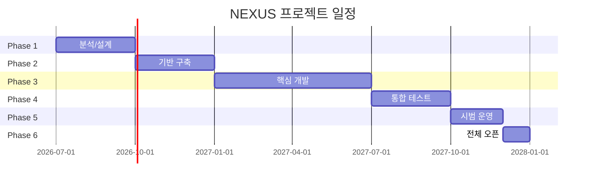

# 냉연 통합 MES/APS 시스템 (NEXUS) WBS (Work Breakdown Structure)

**버전**: 1.0
**작성일**: 2026-02-07
**기반 문서**: PRD-20260207-063510, TRD-20260207-064239
**상태**: Draft

---

## 프로젝트 요약

| 항목 | 값 |
|------|-----|
| 총 작업 기간 | 78주 (18개월) |
| 총 공수 | 28,800 Man-Hours (3,600 Man-Days / 180 Man-Months) |
| 팀 규모 | 40명 (사내 15명 + 외부 25명) |
| 방법론 | Agile (SAFe) + Waterfall Hybrid |
| 스프린트 주기 | 2주 |
| 버퍼 비율 | 20% (이미 포함) |

---

## 1. 프로젝트 단계 (Phases)



### Phase 1: 분석 및 설계 (M1)
- **기간**: 2026.07 ~ 2026.09 (3개월, 13주)
- **목표**: 상세 요구사항 확정 및 시스템 아키텍처 설계 완료
- **산출물**: SRS, 아키텍처 설계서, APS PoC 결과, 인터페이스 설계서
- **마일스톤**: M1 - 분석/설계 완료

### Phase 2: 기반 구축 (M2)
- **기간**: 2026.10 ~ 2026.12 (3개월, 13주)
- **목표**: 개발 환경 및 인프라 구축, 공통 모듈 개발 완료
- **산출물**: 개발/테스트/운영 환경, 공통 프레임워크, CI/CD, API Gateway
- **마일스톤**: M2 - 기반 구축 완료

### Phase 3: 핵심 개발 (M3)
- **기간**: 2027.01 ~ 2027.06 (6개월, 26주)
- **목표**: MES/APS 핵심 기능 개발 완료
- **산출물**: APS 엔진, MES 핵심 모듈, 대시보드, 연동 모듈
- **마일스톤**: M3 - 핵심 개발 완료

### Phase 4: 통합 테스트 (M4)
- **기간**: 2027.07 ~ 2027.09 (3개월, 13주)
- **목표**: 통합 테스트 및 성능 테스트 완료
- **산출물**: 테스트 결과 보고서, 보안 점검 결과, 사용자 매뉴얼
- **마일스톤**: M4 - 통합 테스트 완료

### Phase 5: 시범 운영 (M5)
- **기간**: 2027.10 ~ 2027.11 (2개월, 9주)
- **목표**: PCM+CAL 라인 시범 운영 및 안정화
- **산출물**: 시범 운영 결과 보고서, 이슈 조치 내역, 교육 완료
- **마일스톤**: M5 - 시범 운영 완료

### Phase 6: 전체 오픈 (M6)
- **기간**: 2027.12 (1개월, 4주)
- **목표**: 전체 9개 라인 Go-Live
- **산출물**: 운영 매뉴얼, 운영 이관 완료, 안정화 지원 체계
- **마일스톤**: M6 - 전체 오픈 완료

---

## 2. 작업 패키지 (Work Packages)

### WP-1: 프로젝트 관리 (전 기간)
| ID | 작업명 | 담당 역할 | 예상 공수(시간) | 선행 작업 | 산출물 |
|----|--------|----------|---------------|----------|--------|
| WP-1.1 | 프로젝트 착수 및 계획 수립 | PM/PL | 160h | - | 착수보고서, WBS |
| WP-1.2 | 주간/월간 진척 관리 | PM/PL | 1,200h | WP-1.1 | 주간보고서, 월간보고서 |
| WP-1.3 | 리스크 관리 | PM/PL | 240h | WP-1.1 | 리스크 관리대장 |
| WP-1.4 | 이해관계자 커뮤니케이션 | PM/PL | 400h | WP-1.1 | 회의록, 이슈대장 |
| WP-1.5 | 변경 관리 | PM/PL | 160h | WP-1.1 | 변경요청서, 변경이력 |

**소계**: 2,160시간 (270 Man-Days)

---

### WP-2: 요구사항 분석 (Phase 1)
| ID | 작업명 | 담당 역할 | 예상 공수(시간) | 선행 작업 | 산출물 |
|----|--------|----------|---------------|----------|--------|
| WP-2.1 | 현행 시스템 분석 (AS-IS) | BA/컨설턴트 | 480h | WP-1.1 | AS-IS 분석서 |
| WP-2.2 | 요구사항 상세화 (18개 FR) | BA/컨설턴트 | 560h | WP-2.1 | SRS |
| WP-2.3 | APS 제약조건 상세 정의 | APS 전문가 | 320h | WP-2.1 | 제약조건 정의서 |
| WP-2.4 | 인터페이스 요구사항 분석 | 시스템 아키텍트 | 240h | WP-2.1 | 인터페이스 정의서 |
| WP-2.5 | 요구사항 검토 및 확정 | PM/BA | 160h | WP-2.2, WP-2.3, WP-2.4 | 확정 SRS |

**소계**: 1,760시간 (220 Man-Days)

---

### WP-3: 아키텍처 설계 (Phase 1)
| ID | 작업명 | 담당 역할 | 예상 공수(시간) | 선행 작업 | 산출물 |
|----|--------|----------|---------------|----------|--------|
| WP-3.1 | 시스템 아키텍처 설계 | 시스템 아키텍트 | 320h | WP-2.5 | 아키텍처 설계서 |
| WP-3.2 | 데이터베이스 설계 | DBA | 240h | WP-3.1 | ERD, DB 설계서 |
| WP-3.3 | API 설계 | 백엔드 개발자 | 200h | WP-3.1 | API 명세서 |
| WP-3.4 | 보안 아키텍처 설계 | 보안 담당 | 160h | WP-3.1 | 보안 설계서 |
| WP-3.5 | OT/Edge 아키텍처 설계 | 에지 개발자 | 200h | WP-3.1 | OT 연동 설계서 |
| WP-3.6 | UI/UX 설계 | UI/UX 디자이너 | 400h | WP-2.5 | 와이어프레임, 스타일 가이드 |

**소계**: 1,520시간 (190 Man-Days)

---

### WP-4: PoC 수행 (Phase 1)
| ID | 작업명 | 담당 역할 | 예상 공수(시간) | 선행 작업 | 산출물 |
|----|--------|----------|---------------|----------|--------|
| WP-4.1 | APS 엔진 PoC (제약조건 검증) | APS 전문가 | 320h | WP-2.3 | PoC 결과 보고서 |
| WP-4.2 | RFID 고온 환경 PoC | 에지 개발자 | 160h | WP-2.1 | PoC 결과 보고서 |
| WP-4.3 | OPC-UA 대량 수집 PoC | 에지 개발자 | 160h | WP-3.5 | PoC 결과 보고서 |

**소계**: 640시간 (80 Man-Days)

---

### WP-5: 인프라 구축 (Phase 2)
| ID | 작업명 | 담당 역할 | 예상 공수(시간) | 선행 작업 | 산출물 |
|----|--------|----------|---------------|----------|--------|
| WP-5.1 | 개발 환경 구축 | DevOps 엔지니어 | 240h | WP-3.1 | 개발 환경 |
| WP-5.2 | Kubernetes 클러스터 구축 | DevOps 엔지니어 | 320h | WP-5.1 | K8s 클러스터 |
| WP-5.3 | 데이터베이스 구축 (PostgreSQL/TimescaleDB) | DBA | 240h | WP-5.2 | DB 클러스터 |
| WP-5.4 | 메시지 브로커 구축 (Kafka) | DevOps 엔지니어 | 160h | WP-5.2 | Kafka 클러스터 |
| WP-5.5 | CI/CD 파이프라인 구축 | DevOps 엔지니어 | 200h | WP-5.1 | GitLab CI/ArgoCD |
| WP-5.6 | 모니터링 시스템 구축 | DevOps 엔지니어 | 160h | WP-5.2 | Grafana/Prometheus |
| WP-5.7 | Edge Gateway 구축 (9대) | 에지 개발자 | 360h | WP-5.2 | Edge 인프라 |
| WP-5.8 | 클라우드 (AWS EKS) 구축 | DevOps 엔지니어 | 200h | WP-5.2 | AWS 환경 |

**소계**: 1,880시간 (235 Man-Days)

---

### WP-6: 공통 모듈 개발 (Phase 2)
| ID | 작업명 | 담당 역할 | 예상 공수(시간) | 선행 작업 | 산출물 |
|----|--------|----------|---------------|----------|--------|
| WP-6.1 | API Gateway 개발 | 백엔드 개발자 | 240h | WP-5.2 | Kong Gateway 설정 |
| WP-6.2 | 인증/인가 모듈 (Keycloak) | 백엔드 개발자 | 200h | WP-6.1 | 인증 서비스 |
| WP-6.3 | 공통 라이브러리 개발 | 백엔드 개발자 | 320h | WP-5.2 | 공통 모듈 |
| WP-6.4 | 프론트엔드 프레임워크 구축 | 프론트엔드 개발자 | 280h | WP-5.1 | React 프레임워크 |
| WP-6.5 | 데이터 모델 구현 | DBA | 240h | WP-5.3 | 테이블, 인덱스 |
| WP-6.6 | 마스터 데이터 마이그레이션 | DBA/개발자 | 320h | WP-6.5 | 마스터 데이터 |

**소계**: 1,600시간 (200 Man-Days)

---

### WP-7: APS 서비스 개발 (Phase 3)
| ID | 작업명 | 담당 역할 | 예상 공수(시간) | 선행 작업 | 산출물 |
|----|--------|----------|---------------|----------|--------|
| WP-7.1 | 스케줄링 엔진 개발 (FR-002) | APS 개발자 | 800h | WP-4.1 | APS 엔진 |
| WP-7.2 | 통합 생산계획 기능 (FR-001) | APS 개발자 | 480h | WP-7.1 | 계획 수립 모듈 |
| WP-7.3 | What-if 시뮬레이션 (FR-003) | APS 개발자 | 320h | WP-7.1 | 시뮬레이션 모듈 |
| WP-7.4 | 수주-생산 연계 (FR-004) | 백엔드 개발자 | 240h | WP-7.2 | ERP 연동 모듈 |
| WP-7.5 | 계획 UI 개발 (Gantt Chart) | 프론트엔드 개발자 | 400h | WP-7.2 | 계획 화면 |

**소계**: 2,240시간 (280 Man-Days)

---

### WP-8: MES 서비스 개발 (Phase 3)
| ID | 작업명 | 담당 역할 | 예상 공수(시간) | 선행 작업 | 산출물 |
|----|--------|----------|---------------|----------|--------|
| WP-8.1 | 작업지시 관리 (FR-005) | 백엔드 개발자 | 400h | WP-6.3 | 작업지시 서비스 |
| WP-8.2 | 코일 추적 관리 (FR-006) | 백엔드 개발자 | 480h | WP-6.3 | 코일 추적 서비스 |
| WP-8.3 | 실시간 데이터 수집 (FR-007) | 에지 개발자 | 400h | WP-5.7 | 데이터 수집 모듈 |
| WP-8.4 | WIP 관리 (FR-010) | 백엔드 개발자 | 280h | WP-8.2 | 재공 관리 모듈 |
| WP-8.5 | MES 현장 UI (FR-017) | 프론트엔드 개발자 | 480h | WP-8.1 | 터치스크린 UI |
| WP-8.6 | RFID 미들웨어 연동 | 에지 개발자 | 240h | WP-8.2 | RFID 연동 |

**소계**: 2,280시간 (285 Man-Days)

---

### WP-9: 품질 서비스 개발 (Phase 3)
| ID | 작업명 | 담당 역할 | 예상 공수(시간) | 선행 작업 | 산출물 |
|----|--------|----------|---------------|----------|--------|
| WP-9.1 | 품질 관리 기능 (FR-008) | 백엔드 개발자 | 400h | WP-6.3 | 품질 서비스 |
| WP-9.2 | SPC 관리도 (FR-008) | 백엔드 개발자 | 240h | WP-9.1 | SPC 모듈 |
| WP-9.3 | 전자 품질 성적서 (FR-015) | 백엔드 개발자 | 200h | WP-9.1 | 성적서 생성 |
| WP-9.4 | 클레임 역추적 (FR-016) | 백엔드 개발자 | 280h | WP-9.1, WP-8.2 | 역추적 모듈 |
| WP-9.5 | 품질 UI 개발 | 프론트엔드 개발자 | 320h | WP-9.1 | 품질 화면 |

**소계**: 1,440시간 (180 Man-Days)

---

### WP-10: 설비/분석 서비스 개발 (Phase 3)
| ID | 작업명 | 담당 역할 | 예상 공수(시간) | 선행 작업 | 산출물 |
|----|--------|----------|---------------|----------|--------|
| WP-10.1 | 설비 관리 연동 (FR-009) | 백엔드 개발자 | 320h | WP-6.3 | 설비 서비스 |
| WP-10.2 | OEE 자동 산출 | 백엔드 개발자 | 160h | WP-10.1 | OEE 모듈 |
| WP-10.3 | 통합 대시보드 (FR-011) | 프론트엔드 개발자 | 400h | WP-8.3 | 대시보드 |
| WP-10.4 | KPI 관리 (FR-012) | 백엔드 개발자 | 240h | WP-10.1 | KPI 서비스 |
| WP-10.5 | 리포트 자동화 (FR-013) | 백엔드 개발자 | 280h | WP-10.4 | 리포트 서비스 |
| WP-10.6 | BI 데이터 마트 구축 | DBA | 200h | WP-10.5 | 데이터 마트 |

**소계**: 1,600시간 (200 Man-Days)

---

### WP-11: 시스템 연동 (Phase 3)
| ID | 작업명 | 담당 역할 | 예상 공수(시간) | 선행 작업 | 산출물 |
|----|--------|----------|---------------|----------|--------|
| WP-11.1 | SAP ERP 연동 (IF-001) | 백엔드 개발자 | 400h | WP-6.3 | SAP 연동 |
| WP-11.2 | Level 2 연동 (IF-002) | 에지 개발자 | 320h | WP-8.3 | PLC 연동 |
| WP-11.3 | LIMS 연동 (IF-003) | 백엔드 개발자 | 160h | WP-9.1 | LIMS 연동 |
| WP-11.4 | WMS 연동 (IF-004) | 백엔드 개발자 | 160h | WP-8.2 | WMS 연동 |
| WP-11.5 | EMS 연동 (IF-005) | 백엔드 개발자 | 120h | WP-10.1 | EMS 연동 |
| WP-11.6 | 히스토리안 데이터 마이그레이션 | DBA/에지 개발자 | 400h | WP-8.3 | 5년 데이터 |

**소계**: 1,560시간 (195 Man-Days)

---

### WP-12: 모바일/알림 (Phase 3)
| ID | 작업명 | 담당 역할 | 예상 공수(시간) | 선행 작업 | 산출물 |
|----|--------|----------|---------------|----------|--------|
| WP-12.1 | PWA 개발 (FR-018) | 프론트엔드 개발자 | 280h | WP-6.4 | PWA 앱 |
| WP-12.2 | 알림 서비스 (Email/SMS/Push) | 백엔드 개발자 | 200h | WP-6.3 | 알림 서비스 |

**소계**: 480시간 (60 Man-Days)

---

### WP-13: 통합 테스트 (Phase 4)
| ID | 작업명 | 담당 역할 | 예상 공수(시간) | 선행 작업 | 산출물 |
|----|--------|----------|---------------|----------|--------|
| WP-13.1 | 통합 테스트 계획 수립 | QA | 120h | WP-7, WP-8, WP-9, WP-10 | 테스트 계획서 |
| WP-13.2 | 기능 통합 테스트 | QA | 800h | WP-13.1 | 테스트 결과 |
| WP-13.3 | 인터페이스 테스트 | QA | 320h | WP-13.1 | 연동 테스트 결과 |
| WP-13.4 | 성능 테스트 (300동시사용자) | QA/DevOps | 240h | WP-13.2 | 성능 결과 |
| WP-13.5 | 보안 취약점 점검 | 보안 담당 | 160h | WP-13.2 | 보안 점검 결과 |
| WP-13.6 | UAT (사용자 수용 테스트) | PM/현업 | 400h | WP-13.2 | UAT 결과 |
| WP-13.7 | 결함 수정 | 개발팀 전체 | 800h | WP-13.2 | 수정 완료 |

**소계**: 2,840시간 (355 Man-Days)

---

### WP-14: 교육 및 변화관리 (Phase 4~5)
| ID | 작업명 | 담당 역할 | 예상 공수(시간) | 선행 작업 | 산출물 |
|----|--------|----------|---------------|----------|--------|
| WP-14.1 | 교육 자료 개발 | BA/개발자 | 320h | WP-13.6 | 교육 자료 |
| WP-14.2 | 슈퍼유저 교육 (40시간) | 교육팀 | 160h | WP-14.1 | 교육 완료 |
| WP-14.3 | 관리자급 교육 (16시간) | 교육팀 | 80h | WP-14.2 | 교육 완료 |
| WP-14.4 | 전체 사용자 교육 (8시간) | 교육팀 | 120h | WP-14.3 | 교육 완료 |
| WP-14.5 | 사용자 매뉴얼 작성 | 기술문서 담당 | 240h | WP-13.6 | 매뉴얼 |

**소계**: 920시간 (115 Man-Days)

---

### WP-15: 시범 운영 (Phase 5)
| ID | 작업명 | 담당 역할 | 예상 공수(시간) | 선행 작업 | 산출물 |
|----|--------|----------|---------------|----------|--------|
| WP-15.1 | PCM+CAL 라인 시범 운영 | 운영팀/개발팀 | 960h | WP-13.7 | 시범 운영 결과 |
| WP-15.2 | 병행 운영 데이터 정합성 검증 | DBA/QA | 320h | WP-15.1 | 정합성 보고서 |
| WP-15.3 | 이슈 대응 및 안정화 | 개발팀 전체 | 640h | WP-15.1 | 이슈 조치 내역 |
| WP-15.4 | 운영 프로세스 수립 | PM/운영팀 | 160h | WP-15.1 | 운영 절차서 |

**소계**: 2,080시간 (260 Man-Days)

---

### WP-16: 전체 오픈 (Phase 6)
| ID | 작업명 | 담당 역할 | 예상 공수(시간) | 선행 작업 | 산출물 |
|----|--------|----------|---------------|----------|--------|
| WP-16.1 | 전체 라인 확대 배포 | DevOps/운영팀 | 320h | WP-15.4 | 전체 배포 |
| WP-16.2 | 기존 MES 대기 모드 전환 | 운영팀 | 80h | WP-16.1 | 전환 완료 |
| WP-16.3 | Go-Live 지원 | 개발팀 전체 | 480h | WP-16.1 | 안정화 지원 |
| WP-16.4 | 운영 이관 및 인수인계 | PM/개발팀 | 160h | WP-16.3 | 이관 완료 |
| WP-16.5 | 프로젝트 종료 보고 | PM | 80h | WP-16.4 | 종료 보고서 |

**소계**: 1,120시간 (140 Man-Days)

---

## 3. 크리티컬 패스 (Critical Path)

```
WP-1.1 → WP-2.1 → WP-2.5 → WP-3.1 → WP-4.1 → WP-7.1 → WP-7.2 → WP-8.1 → WP-13.2 → WP-15.1 → WP-16.1 → WP-16.4
```

| 단계 | 작업 ID | 작업명 | 공수(시간) | 누적(MD) |
|------|---------|--------|----------|----------|
| 1 | WP-1.1 | 프로젝트 착수 | 160h | 20 |
| 2 | WP-2.1 | AS-IS 분석 | 480h | 80 |
| 3 | WP-2.5 | 요구사항 확정 | 160h | 100 |
| 4 | WP-3.1 | 아키텍처 설계 | 320h | 140 |
| 5 | WP-4.1 | APS 엔진 PoC | 320h | 180 |
| 6 | WP-7.1 | 스케줄링 엔진 개발 | 800h | 280 |
| 7 | WP-7.2 | 계획 수립 모듈 | 480h | 340 |
| 8 | WP-8.1 | 작업지시 서비스 | 400h | 390 |
| 9 | WP-13.2 | 기능 통합 테스트 | 800h | 490 |
| 10 | WP-15.1 | 시범 운영 | 960h | 610 |
| 11 | WP-16.1 | 전체 배포 | 320h | 650 |
| 12 | WP-16.4 | 운영 이관 | 160h | 670 |

**총 크리티컬 패스 길이**: 670 Man-Days (약 34주, 직렬 경로)

---

## 4. 리소스 배분 (Resource Allocation)

### 4.1 역할별 투입 계획

| 역할 | 인원 | 주요 담당 작업 | 투입 공수(MD) | 투입률 |
|------|------|---------------|--------------|--------|
| PM/PL | 3명 | 프로젝트 관리, 요구사항 확정 | 350 | 100% |
| 시스템 아키텍트 | 2명 | 아키텍처 설계, 기술 리뷰 | 180 | 60% |
| APS 전문가/개발자 | 4명 | APS 엔진, 스케줄링 | 400 | 85% |
| 백엔드 개발자 | 10명 | MES/품질/설비/연동 서비스 | 1,200 | 100% |
| 프론트엔드 개발자 | 6명 | 웹 UI, PWA, 대시보드 | 550 | 85% |
| 에지/OT 개발자 | 4명 | 데이터 수집, RFID, Level 2 연동 | 420 | 90% |
| DBA | 2명 | DB 설계, 마이그레이션 | 220 | 80% |
| DevOps 엔지니어 | 3명 | 인프라, CI/CD, 모니터링 | 280 | 75% |
| UI/UX 디자이너 | 2명 | UI 설계, 스타일 가이드 | 100 | 40% |
| QA | 3명 | 테스트 계획, 수행 | 300 | 80% |
| 보안 담당 | 1명 | 보안 설계, 취약점 점검 | 60 | 30% |
| **합계** | **40명** | | **4,060** | |

### 4.2 주차별 투입 현황

| 주차 | PM | 아키텍트 | APS | 백엔드 | 프론트 | 에지 | DBA | DevOps | QA |
|------|-----|---------|-----|--------|--------|------|-----|--------|-----|
| W1-W13 (P1) | ● | ● | ● | ○ | ○ | ○ | ● | - | - |
| W14-W26 (P2) | ● | ○ | ○ | ● | ● | ● | ● | ● | - |
| W27-W52 (P3) | ● | ○ | ● | ● | ● | ● | ○ | ○ | ○ |
| W53-W65 (P4) | ● | - | ○ | ● | ● | ○ | ○ | ○ | ● |
| W66-W74 (P5) | ● | - | ○ | ● | ○ | ○ | ○ | ○ | ● |
| W75-W78 (P6) | ● | - | ○ | ● | ○ | ○ | ○ | ● | ● |

(● 전담, ○ 부분 투입, - 미투입)

---

## 5. 공수 요약 (Effort Summary)

### 5.1 단계별 공수

| 단계 | 공수 (시간) | Man-Days | 비율 |
|------|-----------|----------|------|
| Phase 1: 분석/설계 | 3,920 | 490 | 13.6% |
| Phase 2: 기반 구축 | 3,480 | 435 | 12.1% |
| Phase 3: 핵심 개발 | 9,600 | 1,200 | 33.3% |
| Phase 4: 통합 테스트 | 3,760 | 470 | 13.1% |
| Phase 5: 시범 운영 | 2,080 | 260 | 7.2% |
| Phase 6: 전체 오픈 | 1,120 | 140 | 3.9% |
| PM/공통 (전 기간) | 2,160 | 270 | 7.5% |
| **소계** | **26,120** | **3,265** | **90.7%** |
| 교육/변화관리 | 920 | 115 | 3.2% |
| 버퍼 (기 반영) | 1,760 | 220 | 6.1% |
| **총계** | **28,800** | **3,600** | **100%** |

### 5.2 Man-Month 환산

- 1 Man-Day = 8시간
- 1 Man-Month = 20 Man-Days = 160시간
- **총 공수**: 28,800시간 = 3,600 Man-Days = **180 Man-Months**

### 5.3 예산 배분 (참고)

| 항목 | 예산 (억원) | 비율 |
|------|-----------|------|
| SW 개발 | 80 | 53.3% |
| HW/인프라 | 30 | 20.0% |
| 컨설팅 | 25 | 16.7% |
| 예비비 | 15 | 10.0% |
| **총계** | **150** | **100%** |

---

## 6. 리스크 및 가정사항

### 가정사항
- APS 엔진 PoC 성공 (2026.07 완료)
- 클라우드 하이브리드 아키텍처 채택 확정
- SAP RFC/BAPI 인터페이스 사양 확정 (2026.08)
- RFID 고온 환경 PoC 성공 (200℃ 이상)
- 정기 수리 기간(4월, 10월) 현장 테스트 활용 가능
- 마스터 데이터 클렌징 2026.10 완료

### 일정 리스크

| 리스크 | 영향 | 대응 방안 |
|--------|------|----------|
| APS 엔진 성능 미달 | HIGH | PoC 조기 검증, 상용 엔진 대안 확보 |
| SAP 연동 복잡도 | MEDIUM | 전문가 조기 투입, IDoc 대안 |
| 히스토리안 마이그레이션 지연 | MEDIUM | 요약 데이터 우선, 병렬 작업 |
| 현업 참여 부족 | MEDIUM | 전담자 지정, 주간 리뷰 |
| 인력 이탈 | MEDIUM | 백업 인력 확보, 지식 공유 |

---

## 7. 참고 문서

- 기반 PRD: `workspace/outputs/prd/PRD-20260207-063510.json`
- 기반 TRD: `workspace/outputs/trd/TRD-20260207-064239.json`

---
*이 문서는 WBS 자동 생성 시스템에 의해 작성되었습니다.*
