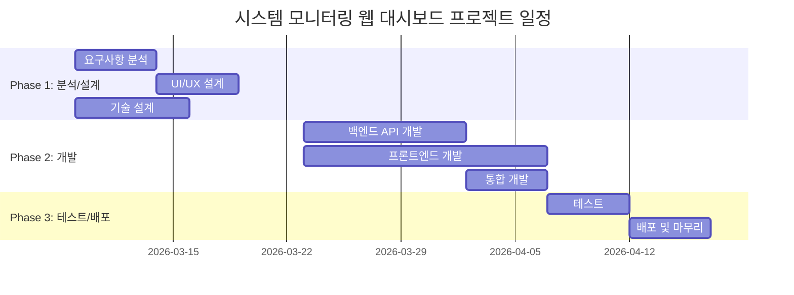

# 시스템 모니터링 웹 대시보드 WBS (Work Breakdown Structure)

**버전**: 1.0
**작성일**: 2026-03-05
**기반 문서**: PRD-20260305-161827, TRD-20260305-162132
**상태**: Draft

---

## 프로젝트 요약

| 항목 | 값 |
|------|-----|
| 총 작업 기간 | 8주 (2개월) |
| 총 공수 | 528시간 (66 Man-Days) → 버퍼 포함 634시간 (79.2 Man-Days) |
| 팀 규모 | 4명 |
| 방법론 | Agile (Scrum) |
| 스프린트 주기 | 2주 |
| 버퍼 비율 | 20% |

---

## 1. 프로젝트 단계 (Phases)



### Phase 1: 분석 및 설계 (W1~W2)
- **기간**: 2026-03-09 ~ 2026-03-20 (2주)
- **목표**: 요구사항 확정, UI/UX 설계 완료, 기술 설계 확정
- **산출물**: 요구사항 명세서, UI 와이어프레임, API 설계서, 프로젝트 환경 설정
- **마일스톤**: M0 - 설계 완료

### Phase 2: 개발 (W3~W6)
- **기간**: 2026-03-23 ~ 2026-04-17 (4주)
- **목표**: 백엔드 API 완성, 프론트엔드 대시보드 완성, 프론트-백엔드 통합
- **산출물**: 시스템 메트릭 API, 4개 차트 컴포넌트, 다크 테마 대시보드, 실시간 갱신 구현
- **마일스톤**: M1 - 백엔드 API 완성, M2 - 프론트엔드 대시보드 완성

### Phase 3: 테스트 및 배포 (W7~W8)
- **기간**: 2026-04-20 ~ 2026-05-01 (2주)
- **목표**: 통합 테스트 완료, 성능 검증, 배포
- **산출물**: 테스트 보고서, Docker 배포 패키지, 운영 가이드
- **마일스톤**: M3 - 프로젝트 완료

---

## 2. 작업 패키지 (Work Packages)

### WP-1: 프로젝트 관리 및 분석
| ID | 작업명 | 담당 역할 | 예상 공수(시간) | 선행 작업 | 산출물 |
|----|--------|----------|---------------|----------|--------|
| WP-1.1 | 프로젝트 킥오프 및 환경 설정 | PM/PL | 8h | - | 프로젝트 계획서, 개발 환경 |
| WP-1.2 | 요구사항 분석 및 확정 | PM/PL | 16h | WP-1.1 | 요구사항 명세서 (확정) |
| WP-1.3 | PRD 미해결 사항 검토 | PM/PL | 8h | WP-1.1 | 미해결 사항 결정서 |

**소계**: 32시간 (4 Man-Days)

---

### WP-2: UI/UX 설계
| ID | 작업명 | 담당 역할 | 예상 공수(시간) | 선행 작업 | 산출물 |
|----|--------|----------|---------------|----------|--------|
| WP-2.1 | 대시보드 레이아웃 설계 | UI/UX 디자이너 | 16h | WP-1.2 | 와이어프레임 |
| WP-2.2 | 다크 테마 색상 팔레트 정의 | UI/UX 디자이너 | 8h | WP-2.1 | 디자인 시스템 (색상, 타이포그래피) |
| WP-2.3 | 차트 컴포넌트 UI 설계 | UI/UX 디자이너 | 16h | WP-2.1 | 차트 디자인 가이드 |

**소계**: 40시간 (5 Man-Days)

---

### WP-3: 기술 설계
| ID | 작업명 | 담당 역할 | 예상 공수(시간) | 선행 작업 | 산출물 |
|----|--------|----------|---------------|----------|--------|
| WP-3.1 | API 엔드포인트 설계 | 백엔드 개발자 | 8h | WP-1.2 | API 명세서 |
| WP-3.2 | 프론트엔드 컴포넌트 구조 설계 | 프론트엔드 개발자 | 8h | WP-1.2 | 컴포넌트 설계서 |
| WP-3.3 | 프로젝트 스캐폴딩 | 프론트엔드 개발자, 백엔드 개발자 | 8h | WP-3.1, WP-3.2 | 프로젝트 초기 코드 |

**소계**: 24시간 (3 Man-Days)

---

### WP-4: 백엔드 API 개발
| ID | 작업명 | 담당 역할 | 예상 공수(시간) | 선행 작업 | 산출물 |
|----|--------|----------|---------------|----------|--------|
| WP-4.1 | FastAPI 프로젝트 구조 설정 | 백엔드 개발자 | 8h | WP-3.3 | FastAPI 기본 프로젝트 |
| WP-4.2 | psutil 메트릭 수집 서비스 구현 | 백엔드 개발자 | 24h | WP-4.1 | MetricsCollector 서비스 |
| WP-4.3 | CPU/메모리 API 엔드포인트 구현 | 백엔드 개발자 | 16h | WP-4.2 | /system/cpu, /system/memory |
| WP-4.4 | 디스크/네트워크 API 엔드포인트 구현 | 백엔드 개발자 | 16h | WP-4.2 | /system/disk, /system/network |
| WP-4.5 | 통합 엔드포인트 및 CORS 설정 | 백엔드 개발자 | 8h | WP-4.3, WP-4.4 | /system/all, CORS 설정 |
| WP-4.6 | 백엔드 단위 테스트 | 백엔드 개발자 | 16h | WP-4.5 | 테스트 코드, 테스트 보고서 |

**소계**: 88시간 (11 Man-Days)

---

### WP-5: 프론트엔드 개발 - 기반
| ID | 작업명 | 담당 역할 | 예상 공수(시간) | 선행 작업 | 산출물 |
|----|--------|----------|---------------|----------|--------|
| WP-5.1 | React + Vite 프로젝트 설정 | 프론트엔드 개발자 | 8h | WP-3.3 | React 기본 프로젝트 |
| WP-5.2 | 다크 테마 CSS 구현 | 프론트엔드 개발자 | 16h | WP-5.1, WP-2.2 | 테마 CSS, 전역 스타일 |
| WP-5.3 | 반응형 그리드 레이아웃 구현 | 프론트엔드 개발자 | 16h | WP-5.2, WP-2.1 | DashboardLayout 컴포넌트 |

**소계**: 40시간 (5 Man-Days)

---

### WP-6: 프론트엔드 개발 - 차트
| ID | 작업명 | 담당 역할 | 예상 공수(시간) | 선행 작업 | 산출물 |
|----|--------|----------|---------------|----------|--------|
| WP-6.1 | CPU 라인 차트 컴포넌트 | 프론트엔드 개발자 | 16h | WP-5.3, WP-2.3 | CpuChart 컴포넌트 |
| WP-6.2 | 메모리 라인 차트 컴포넌트 | 프론트엔드 개발자 | 16h | WP-5.3, WP-2.3 | MemoryChart 컴포넌트 |
| WP-6.3 | 디스크 파이 차트 컴포넌트 | 프론트엔드 개발자 | 16h | WP-5.3, WP-2.3 | DiskChart 컴포넌트 |
| WP-6.4 | 네트워크 라인 차트 컴포넌트 | 프론트엔드 개발자 | 16h | WP-5.3, WP-2.3 | NetworkChart 컴포넌트 |
| WP-6.5 | 폴링 서비스 (useSystemMetrics) | 프론트엔드 개발자 | 16h | WP-5.1 | useSystemMetrics Hook |

**소계**: 80시간 (10 Man-Days)

---

### WP-7: 프론트엔드-백엔드 통합
| ID | 작업명 | 담당 역할 | 예상 공수(시간) | 선행 작업 | 산출물 |
|----|--------|----------|---------------|----------|--------|
| WP-7.1 | API 연동 및 데이터 바인딩 | 프론트엔드 개발자 | 16h | WP-4.5, WP-6.5 | API 연동 완료 |
| WP-7.2 | 실시간 갱신 통합 테스트 | 프론트엔드 개발자, 백엔드 개발자 | 16h | WP-7.1 | 통합 동작 확인 |
| WP-7.3 | 에러 처리 및 폴백 구현 | 프론트엔드 개발자 | 8h | WP-7.1 | 에러 핸들링 코드 |

**소계**: 40시간 (5 Man-Days)

---

### WP-8: 테스트
| ID | 작업명 | 담당 역할 | 예상 공수(시간) | 선행 작업 | 산출물 |
|----|--------|----------|---------------|----------|--------|
| WP-8.1 | 기능 테스트 (4개 차트) | QA | 24h | WP-7.2 | 기능 테스트 보고서 |
| WP-8.2 | 성능 테스트 (갱신 주기, 로딩) | QA | 16h | WP-7.2 | 성능 테스트 보고서 |
| WP-8.3 | 브라우저 호환성 테스트 | QA | 8h | WP-7.2 | 호환성 테스트 보고서 |
| WP-8.4 | 장시간 안정성 테스트 (24시간) | QA | 8h | WP-8.1 | 안정성 테스트 보고서 |
| WP-8.5 | 버그 수정 | 프론트엔드 개발자, 백엔드 개발자 | 24h | WP-8.1 | 버그 수정 완료 |

**소계**: 80시간 (10 Man-Days)

---

### WP-9: 배포 및 문서화
| ID | 작업명 | 담당 역할 | 예상 공수(시간) | 선행 작업 | 산출물 |
|----|--------|----------|---------------|----------|--------|
| WP-9.1 | Dockerfile 및 Docker Compose 작성 | 백엔드 개발자 | 16h | WP-7.2 | Docker 배포 패키지 |
| WP-9.2 | 배포 테스트 | 백엔드 개발자 | 8h | WP-9.1 | 배포 검증 결과 |
| WP-9.3 | 사용자 가이드 작성 | PM/PL | 16h | WP-8.5 | 사용자 가이드 |
| WP-9.4 | 프로젝트 완료 보고 | PM/PL | 8h | WP-9.3 | 완료 보고서 |

**소계**: 48시간 (6 Man-Days)

---

### WP-10: 프로젝트 관리 (전 기간)
| ID | 작업명 | 담당 역할 | 예상 공수(시간) | 선행 작업 | 산출물 |
|----|--------|----------|---------------|----------|--------|
| WP-10.1 | 스프린트 계획 및 리뷰 (4회) | PM/PL | 16h | - | 스프린트 보고서 |
| WP-10.2 | 일일 스탠드업 미팅 | PM/PL | 16h | - | 회의록 |
| WP-10.3 | 리스크 관리 및 이슈 추적 | PM/PL | 16h | - | 리스크 대응 기록 |
| WP-10.4 | 코드 리뷰 관리 | PM/PL | 8h | - | 코드 리뷰 기록 |

**소계**: 56시간 (7 Man-Days)

---

## 3. 크리티컬 패스 (Critical Path)

```
WP-1.1 → WP-1.2 → WP-3.2 → WP-5.1 → WP-5.2 → WP-5.3 → WP-6.1~6.4 → WP-7.1 → WP-7.2 → WP-8.1 → WP-8.5 → WP-9.3 → WP-9.4
```

| 단계 | 작업 ID | 작업명 | 공수(시간) | 누적 |
|------|---------|--------|----------|------|
| 1 | WP-1.1 | 프로젝트 킥오프 | 8h | 8h |
| 2 | WP-1.2 | 요구사항 분석 | 16h | 24h |
| 3 | WP-3.2 | 프론트엔드 구조 설계 | 8h | 32h |
| 4 | WP-5.1 | React 프로젝트 설정 | 8h | 40h |
| 5 | WP-5.2 | 다크 테마 CSS | 16h | 56h |
| 6 | WP-5.3 | 반응형 그리드 레이아웃 | 16h | 72h |
| 7 | WP-6.1~6.4 | 차트 컴포넌트 4종 (병렬) | 16h | 88h |
| 8 | WP-7.1 | API 연동 | 16h | 104h |
| 9 | WP-7.2 | 통합 테스트 | 16h | 120h |
| 10 | WP-8.1 | 기능 테스트 | 24h | 144h |
| 11 | WP-8.5 | 버그 수정 | 24h | 168h |
| 12 | WP-9.3 | 사용자 가이드 | 16h | 184h |
| 13 | WP-9.4 | 완료 보고 | 8h | 192h |

**총 크리티컬 패스 길이**: 192시간 = 24 Man-Days = **약 4.8주**

---

## 4. 리소스 배분 (Resource Allocation)

### 4.1 역할별 투입 계획

| 역할 | 인원 | 주요 담당 작업 | 투입 공수 | 투입률 |
|------|------|---------------|----------|--------|
| PM/PL | 1명 | WP-1, WP-9.3~9.4, WP-10 | 136h (17MD) | 53% |
| 프론트엔드 개발자 | 1명 | WP-5, WP-6, WP-7, WP-8.5(일부) | 188h (23.5MD) | 73% |
| 백엔드 개발자 | 1명 | WP-4, WP-7.2, WP-8.5(일부), WP-9.1~9.2 | 140h (17.5MD) | 55% |
| UI/UX 디자이너 (파트타임) | 0.5명 | WP-2 | 40h (5MD) | 31% |
| QA (파트타임) | 0.5명 | WP-8.1~8.4 | 56h (7MD) | 22% |

### 4.2 주차별 투입 현황

| 주차 | PM/PL | FE 개발자 | BE 개발자 | UI/UX | QA |
|------|-------|----------|----------|-------|-----|
| W1 | ● | ○ | ○ | ● | - |
| W2 | ● | ○ | ○ | ● | - |
| W3 | ○ | ● | ● | - | - |
| W4 | ○ | ● | ● | - | - |
| W5 | ○ | ● | ○ | - | - |
| W6 | ○ | ● | ○ | - | - |
| W7 | ○ | ○ | ○ | - | ● |
| W8 | ● | ○ | ○ | - | ○ |

(● 전담, ○ 부분 투입, - 미투입)

---

## 5. 공수 요약 (Effort Summary)

### 5.1 단계별 공수

| 단계 | 공수 (시간) | Man-Days | 비율 |
|------|-----------|----------|------|
| 분석/설계 (WP-1~3) | 96 | 12.0 | 18% |
| 개발 (WP-4~7) | 248 | 31.0 | 47% |
| 테스트 (WP-8) | 80 | 10.0 | 15% |
| 배포/문서화 (WP-9) | 48 | 6.0 | 9% |
| 프로젝트 관리 (WP-10) | 56 | 7.0 | 11% |
| **소계** | **528** | **66.0** | 100% |
| 버퍼 (20%) | 106 | 13.2 | - |
| **총계** | **634** | **79.2** | - |

### 5.2 Man-Month 환산

- 1 Man-Day = 8시간
- 1 Man-Month = 20 Man-Days = 160시간
- **총 공수**: 634시간 = 79.2 Man-Days = **4.0 Man-Months**

---

## 6. 리스크 및 가정사항

### 가정사항
- 팀원은 해당 기술 스택에 대한 기본 역량을 보유하고 있음
- 개발 환경(PC, 네트워크)은 사전에 준비되어 있음
- PRD의 미해결 사항(UNR-001~005)은 Phase 1에서 확정됨
- 외부 라이브러리(React, Recharts, FastAPI, psutil)의 안정 버전 사용
- 로컬 서버 모니터링만 대상 (원격 서버 제외)

### 일정 리스크
| 리스크 | 영향 | 대응 방안 |
|--------|------|----------|
| 프론트엔드 차트 성능 이슈 | MEDIUM | 데이터 포인트 제한, 차트 라이브러리 최적화 옵션 활용 |
| psutil OS별 동작 차이 | MEDIUM | 타겟 OS 확정 후 집중 테스트 |
| 요구사항 변경 (미해결 사항) | HIGH | Phase 1에서 조기 확정, 변경 시 영향 분석 수행 |
| 팀원 가용성 변동 | MEDIUM | 20% 버퍼로 흡수, 크리티컬 패스 작업 우선 배정 |

---

## 7. 참고 문서

- 기반 PRD: `workspace/outputs/prd/PRD-20260305-161827.json`
- 기반 TRD: `workspace/outputs/trd/TRD-20260305-162132.json`

---
*이 문서는 WBS 자동 생성 시스템에 의해 작성되었습니다.*
