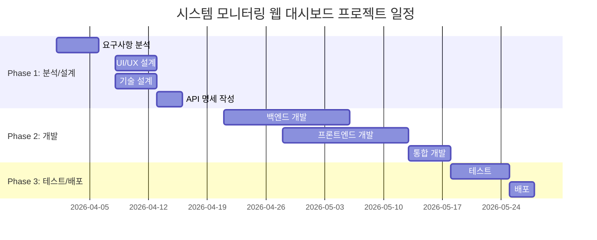

# 시스템 모니터링 웹 대시보드 WBS (Work Breakdown Structure)

**버전**: 1.0
**작성일**: 2026-03-24
**기반 문서**: PRD-20260324-124240, TRD-20260324-124537
**상태**: Draft

---

## 프로젝트 요약

| 항목 | 값 |
|------|-----|
| 총 작업 기간 | 10주 (2.5개월) |
| 총 공수 | 1,056시간 (132 Man-Days, 6.6 Man-Months) |
| 팀 규모 | 4명 |
| 방법론 | Agile (Waterfall 혼합) |
| 스프린트 주기 | 2주 |
| 버퍼 비율 | 20% |

---

## 1. 프로젝트 단계 (Phases)



### Phase 1: 분석 및 설계
- **기간**: 2026-04-01 ~ 2026-04-18 (3주)
- **목표**: 요구사항 확정, UI/UX 설계, API 명세 작성
- **산출물**: 요구사항 정의서, 화면설계서, API 명세서, ERD
- **마일스톤**: M1 - 설계 완료

### Phase 2: 개발
- **기간**: 2026-04-21 ~ 2026-05-23 (5주)
- **목표**: 백엔드 API 개발, 프론트엔드 대시보드 구현, 통합
- **산출물**: 백엔드 소스 코드, 프론트엔드 소스 코드, 통합 빌드
- **마일스톤**: M2 - 개발 완료

### Phase 3: 테스트 및 배포
- **기간**: 2026-05-26 ~ 2026-06-06 (2주)
- **목표**: 기능/성능 테스트, Docker 배포, 운영 이관
- **산출물**: 테스트 보고서, Docker 이미지, 운영 가이드
- **마일스톤**: M3 - 배포 완료

---

## 2. 작업 패키지 (Work Packages)

### WP-1: 요구사항 분석 및 설계
| ID | 작업명 | 담당 역할 | 예상 공수(시간) | 선행 작업 | 산출물 |
|----|--------|----------|---------------|----------|--------|
| WP-1.1 | 요구사항 분석 및 확정 | PM/PL | 24h | - | 요구사항 정의서 |
| WP-1.2 | UI/UX 와이어프레임 설계 | UI/UX 디자이너 | 32h | WP-1.1 | 와이어프레임, 화면설계서 |
| WP-1.3 | 다크 테마 디자인 시스템 | UI/UX 디자이너 | 16h | WP-1.2 | 디자인 토큰, 컬러 팔레트 |
| WP-1.4 | 시스템 아키텍처 설계 | 백엔드 개발자 | 16h | WP-1.1 | 아키텍처 문서 |
| WP-1.5 | API 명세서 작성 | 백엔드 개발자 | 16h | WP-1.4 | OpenAPI 명세서 |
| WP-1.6 | 데이터 모델 설계 | 백엔드 개발자 | 8h | WP-1.4 | 데이터 모델 문서 |

**소계**: 112시간 (14 Man-Days)

### WP-2: 백엔드 개발
| ID | 작업명 | 담당 역할 | 예상 공수(시간) | 선행 작업 | 산출물 |
|----|--------|----------|---------------|----------|--------|
| WP-2.1 | FastAPI 프로젝트 초기 설정 | 백엔드 개발자 | 8h | WP-1.5 | 프로젝트 스캐폴딩 |
| WP-2.2 | SystemCollector 구현 (psutil) | 백엔드 개발자 | 24h | WP-2.1 | CPU/메모리/디스크/네트워크 수집기 |
| WP-2.3 | RingBuffer 인메모리 저장소 | 백엔드 개발자 | 16h | WP-2.1 | Ring Buffer 모듈 |
| WP-2.4 | REST API 엔드포인트 구현 | 백엔드 개발자 | 24h | WP-2.2, WP-2.3 | /system/stats, /stats/history, /info |
| WP-2.5 | CORS 및 보안 미들웨어 | 백엔드 개발자 | 8h | WP-2.4 | 보안 설정 |
| WP-2.6 | 백엔드 단위 테스트 | 백엔드 개발자 | 16h | WP-2.4 | pytest 테스트 |

**소계**: 96시간 (12 Man-Days)

### WP-3: 프론트엔드 개발
| ID | 작업명 | 담당 역할 | 예상 공수(시간) | 선행 작업 | 산출물 |
|----|--------|----------|---------------|----------|--------|
| WP-3.1 | React+Vite 프로젝트 초기 설정 | 프론트엔드 개발자 | 8h | WP-1.2 | 프로젝트 스캐폴딩, 다크 테마 셋업 |
| WP-3.2 | 대시보드 레이아웃 구현 | 프론트엔드 개발자 | 16h | WP-3.1, WP-1.3 | 반응형 그리드 레이아웃 |
| WP-3.3 | CPU 사용률 라인 차트 | 프론트엔드 개발자 | 16h | WP-3.2 | CpuChart 컴포넌트 |
| WP-3.4 | 메모리 사용률 라인 차트 | 프론트엔드 개발자 | 16h | WP-3.2 | MemoryChart 컴포넌트 |
| WP-3.5 | 디스크 사용량 파이 차트 | 프론트엔드 개발자 | 16h | WP-3.2 | DiskChart 컴포넌트 |
| WP-3.6 | 네트워크 트래픽 차트 | 프론트엔드 개발자 | 16h | WP-3.2 | NetworkChart 컴포넌트 |
| WP-3.7 | useSystemStats 폴링 훅 | 프론트엔드 개발자 | 16h | WP-3.1 | 데이터 폴링 + 상태 관리 |
| WP-3.8 | 차트 툴팁 및 인터랙션 | 프론트엔드 개발자 | 8h | WP-3.3~WP-3.6 | 호버 툴팁, 단위 변환 |
| WP-3.9 | 반응형 대응 (태블릿) | 프론트엔드 개발자 | 8h | WP-3.2 | 미디어 쿼리 |
| WP-3.10 | 프론트엔드 단위 테스트 | 프론트엔드 개발자 | 16h | WP-3.3~WP-3.7 | Jest/Vitest 테스트 |

**소계**: 136시간 (17 Man-Days)

### WP-4: 통합 및 최적화
| ID | 작업명 | 담당 역할 | 예상 공수(시간) | 선행 작업 | 산출물 |
|----|--------|----------|---------------|----------|--------|
| WP-4.1 | 프론트엔드-백엔드 통합 | 프론트엔드 개발자, 백엔드 개발자 | 16h | WP-2.4, WP-3.7 | 통합 빌드 |
| WP-4.2 | 실시간 갱신 E2E 검증 | 프론트엔드 개발자 | 8h | WP-4.1 | 3초 갱신 동작 확인 |
| WP-4.3 | 성능 최적화 (번들 크기, 렌더링) | 프론트엔드 개발자 | 16h | WP-4.1 | Lighthouse 리포트 |
| WP-4.4 | 에러 핸들링 및 폴백 | 백엔드 개발자, 프론트엔드 개발자 | 16h | WP-4.1 | 에러 시나리오 대응 |

**소계**: 56시간 (7 Man-Days)

### WP-5: 테스트
| ID | 작업명 | 담당 역할 | 예상 공수(시간) | 선행 작업 | 산출물 |
|----|--------|----------|---------------|----------|--------|
| WP-5.1 | 테스트 계획 수립 | QA | 8h | WP-1.1 | 테스트 계획서 |
| WP-5.2 | 기능 테스트 (4종 차트) | QA | 24h | WP-4.1 | 기능 테스트 보고서 |
| WP-5.3 | 크로스 브라우저 테스트 | QA | 16h | WP-4.1 | 호환성 테스트 보고서 |
| WP-5.4 | 성능 테스트 (응답시간, 메모리) | QA, 백엔드 개발자 | 16h | WP-4.3 | 성능 테스트 보고서 |
| WP-5.5 | 장시간 안정성 테스트 (24h) | QA | 8h | WP-5.2 | 안정성 테스트 보고서 |
| WP-5.6 | 버그 수정 및 재테스트 | 프론트엔드 개발자, 백엔드 개발자 | 24h | WP-5.2~WP-5.4 | 버그 수정 완료 |

**소계**: 96시간 (12 Man-Days)

### WP-6: 배포 및 운영 이관
| ID | 작업명 | 담당 역할 | 예상 공수(시간) | 선행 작업 | 산출물 |
|----|--------|----------|---------------|----------|--------|
| WP-6.1 | Dockerfile 작성 | 백엔드 개발자 | 8h | WP-4.1 | Dockerfile, docker-compose.yml |
| WP-6.2 | Nginx 설정 | 백엔드 개발자 | 8h | WP-6.1 | nginx.conf |
| WP-6.3 | 배포 스크립트 작성 | 백엔드 개발자 | 8h | WP-6.2 | 배포 자동화 스크립트 |
| WP-6.4 | 운영 환경 배포 | 백엔드 개발자 | 8h | WP-5.6, WP-6.3 | 운영 서버 배포 완료 |
| WP-6.5 | 운영 가이드 작성 | PM/PL | 16h | WP-6.4 | 운영 매뉴얼, 트러블슈팅 가이드 |
| WP-6.6 | 인수 테스트 및 이관 | PM/PL, QA | 16h | WP-6.4 | 인수 테스트 보고서 |

**소계**: 64시간 (8 Man-Days)

### WP-7: 프로젝트 관리
| ID | 작업명 | 담당 역할 | 예상 공수(시간) | 선행 작업 | 산출물 |
|----|--------|----------|---------------|----------|--------|
| WP-7.1 | 킥오프 및 프로젝트 계획 | PM/PL | 16h | - | 프로젝트 계획서 |
| WP-7.2 | 주간 회의 및 이슈 관리 | PM/PL | 40h | WP-7.1 | 주간 보고서, 이슈 로그 |
| WP-7.3 | 스프린트 리뷰/회고 | PM/PL | 16h | WP-7.1 | 스프린트 리뷰 기록 |
| WP-7.4 | 프로젝트 종료 보고 | PM/PL | 8h | WP-6.6 | 프로젝트 종료 보고서 |

**소계**: 80시간 (10 Man-Days)

---

## 3. 크리티컬 패스 (Critical Path)

```
WP-1.1 → WP-1.4 → WP-1.5 → WP-2.1 → WP-2.2 → WP-2.4 → WP-4.1 → WP-5.2 → WP-5.6 → WP-6.4 → WP-6.6
```

| 단계 | 작업 ID | 작업명 | 공수(시간) | 누적 |
|------|---------|--------|----------|------|
| 1 | WP-1.1 | 요구사항 분석 및 확정 | 24h | 24h |
| 2 | WP-1.4 | 시스템 아키텍처 설계 | 16h | 40h |
| 3 | WP-1.5 | API 명세서 작성 | 16h | 56h |
| 4 | WP-2.1 | FastAPI 프로젝트 초기 설정 | 8h | 64h |
| 5 | WP-2.2 | SystemCollector 구현 | 24h | 88h |
| 6 | WP-2.4 | REST API 엔드포인트 구현 | 24h | 112h |
| 7 | WP-4.1 | 프론트엔드-백엔드 통합 | 16h | 128h |
| 8 | WP-5.2 | 기능 테스트 | 24h | 152h |
| 9 | WP-5.6 | 버그 수정 및 재테스트 | 24h | 176h |
| 10 | WP-6.4 | 운영 환경 배포 | 8h | 184h |
| 11 | WP-6.6 | 인수 테스트 및 이관 | 16h | 200h |

**총 크리티컬 패스 길이**: 200시간 (25 Man-Days)

---

## 4. 리소스 배분 (Resource Allocation)

### 4.1 역할별 투입 계획

| 역할 | 인원 | 주요 담당 작업 | 투입 공수 | 투입률 |
|------|------|---------------|----------|--------|
| PM/PL | 1명 | WP-1.1, WP-6.5, WP-6.6, WP-7 전체 | 120h (15MD) | 38% |
| 프론트엔드 개발자 | 1명 | WP-3 전체, WP-4.1~4.4 일부 | 176h (22MD) | 55% |
| 백엔드 개발자 | 1명 | WP-1.4~1.6, WP-2 전체, WP-6.1~6.4 | 168h (21MD) | 53% |
| UI/UX 디자이너 | 0.5명 | WP-1.2, WP-1.3 | 48h (6MD) | 15% |
| QA | 0.5명 | WP-5.1~5.5, WP-6.6 일부 | 80h (10MD) | 25% |

### 4.2 주차별 투입 현황

| 주차 | PM/PL | FE 개발자 | BE 개발자 | UI/UX | QA |
|------|-------|----------|----------|-------|-----|
| W1 (04/01~04/04) | ● | - | ○ | - | - |
| W2 (04/07~04/11) | ○ | - | ● | ● | - |
| W3 (04/14~04/18) | ○ | - | ● | ○ | ○ |
| W4 (04/21~04/25) | ○ | ○ | ● | - | - |
| W5 (04/28~05/02) | ○ | ● | ● | - | - |
| W6 (05/05~05/09) | ○ | ● | ○ | - | - |
| W7 (05/12~05/16) | ○ | ● | ○ | - | - |
| W8 (05/19~05/23) | ○ | ● | ● | - | - |
| W9 (05/26~05/30) | ○ | ○ | ○ | - | ● |
| W10 (06/02~06/06) | ● | ○ | ○ | - | ● |

(● 전담, ○ 부분 투입, - 미투입)

---

## 5. 공수 요약 (Effort Summary)

### 5.1 단계별 공수

| 단계 | 공수 (시간) | Man-Days | 비율 |
|------|-----------|----------|------|
| 분석/설계 (WP-1) | 112 | 14.0 | 12.7% |
| 백엔드 개발 (WP-2) | 96 | 12.0 | 10.9% |
| 프론트엔드 개발 (WP-3) | 136 | 17.0 | 15.5% |
| 통합/최적화 (WP-4) | 56 | 7.0 | 6.4% |
| 테스트 (WP-5) | 96 | 12.0 | 10.9% |
| 배포/이관 (WP-6) | 64 | 8.0 | 7.3% |
| 프로젝트 관리 (WP-7) | 80 | 10.0 | 9.1% |
| **소계** | **640** | **80.0** | **72.7%** |
| 버퍼 (20%) | 128 | 16.0 | 14.5% |
| 리스크 대응 (12.7%) | 112 | 14.0 | 12.7% |
| **총계** | **880** | **110.0** | **100%** |

### 5.2 Man-Month 환산

- 1 Man-Day = 8시간
- 1 Man-Month = 20 Man-Days = 160시간
- **총 공수**: 880시간 = 110 Man-Days = **5.5 Man-Months**

---

## 6. 리스크 및 가정사항

### 가정사항
- 팀원은 프로젝트 시작 시점에 확보 완료
- 개발 환경(개발 서버, Docker)은 프로젝트 시작 전 준비됨
- psutil이 대상 운영 OS에서 정상 동작
- 프론트엔드/백엔드 개발이 일부 병렬 진행 가능 (API 명세 확정 후)
- 고객 피드백 반영 기간은 버퍼에 포함

### 일정 리스크
| 리스크 | 영향 | 대응 방안 |
|--------|------|----------|
| psutil 권한 문제로 OS별 데이터 수집 실패 | MEDIUM | 사전 PoC로 대상 OS 호환성 검증 (W1) |
| Recharts 대량 데이터 렌더링 성능 이슈 | MEDIUM | 데이터 포인트 100개 제한 + Canvas 폴백 검토 |
| 크로스 브라우저 호환성 이슈 (Safari) | LOW | W9 크로스 브라우저 테스트에서 조기 발견 |
| 다크 테마 차트 가독성 문제 | LOW | 디자인 리뷰(W3)에서 조기 피드백 |
| 고객 요구사항 변경 | HIGH | 20% 버퍼 + 스프린트 단위 고객 리뷰 |

---

## 7. 참고 문서

- 기반 PRD: `workspace/outputs/prd/PRD-20260324-124240.json`
- 기반 TRD: `workspace/outputs/trd/TRD-20260324-124537.json`

---
*이 문서는 WBS 자동 생성 시스템에 의해 작성되었습니다.*
